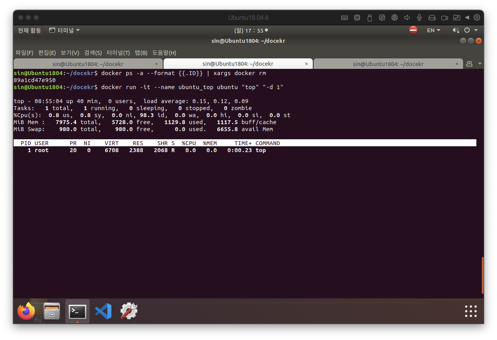
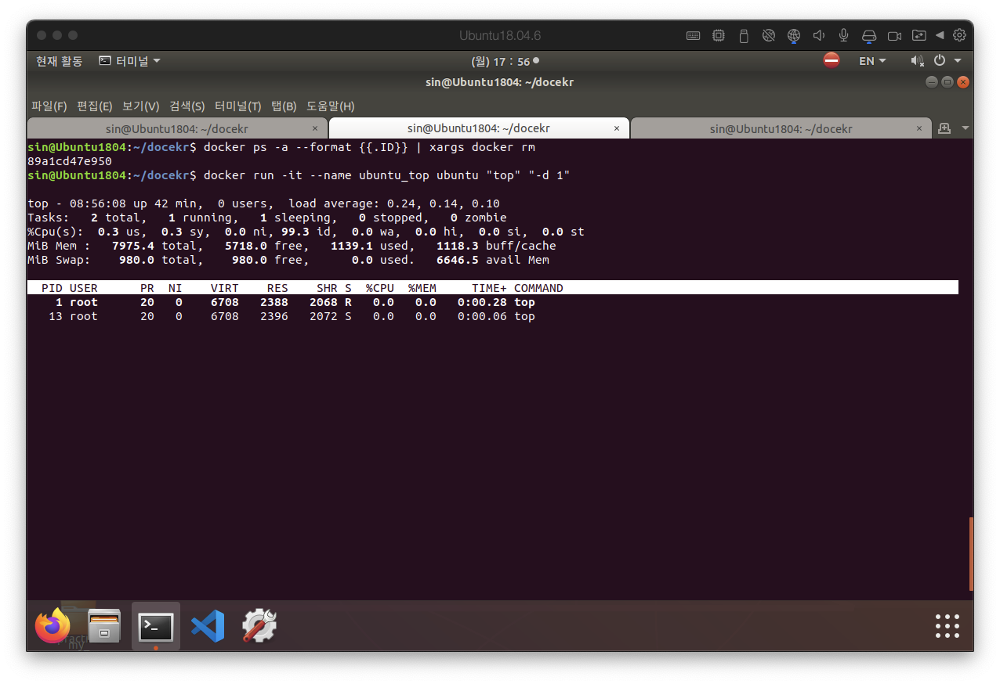
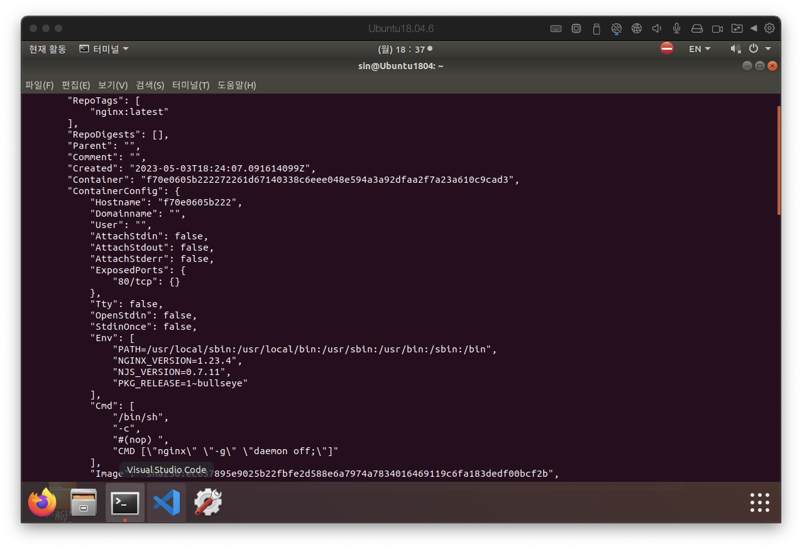
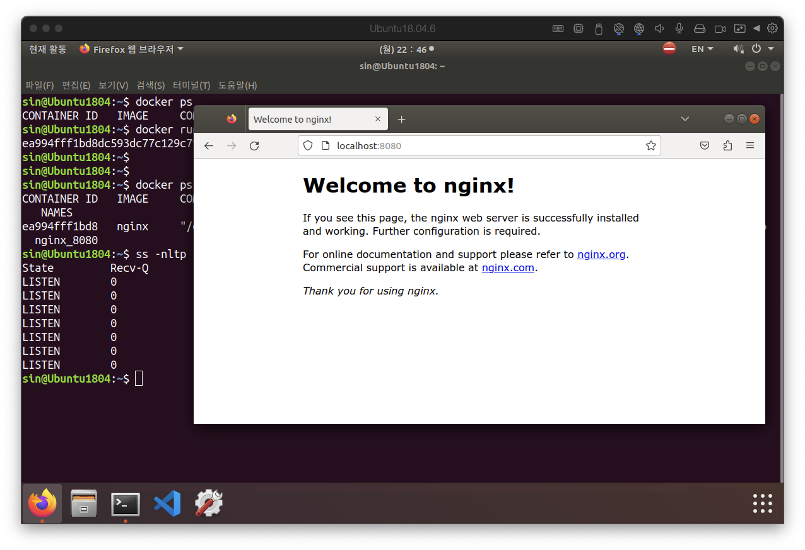
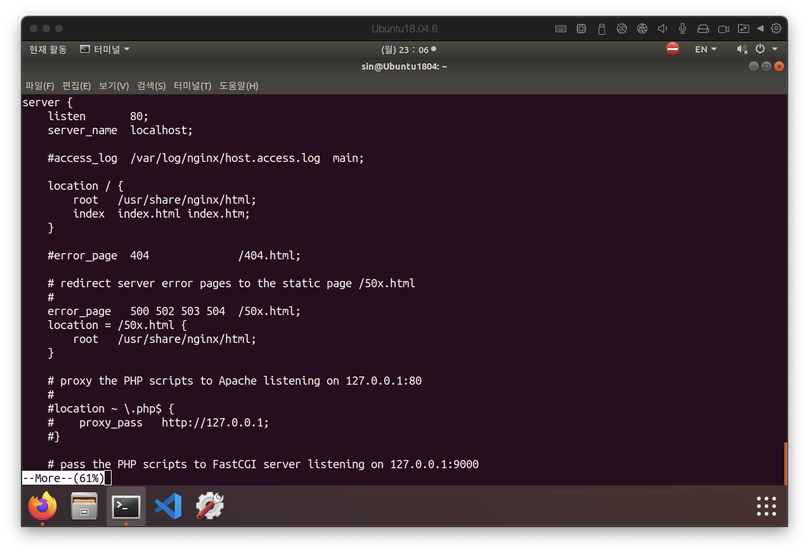
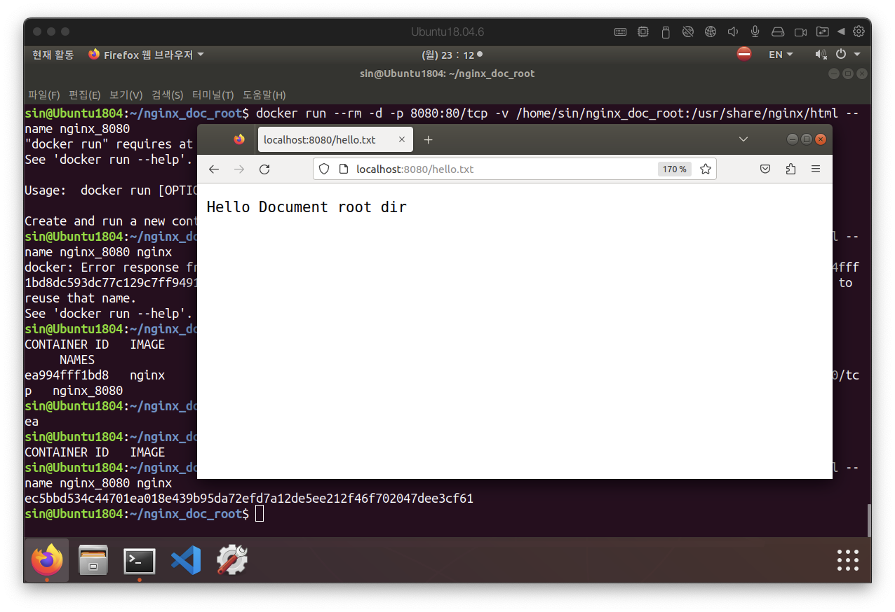

# docker CLI
{: .no_toc }

## Table of contents
{: .no_toc .text-delta }

1. TOC
{:toc}

---

# docker 계정 그룹에 일반 유저 계정 추가하기

```bash
sin@Ubuntu1804:~$ whoami
sin
sin@Ubuntu1804:~$ sudo usermod -aG docker sin  // docker 그룹에 sin 유저를 추가한다.
[sudo] sin의 암호: 
sin@Ubuntu1804:~$ id
uid=1000(sin) gid=1000(sin) 그룹들=1000(sin),4(adm),24(cdrom),27(sudo),30(dip),46(plugdev),108(lxd),113(lpadmin),114(sambashare)
sin@Ubuntu1804:~$ id sin  
// terminal 세션이 생성된 이후에 계정 권한이 추가된 거기 때문에 해당 명령으로 그룹 확인이 가능하다.
uid=1000(sin) gid=1000(sin) 그룹들=1000(sin),4(adm),24(cdrom),27(sudo),30(dip),46(plugdev),108(lxd),113(lpadmin),114(sambashare),999(docker)
sin@Ubuntu1804:~$ 
```

`newgrp <group>` 명령을 통해 세션을 재생성 하거나 시스템을 재부팅 해주면 정상적으로 반영된다.
```bash
sin@Ubuntu1804:~$ id
uid=1000(sin) gid=1000(sin) 그룹들=1000(sin),4(adm),24(cdrom),27(sudo),30(dip),46(plugdev),108(lxd),113(lpadmin),114(sambashare),999(docker)
```

# docker ps
```
sin@Ubuntu1804:~$ docker ps
CONTAINER ID   IMAGE     COMMAND   CREATED   STATUS    PORTS     NAMES
sin@Ubuntu1804:~$ docker ps -a
CONTAINER ID   IMAGE         COMMAND    CREATED          STATUS                        PORTS     NAMES
134343a6f2ec   ubuntu        "bash"     22 minutes ago   Exited (127) 22 minutes ago             thirsty_faraday
8e127241cda0   hello-world   "/hello"   25 minutes ago   Exited (0) 25 minutes ago               goofy_allen
```


# docker run
docker container를 실행한다.

## container 이름 지정
`docker run --name <container_name> <image_name>`

```bash
sin@Ubuntu1804:~$ docker run --name my-hello hello-world

Hello from Docker!
This message shows that your installation appears to be working correctly.

To generate this message, Docker took the following steps:
 1. The Docker client contacted the Docker daemon.
 2. The Docker daemon pulled the "hello-world" image from the Docker Hub.
    (arm64v8)
 3. The Docker daemon created a new container from that image which runs the
    executable that produces the output you are currently reading.
 4. The Docker daemon streamed that output to the Docker client, which sent it
    to your terminal.

To try something more ambitious, you can run an Ubuntu container with:
 $ docker run -it ubuntu bash

Share images, automate workflows, and more with a free Docker ID:
 https://hub.docker.com/

For more examples and ideas, visit:
 https://docs.docker.com/get-started/

sin@Ubuntu1804:~$ docker ps -a
CONTAINER ID   IMAGE         COMMAND    CREATED          STATUS                        PORTS     NAMES
84e8cb75bd5c   hello-world   "/hello"   3 seconds ago    Exited (0) 2 seconds ago                my-hello
134343a6f2ec   ubuntu        "bash"     24 minutes ago   Exited (127) 23 minutes ago             thirsty_faraday
8e127241cda0   hello-world   "/hello"   26 minutes ago   Exited (0) 26 minutes ago               goofy_allen
sin@Ubuntu1804:~$ 
```


# docker rm
docker container를 삭제한다. container id 혹은 container name을 통해서 해당 container를 삭제할 수 있다.


```bash
sin@Ubuntu1804:~$ docker ps -a
CONTAINER ID   IMAGE         COMMAND    CREATED          STATUS                        PORTS     NAMES
84e8cb75bd5c   hello-world   "/hello"   3 seconds ago    Exited (0) 2 seconds ago                my-hello
134343a6f2ec   ubuntu        "bash"     24 minutes ago   Exited (127) 23 minutes ago             thirsty_faraday
8e127241cda0   hello-world   "/hello"   26 minutes ago   Exited (0) 26 minutes ago               goofy_allen
sin@Ubuntu1804:~$ docker rm 8e12
// container id를 통해 삭제하는 경우
8e12
sin@Ubuntu1804:~$ docker ps -a
CONTAINER ID   IMAGE         COMMAND    CREATED          STATUS                        PORTS     NAMES
84e8cb75bd5c   hello-world   "/hello"   2 minutes ago    Exited (0) 2 minutes ago                my-hello
134343a6f2ec   ubuntu        "bash"     26 minutes ago   Exited (127) 26 minutes ago             thirsty_faraday
sin@Ubuntu1804:~$ docker rm my-hello
// container name을 통해 삭제하는 경우
my-hello
sin@Ubuntu1804:~$ docker ps -a
CONTAINER ID   IMAGE     COMMAND   CREATED          STATUS                        PORTS     NAMES
134343a6f2ec   ubuntu    "bash"    26 minutes ago   Exited (127) 26 minutes ago             thirsty_faraday
sin@Ubuntu1804:~$ 
```

# filtering
filter를 통해 ps 목록에서 id, name 혹은 상태에 대해 원하는 항목만 출력할 수 있다.

```bash
sin@Ubuntu1804:~$ for il in {1..10}; do docker run --name hello-world_${il} hello-world; done
```

```bash
sin@Ubuntu1804:~$ docker ps -a
CONTAINER ID   IMAGE         COMMAND    CREATED          STATUS                        PORTS     NAMES
0ae5e0bda322   hello-world   "/hello"   7 seconds ago    Exited (0) 6 seconds ago                hello-world_10
b9ff31e17bb1   hello-world   "/hello"   7 seconds ago    Exited (0) 6 seconds ago                hello-world_9
7b1438f8284b   hello-world   "/hello"   8 seconds ago    Exited (0) 7 seconds ago                hello-world_8
7b0fe728d805   hello-world   "/hello"   8 seconds ago    Exited (0) 7 seconds ago                hello-world_7
d7527e889995   hello-world   "/hello"   9 seconds ago    Exited (0) 8 seconds ago                hello-world_6
9a7bf8c3903b   hello-world   "/hello"   9 seconds ago    Exited (0) 8 seconds ago                hello-world_5
75968434446b   hello-world   "/hello"   10 seconds ago   Exited (0) 9 seconds ago                hello-world_4
40efd1845c66   hello-world   "/hello"   10 seconds ago   Exited (0) 9 seconds ago                hello-world_3
33b086d22b07   hello-world   "/hello"   10 seconds ago   Exited (0) 10 seconds ago               hello-world_2
60cf39c4321e   hello-world   "/hello"   11 seconds ago   Exited (0) 10 seconds ago               hello-world_1
134343a6f2ec   ubuntu        "bash"     29 minutes ago   Exited (127) 29 minutes ago             thirsty_faraday
```


```bash
sin@Ubuntu1804:~$ docker ps -a -f "name=hello"
CONTAINER ID   IMAGE         COMMAND    CREATED              STATUS                          PORTS     NAMES
0ae5e0bda322   hello-world   "/hello"   About a minute ago   Exited (0) About a minute ago             hello-world_10
b9ff31e17bb1   hello-world   "/hello"   About a minute ago   Exited (0) About a minute ago             hello-world_9
7b1438f8284b   hello-world   "/hello"   About a minute ago   Exited (0) About a minute ago             hello-world_8
7b0fe728d805   hello-world   "/hello"   About a minute ago   Exited (0) About a minute ago             hello-world_7
d7527e889995   hello-world   "/hello"   About a minute ago   Exited (0) About a minute ago             hello-world_6
9a7bf8c3903b   hello-world   "/hello"   About a minute ago   Exited (0) About a minute ago             hello-world_5
75968434446b   hello-world   "/hello"   About a minute ago   Exited (0) About a minute ago             hello-world_4
40efd1845c66   hello-world   "/hello"   About a minute ago   Exited (0) About a minute ago             hello-world_3
33b086d22b07   hello-world   "/hello"   About a minute ago   Exited (0) About a minute ago             hello-world_2
60cf39c4321e   hello-world   "/hello"   About a minute ago   Exited (0) About a minute ago             hello-world_1
sin@Ubuntu1804:~$ 
```

```bash
sin@Ubuntu1804:~$ docker ps -af "name=hello-world_[1-3]"
CONTAINER ID   IMAGE         COMMAND    CREATED         STATUS                     PORTS     NAMES
0ae5e0bda322   hello-world   "/hello"   2 minutes ago   Exited (0) 2 minutes ago             hello-world_10
40efd1845c66   hello-world   "/hello"   2 minutes ago   Exited (0) 2 minutes ago             hello-world_3
33b086d22b07   hello-world   "/hello"   2 minutes ago   Exited (0) 2 minutes ago             hello-world_2
60cf39c4321e   hello-world   "/hello"   2 minutes ago   Exited (0) 2 minutes ago             hello-world_1
sin@Ubuntu1804:~$ 
```

# formatting
결과 중에서 원하는 목록만 확인할 수 있다.

```bash
sin@Ubuntu1804:~$ docker ps -af "ancestor=hello-world" --format {{.Names}}
nice_sutherland
```

```bash
sin@Ubuntu1804:~$ docker ps -af "name=hel" --format "{{.ID}} {{.Image}} {{.Names}}"
0ae5e0bda322 hello-world hello-world_10
b9ff31e17bb1 hello-world hello-world_9
7b1438f8284b hello-world hello-world_8
7b0fe728d805 hello-world hello-world_7
d7527e889995 hello-world hello-world_6
9a7bf8c3903b hello-world hello-world_5
75968434446b hello-world hello-world_4
40efd1845c66 hello-world hello-world_3
33b086d22b07 hello-world hello-world_2
60cf39c4321e hello-world hello-world_1
```


> 응용: 여러개의 container를 한번에 지울 수 있다.
```bash
sin@Ubuntu1804:~$ docker ps -af "name=hello" --format "{{.ID}}" | xargs docker rm
0ae5e0bda322
b9ff31e17bb1
7b1438f8284b
7b0fe728d805
d7527e889995
9a7bf8c3903b
75968434446b
40efd1845c66
33b086d22b07
60cf39c4321e
```

# docker rmi
docker image를 삭제한다.

```bash
sin@Ubuntu1804:~$ docker images
REPOSITORY    TAG       IMAGE ID       CREATED       SIZE
hello-world   latest    b038788ddb22   2 weeks ago   9.14kB
ubuntu        latest    3f5ef9003cef   3 weeks ago   69.2MB
````

```bash
sin@Ubuntu1804:~$ docker rmi hello-world
Untagged: hello-world:latest
Untagged: hello-world@sha256:fc6cf906cbfa013e80938cdf0bb199fbdbb86d6e3e013783e5a766f50f5dbce0
Deleted: sha256:b038788ddb222cb7d6025b411759e4f5abe9910486c8f98534ead97befd77dd7
Deleted: sha256:a7866053acacfefb68912a8916b67d6847c12b51949c6b8a5580c6609c08ae45
```


# docker image

```bash
sin@Ubuntu1804:~$ docker image ls
REPOSITORY   TAG       IMAGE ID       CREATED       SIZE
ubuntu       latest    3f5ef9003cef   3 weeks ago   69.2MB
```

```bash
sin@Ubuntu1804:~$ docker image pull nginx 
// docker pull == docker image pull
Using default tag: latest
latest: Pulling from library/nginx
b5d25b35c1db: Pull complete 
93b39cd2d2c2: Pull complete 
4b1895c88e37: Pull complete 
696a1263847b: Pull complete 
4f04dadf0407: Pull complete 
cb9192afe1d0: Pull complete 
Digest: sha256:480868e8c8c797794257e2abd88d0f9a8809b2fe956cbfbc05dcc0bca1f7cd43
Status: Downloaded newer image for nginx:latest
docker.io/library/nginx:latest
```

```bash
sin@Ubuntu1804:~$ docker image inspect -f {{.Config.Env}} nginx:latest 
// docker image inspect == docker inspect
[PATH=/usr/local/sbin:/usr/local/bin:/usr/sbin:/usr/bin:/sbin:/bin NGINX_VERSION=1.23.4 NJS_VERSION=0.7.11 PKG_RELEASE=1~bullseye]
sin@Ubuntu1804:~$ 
```


# docker save
특정 이미지를 로컬에 저정해 두고 나중에 사용할 수 있다.

```bash
sin@Ubuntu1804:~/docekr$ docker image save nginx > docker_nginx_1.23.4.tar
sin@Ubuntu1804:~/docekr$ ls
docker_nginx_1.23.4.tar
sin@Ubuntu1804:~/docekr$ file docker_nginx_1.23.4.tar 
docker_nginx_1.23.4.tar: POSIX tar archive
sin@Ubuntu1804:~/docekr$ 
```

# docker load
저장된 docker image 파일을 불러온다.

```bash
sin@Ubuntu1804:~/docekr$ docker images
REPOSITORY   TAG       IMAGE ID       CREATED       SIZE
ubuntu       latest    3f5ef9003cef   3 weeks ago   69.2MB
sin@Ubuntu1804:~/docekr$ docker load < docker_nginx_1.23.4.tar 
8097870b0d19: Loading layer [==================================================>]  77.85MB/77.85MB
7ba35222bdfd: Loading layer [==================================================>]  61.49MB/61.49MB
2683e0853f69: Loading layer [==================================================>]  3.584kB/3.584kB
b2c703d03c2d: Loading layer [==================================================>]  4.608kB/4.608kB
d0032f33ee59: Loading layer [==================================================>]  3.584kB/3.584kB
5f5ab8e21594: Loading layer [==================================================>]  7.168kB/7.168kB
Loaded image: nginx:latest
sin@Ubuntu1804:~/docekr$ docker images
REPOSITORY   TAG       IMAGE ID       CREATED       SIZE
nginx        latest    6405d9b26faf   2 weeks ago   135MB
ubuntu       latest    3f5ef9003cef   3 weeks ago   69.2MB
sin@Ubuntu1804:~/docekr$ 
```


# docker exec
기존에 존재하는 container에 새로운 명령을 실행시키는 명령이다.

```bash
docker run -it --name ubuntu_top ubuntu "top" "-d 1"
docker run -it --name ubuntu_top2 ubuntu "top" "-d 1"
```


위 명령의 실행 결과는 서로다른 2개의 container 안에서 두 개의 프로세스가 실행되는 형태이다. 만약 하나의 container안에서 두 개의 프로세스를 실행시키고 싶다면

```bash
docekr exec -it ubuntu_top "top" "-d 0.2"
```
이 명령을 통해 기존의 container안에 새로운 프로세스를 실행시킬 수 있다.




이때, 첫 번째 프로세스를 종료하면 나머지 프로세스들은 자동을 종료된다.


# biding
container의 자원을 외부와 연결하는 작업을 의미한다. 여기에는 network, directory나 file 혹은 shell 설정과 관련된 environment 등이 해당한다.



```bash
sin@Ubuntu1804:~$ docker inspect nginx:latest 
[
    {
        "Id": "sha256:6405d9b26fafcc65baf6cbacd0211bd624632da10d18cae7dc42220a00eb7655",
        "RepoTags": [
            "nginx:latest"
        ],
        "RepoDigests": [],
        "Parent": "",
        "Comment": "",
        "Created": "2023-05-03T18:24:07.091614099Z",
        "Container": "f70e0605b222272261d67140338c6eee048e594a3a92dfaa2f7a23a610c9cad3",
        "ContainerConfig": {
            "Hostname": "f70e0605b222",
            "Domainname": "",
            "User": "",
            "AttachStdin": false,
            "AttachStdout": false,
            "AttachStderr": false,
            # daemon 서비스 특성상 SIGTTIN, SIGTTOUT을 발생시키지 않기 위해서 std를 사용하지 않는다.
            "ExposedPorts": {
                "80/tcp": {}   # 웹 서비스이기 때문에 HTTP 포트인 80번을 사용해서 외부와 연결한다.
            },
     ...
        }
    }
]
```

```bash
$ docker run --rm(종료 시 container 자동 삭제) -p 8080:80/tcp(포트 연결, 외부:내부) --name nginx_8080 nginx
```

```bash
sin@Ubuntu1804:~$ docker run --rm -p 8080:80/tcp --name nginx_8080 nginx
/docker-entrypoint.sh: /docker-entrypoint.d/ is not empty, will attempt to perform configuration
/docker-entrypoint.sh: Looking for shell scripts in /docker-entrypoint.d/
/docker-entrypoint.sh: Launching /docker-entrypoint.d/10-listen-on-ipv6-by-default.sh
10-listen-on-ipv6-by-default.sh: info: Getting the checksum of /etc/nginx/conf.d/default.conf
10-listen-on-ipv6-by-default.sh: info: Enabled listen on IPv6 in /etc/nginx/conf.d/default.conf
/docker-entrypoint.sh: Launching /docker-entrypoint.d/20-envsubst-on-templates.sh
/docker-entrypoint.sh: Launching /docker-entrypoint.d/30-tune-worker-processes.sh
/docker-entrypoint.sh: Configuration complete; ready for start up
2023/05/22 09:41:45 [notice] 1#1: using the "epoll" event method
2023/05/22 09:41:45 [notice] 1#1: nginx/1.23.4
2023/05/22 09:41:45 [notice] 1#1: built by gcc 10.2.1 20210110 (Debian 10.2.1-6) 
2023/05/22 09:41:45 [notice] 1#1: OS: Linux 4.15.0-156-generic
2023/05/22 09:41:45 [notice] 1#1: getrlimit(RLIMIT_NOFILE): 1048576:1048576
2023/05/22 09:41:45 [notice] 1#1: start worker processes
2023/05/22 09:41:45 [notice] 1#1: start worker process 28
2023/05/22 09:41:45 [notice] 1#1: start worker process 29
2023/05/22 09:41:45 [notice] 1#1: start worker process 30
2023/05/22 09:41:45 [notice] 1#1: start worker process 31
2023/05/22 09:41:45 [notice] 1#1: start worker process 32
2023/05/22 09:41:45 [notice] 1#1: start worker process 33
```

```bash
$ ss -nlt 'sport = :8080'(패턴을 통한 시작 포트를 색인)
```

```bash
sin@Ubuntu1804:~$ ss -nlt 'sport = :8080'
State           Recv-Q           Send-Q                        Local Address:Port                       Peer Address:Port           
LISTEN          0                128                                 0.0.0.0:8080                            0.0.0.0:*              
LISTEN          0                128                                    [::]:8080                               [::]:*              
sin@Ubuntu1804:~$ 
```




# nginx container를 백그라운드(-d[etach])에서 실행시키고 실행과 관련된 log를 확인하는 방법

```bash
sin@Ubuntu1804:~$ docker run -d --rm -p 8080:80/tcp --name nginx_8080 nginx
691dfe2d6f61900d8464e5b064a3dab9f290c67c8726945ed255b0f0672b416b
```
```bash

sin@Ubuntu1804:~$ docker ps
CONTAINER ID   IMAGE     COMMAND                   CREATED         STATUS         PORTS                                   NAMES
691dfe2d6f61   nginx     "/docker-entrypoint.…"   6 seconds ago   Up 5 seconds   0.0.0.0:8080->80/tcp, :::8080->80/tcp   nginx_8080
```

```bash
sin@Ubuntu1804:~$ docker logs -f nginx_8080 
/docker-entrypoint.sh: /docker-entrypoint.d/ is not empty, will attempt to perform configuration
/docker-entrypoint.sh: Looking for shell scripts in /docker-entrypoint.d/
/docker-entrypoint.sh: Launching /docker-entrypoint.d/10-listen-on-ipv6-by-default.sh
10-listen-on-ipv6-by-default.sh: info: Getting the checksum of /etc/nginx/conf.d/default.conf
10-listen-on-ipv6-by-default.sh: info: Enabled listen on IPv6 in /etc/nginx/conf.d/default.conf
/docker-entrypoint.sh: Launching /docker-entrypoint.d/20-envsubst-on-templates.sh
/docker-entrypoint.sh: Launching /docker-entrypoint.d/30-tune-worker-processes.sh
/docker-entrypoint.sh: Configuration complete; ready for start up
2023/05/22 10:37:31 [notice] 1#1: using the "epoll" event method
2023/05/22 10:37:31 [notice] 1#1: nginx/1.23.4
2023/05/22 10:37:31 [notice] 1#1: built by gcc 10.2.1 20210110 (Debian 10.2.1-6) 
2023/05/22 10:37:31 [notice] 1#1: OS: Linux 4.15.0-156-generic
2023/05/22 10:37:31 [notice] 1#1: getrlimit(RLIMIT_NOFILE): 1048576:1048576
2023/05/22 10:37:31 [notice] 1#1: start worker processes
2023/05/22 10:37:31 [notice] 1#1: start worker process 30
2023/05/22 10:37:31 [notice] 1#1: start worker process 31
2023/05/22 10:37:31 [notice] 1#1: start worker process 32
2023/05/22 10:37:31 [notice] 1#1: start worker process 33
2023/05/22 10:37:31 [notice] 1#1: start worker process 34
2023/05/22 10:37:31 [notice] 1#1: start worker process 35
```


# 데몬으로 실행중인 container의 안으로 들어가는 방법

```bash
sin@Ubuntu1804:~$ docker run --rm -itd --name ubuntu_bash ubuntu bash
edfa0c53c56bd9005e6f18f0a955b63711bdc299305510e35c0268fbd5a08023
```

```bash
sin@Ubuntu1804:~$ docker attach ubuntu_bash
root@edfa0c53c56b:/# ps
  PID TTY          TIME CMD
    1 pts/0    00:00:00 bash
    9 pts/0    00:00:00 ps
```

ctrl + P, ctrl + Q 를 누르면 다음과 같은 메시지와 함께 데몬이 유지된 상태로 Host OS로 나올 수 있다.
```bash
root@edfa0c53c56b:/# read escape sequence
```


# Nginx의 container 내부 확인을 통한 구조 확인

```bash
root@bc24757ae19e:/etc/nginx/conf.d# pwd
/etc/nginx/conf.d
```



# 디렉터리 마운트

```bash
docker run -v <Host OS의 디렉터리>:<Container의 디렉터리> <Image_name>
docker run --mount type=bind,src=<Host OS의 디렉터리>,dst=<container의 디렉터리>
```

```bash
sin@Ubuntu1804:~$ mkdir ~/nginx_doc_root

sin@Ubuntu1804:~$ readlink -f nginx_doc_root/
/home/sin/nginx_doc_root

docker run --rm -d -p 8080:80/tcp -v /home/sin/nginx_doc_root:/usr/share/nginx/html --name nginx_8080 nginx
```




# 환경변수 바인딩
```bash
docker run -e <환경 변수명>=<변수>
```


```bash
sin@Ubuntu1804:~$ docker run --rm -it --name ubuntu_bash ubuntu bash
root@17ee66e67947:/# echo $LANG

root@17ee66e67947:/# exit
exit
sin@Ubuntu1804:~$ docker run --rm -it -e LANG=en_US.utf8 --name ubuntu_bash ubuntu bash
root@76ef2b3f7afb:/# echo $LANG
en_US.utf8
root@76ef2b3f7afb:/# 
```


