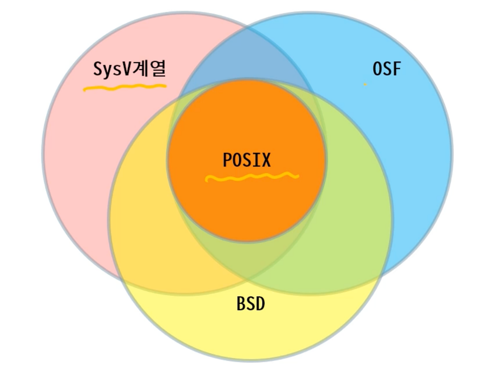
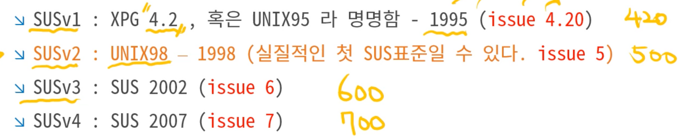
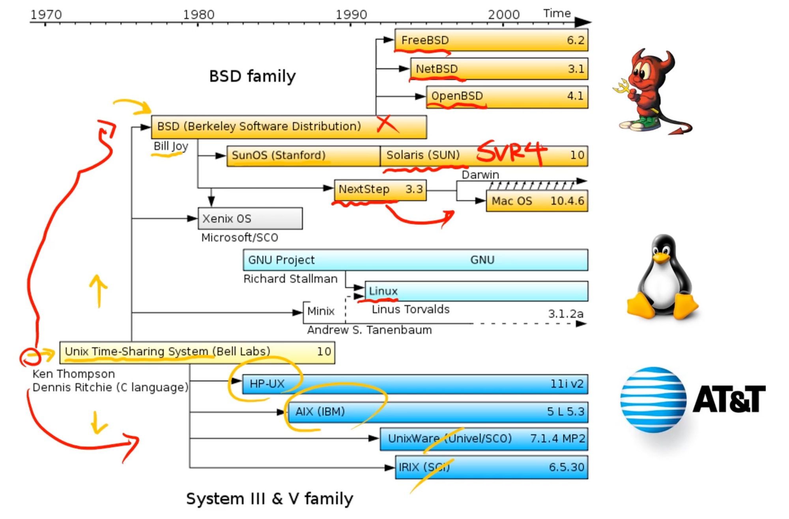

# Linux의 역사와 배포판
{: .no_toc }

## Table of contents
{: .no_toc .text-delta }

1. TOC
{:toc}

---

# Linux의 역사와 배경

- 표준안(Standards): 표준화된 지식과 규격은 호환성을 높이고, 효율적으로 협력가능한 작업을 가능하게 한다.
- 인터넷 검색을 통한 출처가 불문명한 문서와 출처가 애매한 책을 조심해야 한다. 따라서 항상 표준 문서와 공식 문서를 먼저 보는것이 중요하다.
- 어떤 기술이나 표준 규격이 등장하게 된 **인과 관계**를 알아두면, 현재 사용되는 기술들이 어떻게 변해가는지를 알 수 있다.
- 기술의 발전은 직면한 문제나 어려움을 해결하기 위해 만들어진다.
    - 점진적으로 진행되다가 특이점(Singularity)에서 점프하게 된다.
    - 기존의 것을 향사시키거나, 아예 버리고 새로 만들기도 한다.
- 기술의 생성 배경(철학)과 만든 사람을 기억하는 것이 원리를 파악하는데 큰 도움이 된다.

> 표준을 준수하는 것은 호환성(Compatibility)을 보장한다는 것이다. 컴퓨터 시스템에서 “개방적 호환성”은 “교환”의 효율을 높인다. 표준을 근간으로 만들어진 서비스는 다양하게 조합해도 동작이 보장된다. 또한 소프트웨어나 하드웨어들이 같은 규격내에서 경쟁을 하기 때문에 성능은 높아지고 비용은 감소하기 된다.

# C언어의 특징

- 어세블리어에 버금가는 성능
- 낮은 추상화 지원 → stdio, File 객체
- 저수준의 하드웨어 조작이 가능
- 쉬운 언어적 특성

> C언어는 하드웨어를 가리지 않고 동작하는 언어를 만들기 위해 탄생

# C언어의 국제 표준: ISO/IEC 9899

- ANSI-C (C89): 1989년도 표준, 최초의 C언어 표준
    - ANSI-C 이전의 C언어는 표준이 없는 무질서했다.
- C99: C89의 부족한 기능을 보완한 표준
    - restric pointer, Variable Length Array, Flexible array, members, …
- C11: 2011년도 표준
    - Generic, Atomic, Thread를 언어 레벨에서 지원

# UNIX의 분열: BSD(Berkeley Software Distribution)

- Ken Thompson이 안식년을 맞아 모교인 버클리의 객원교수로 가게 되면서 본격적인 연구가 수행되었다.
- C shell, 가상기억장치, TCP/IP 네트워킹이 도입되었다.
- BSD UNIX는 실험적이요 미래지향적인 기능을 테스트하는 용도로 발전되면서, AT&T UNIX와 차별성을 가지게 되는 계기가 되었다.
- 또한 당시는 지금처럼 인터넷이 발달되지 않아 개발자들간의 소통의 부재로 인한 개개인의 무분별한 기능 개발로 호환성은 떨어지게 되었다.
- 일부 벤더들이 기존 UNIX와의 차별점을 만들기 위해 호환되지 않는 기능들을 추가하고 개방하지 않음
    - 이에 반해 Linux는 기존의 POSIX, GNU에 기반한 공도체의 강력한 구심점으로 인해 분열이 일어나지 않았다.

# 호환성 문제

- SysV 계열과 BSD 계열의 경쟁은 호환성 문제의 원인이 되었다.
- 각 UNIX 벤더들마다 제품과 통신 및 매뉴얼이 상이한 문제 발생
    - 시스템 관리자들과 프로그래머들의 고충이 높아짐
    - JAVA 탄생의 모티브가 되기도 함
        - JAVA는 중간에 Byte 코드를 생성하고 이를 해석하는 방법으로 호환성 문제를 해결
- 미국의 전기전자공학회(IEEE)의 주도로 System call의 표준화 진행 → 1988년 POSIX(Portable Operating System Interface) 초안 발표: POSIX.1 1003-1988
    - POSIX 규격에 맞추지 않으면 미정부 조달 불가
    - POSIX는 느슨하게 작성되어 구현 방법과 같은 세부사항은 제약하지 않았다.
- AT&T와 Sun microsystems의 공조
    - POSIX는 정부 조달의 최소 기준이고, 더 넓은 의미의 산업계 표준(De facto)를 만들었다.
    - 업계 표준인 SVR4를 만들었다. Sun microsystems는 자사의 SunOS(BSD)를 Solaris (SVR4)로 개작

# OSF(Open Software Foundation)의 등장

- DEC, IBM, HP, Siemens, Apollo computer, Group Bull, Nixdorf computer
- AT&T, Sun의 독점을 막기위해 뭉칭 Minor vendor들이 설립한 비영리 단체
- OSF를 만들어서 표준앙을 제정, 통합 유닉스로서 OSF/1을 발표
- 결과적으로 표준안 제정이 아닌 새로운 UNIX family의 등장

# X/Open

- 1984년 유럽의 컴퓨터 제조업체들이 Open Systme의 표준화를 위해 출범된 단체
- 제조업자, 사용자 대표, 소프트웨어 벤더, 기관 등이 가입
- 표준화 제정이 아닌 교육과 전파하는데 주력
    - 가이드라인 배포: XPG(X/Open Portavility Guide)
- manual page(man ps)는 XPG의 산문이다.
- 1993년 Novell의 UNIX사업 실패로 X/Open에 UNIX 권리를 양도

# Single UNIX Specification (단일 표준안)

- POSIX의 부족한 호환성을 개선, 빌 게이츠의 등장으로 인한 sus의 출범
- 더군다나 XPG는 지침서(guideline)일 뿐, 강제성은 없었다.
- 모든 유닉스 업계와 우주의 힘을 모은 결과
- sus의 버전은 다음과 같다.

# UNIX 이후의 세계

- Linux는 임시 운영체제였다.
- Linux는 UNIX의 코드를 복사한게 아니기 때문에 호환성이 없다.

## GNU (Gnu is Not UNIX)

- Linux는 GNU의 컴파일러와 각종 유틸리티의 도움을 받아서 발전했다.
    - GNU의 각종 툴들이 포팅되면서 처음부터 POSIX 표준안에 근거하여 작성되었다.
    - Linux에서 커널을 제외한 나머지 부분은 GNU의 공로가 더 크다.

## FSF (Free Software Foundation)

- 소프트웨어의 자유로운 개발과 배포를 막는 기존의 상업적 지적재산권 제도가 SW발전을 저해하는 것을 막기위해 설립되었다.(1985)
- Linux는 GPL 공개라이선스를 따르고 있기 때문에 GPL 라이선스가 붙어있는 소프트웨어를 이용한다면 내가 개발한 소스코드 또한 공개 되어야한다.

# Linux의 성공 및 사이드 이펙트

- 소스 코드를 오픈하고 UNIX의 표준(POISX, SUS)를 받아들여 빠르게 시장의 규모를 키워냈고, 그 결과 단기간에 상업용 수준까지 발전했다.
- 당시  폐쇄적인 IT업계의 분위기로 인해 운영체제와 컴파일러들은 매우 비싼 소프트웨어였고 당연히 비싼 소프트웨어로 개발된 응용 프로그램도 비싸질 수 밖에 없었다. 이는 IT 전반의 발전을 느리게 했다.
    - 벤더들의 고압적인 태도로 OS에 존재하는 오류를 판단하거나 수정하기 어려워 지면서 고객들의 불만이 증가 → 이러한 요구를 충족시켜준 Linux를 자연스럽게 사용하게 되면서 서버 시장에 많이 사용되기 시작했다.

# Linux 배포판

- 소스 코드를 직접 받아서 컴파일 하는것은 비효율 적이기 때문에 미리 컴파일된 프로그램을 복사만 해주는 프로그램 관리자들이 등장하게 되었다.
    - 패키지: 소스 코드가 미리 컴파일되어 실행 가능한 형태
- 패키지 시스템에 따라 Linux의 계열이 달라진다.
- DEB 계열: Debian, Ubuntu, Mint, …
- RPM 계열: RHEL, CentOS, Fedora, Suse, …

# Summary

- Multic으로 부터 UNIX가 탄생 (Ken Thompson)
- AT&T와 BSD로 분리
    - 표준의 부재로 인한 무분별한 개발
- POSIX, X/Open, OSF/1의 관계
- System V release 4 (SVR4, 1988) 탄생 ⇒ 업계의 실질적 표준
- winsows NT로 인해 UNIX 업계의 통합 촉발
- SUS의 탄생
    - XPG: man page는 SUS에 기초한다.
    - IEEE std 1003.1은 무엇인가? POSIX.1