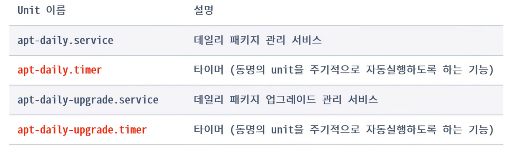
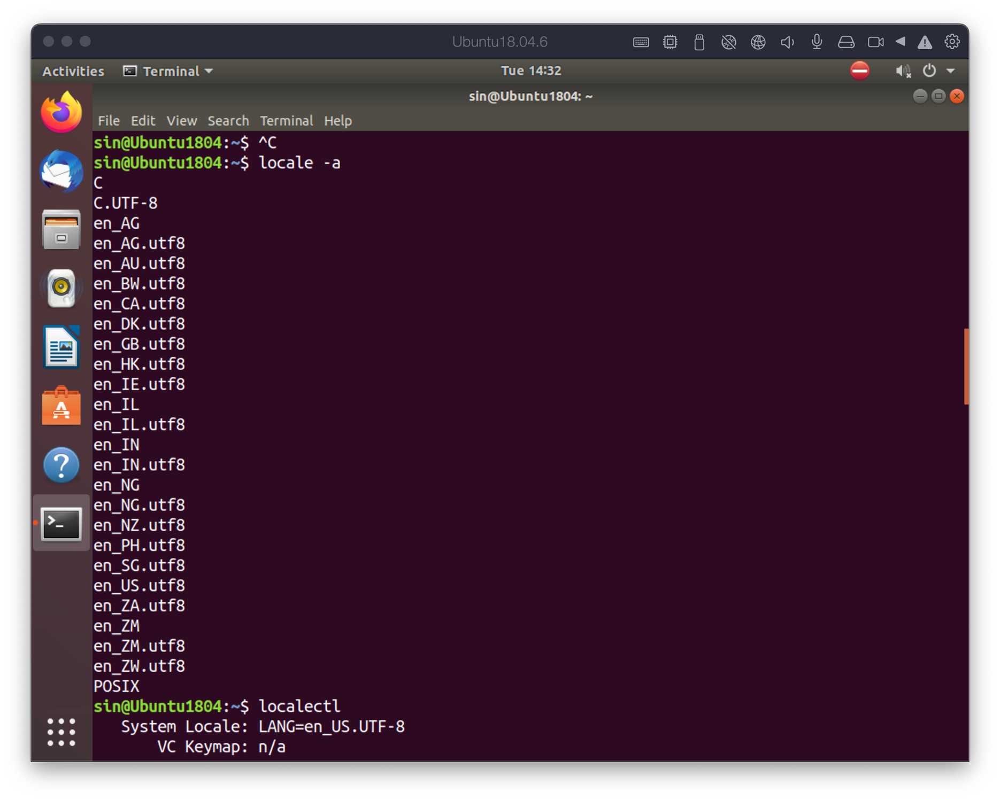
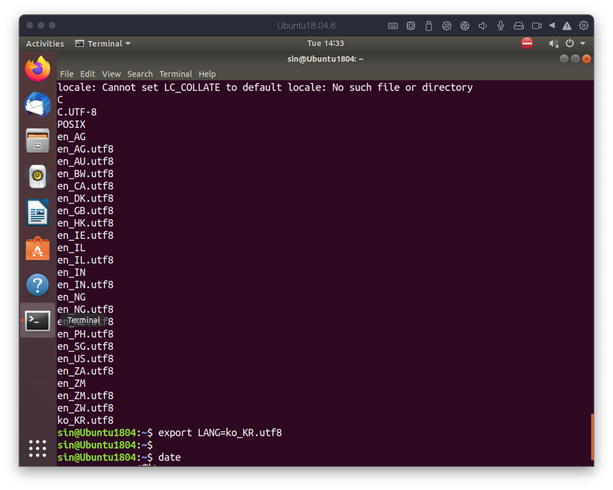

# Linux 설치 후 작업
{: .no_toc }

## Table of contents
{: .no_toc .text-delta }

1. TOC
{:toc}

---


# open-vm-tools 설치
- VMware로 설치한 경우에는 꼭 해줘야 하는 작업으로 화면 크기 및 여러가지 편의 기능을 사용할 수 있다.
- VMware의 vm-tools의 패지키 버전(pre-built)
- 주요 기능:
    - 화면 조절: 창 크기에 맞게 화면의 크기가 변경, 그래픽 가속으로 인한 속도 향상
    - 클립보드: 호스트 OS와의 클립보드 공유
    - 파일 복사: 드레그 앤 드롭을 통해 파일 공유

## 방법
```bash
$ sudo apt install open-vm-tools{,-desktop}
$ sudo reboot
```

# daily service 비활성화
- daily로 실행되는 패키지 유지보수 서비스는 시스템의 기동을 느리게 하거나 펜딩에 원인이 된다. 하지만 server로 사용하는 경우에는 사용이 권장된다.
- apt-daily.timer와 apt-daily-upgrade.timer를 꺼준다.



## 방법

```bash
$ sudo systemctl disable --now apt-daily.timer
$ sudo systemctl disable --now apt-daily-upgrade.timer
# 위 두 명령을 통해 서비스를 꺼준다.

$ sudo systemctl status [unit 이름]
```

# root 함호 설정

- root 계정의 암호를 변경한다.

## 방법

```bash
$ sudo passwd
```

# 폰트 설치
- 코딩에 적합한 fixed width font를 설치한다.


# LANG, LANGUAGE: locale/character set
- LANG 환경변수
    - locale + charactor set
    - locale: 사용자의 언어 및 지역정보
    - UTF-8: unicode 8byte
    - LANGUAGE: 언어의 우선순위를 설정
        - LANGUAGE=en:ko:ja (영어, 한글, 일본어 순)
    - locale “C”
        - C언어가 작동하기 위한 최소한의 locale을 의미한다. (영어?)


- 실습
    - 시스템에 설치된 locale을 확인하는 방법
        
        ```bash
        # 시스템에 설치된 locale 리스트를 모두 출력
        $ locale -a
        # systemctl이 도입되면서 locale 명령이 통합
        # localctl -h을 통해서 명령 옵션을 확인해보자
        $ localectl list-locales
        ```
        
    - 현재 터미널의 locale을 변경하는 방법
        
        ```bash
        # 우선순위는 설정하지 않아도 된다.
        $ export LANGUAGE=
        $ export LANG=en_US.utf8
        $ export LANG=en_US.utf8
        ```
        
    - 시스템의 locale을 변경하는 방법
        
        ```bash
        $ localectl set-locale LANG="en_US.utf8"
        
        # 시스템의 locale 정보를 확인할 수 있다.
        $ localectl status 
        ```
        



위 그림처럼 한국 locale 정보가 없는 경우 언어팩을 설치해주어야 한다.

```bash
$ sudo apt-get install language-pack-ko
```



다음과 같이 ko_RK.utf8이 정상적으로 설치된 모습을 확인할 수 있다. 추가적으로 date 명령을 통해 한국어가 정상적으로 표기되는지 확인할 수 있다.