# Linux 설치 후 작업
{: .no_toc }

## Table of contents
{: .no_toc .text-delta }

1. TOC
{:toc}

---

# Key word

- CLI command: Command Line Interface command

# Command completion
명령행 완성 기능 또는 auto-completion이라고 한다. 명령어의 일부분을 가지고 명령어를 완성시켜주거나 가능한 명령들을 알려주는 역할을 수행한다.

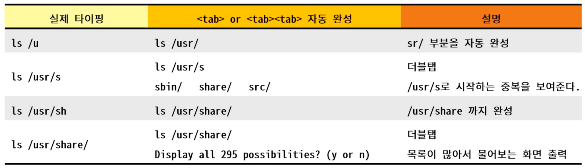

# 국제화 규격
internationalization ⇒ i18n은 i~n 사이의 alphabet 개수에 기인한다. 또한 UTF8이 기본문자 세트로 사용하는 시스템들을 의미한다. Linux/UNIX command는 i18n에 맞춰서 만들어져 있다. 때문에 LANG 환경변수에 영향을 받는다.

# File 관련 명령어
- file mode
    - 눈에 보이는 9bit와 눈에 보이지 않는 3bit를 포함해서 총 12bit로 구성된다. 9bit는 파일의 owner, group, others의 접근 권한을 의미하며, 나머지 3bit는 SetUID, SetGID, Sticky bit는 깊은 허가와 같이 보안과 관련된 요소들을 의미한다.
    - Symbolic mode: “rwx”로 표기
    - Octal mode: bit로 표기
    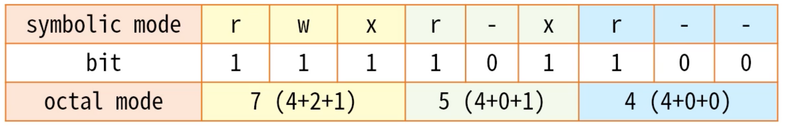
        
    - 파일 생성시 mode의 기본값은 umask를 뺀 나머지가 된다.
        - e.g. 디렉터리는 777 - 022 = 755, 파일은 666 - 022 = 644가 된다.
- pwd(Print Working Directory): 현재 디렉토리의 위치를 알려준다.
- cd(Change Directory): 작업 디렉토리를 변경한다.
    - / : 루트 디렉토리
    - ~ : 홈 디렉토리
    - - : 이전 디렉토리

> 경로에는 absolute path(절대 경로)와 relative path(상대 경로)가 있음

- ls (list): 디렉토리에 존재하는 파일들의 정보를 표시한다.
    - -a(all), -l(long), -t(sort), -r(reverse)
    - -: regular file, d: directory, l: symbolic link

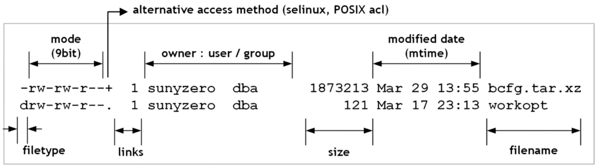
    
- mkdir [-p]  <directory name> 디렉터리를 생성하는 명령어이다.
- rmdir [-p] <directory name> 의 경우 디렉터리 안이 비워져 있어야 실행되기 때문에
    - rm -rf <directory name> 을 주로 사용한다.
        - -r(recursively), -f(force)
- chmod <mod> <file/directory name>
    - u+x, g=rx, o=: user에 실행권한 추가, group에 읽기, 실행권한만 추가, other은 모든 권한 제거
    - 디렉터리의 경우 파일들의 정보를 담고 있는 파일과 같다. 때문에 읽기 권한만 있는 경우에 안에있는 파일들의 목록은 볼 수 있지만, 디렉터리 안에있는 파일에는 접근하지 못한다.
        
        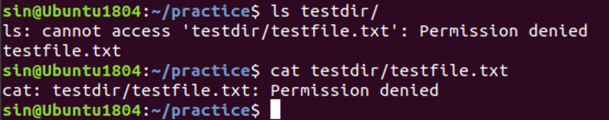
        
    - 반대로, 실행 권한만 있는 경우에 디렉터리 안의 파일들의 목록을 확인할 순 없지만, 디렉터리 안에있는 파일의 내용을 확인할 수 있다.
        
        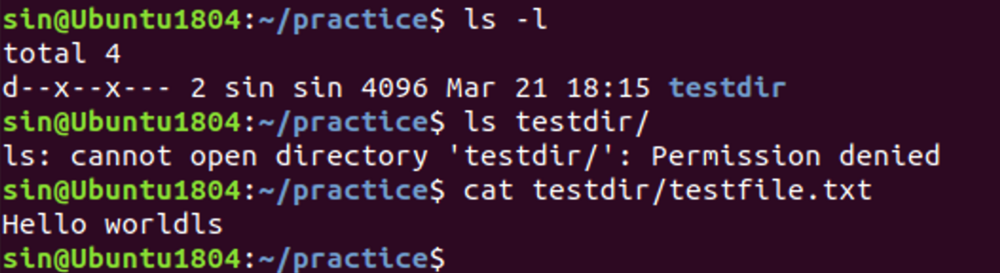
        
- cp(copy)
- mv(move, rename)
- rm(remove)
- chown(change owner): root 권한이 필요하다.
- chgrp(change group): root 권한이 필요하다.

> terminal 앞에 $는 일반유저, #는 root 권한을 가진 계정을 의미한다.

- file <file>: 파일의 타입을 확인
    - 파일은 고유 표식을 가지고 있고 이를 통해 파일의 종류를 분류할 수 있다.
    - 이런 이유에서 UNIX 계열에서 파일의 확장자는 중요하진 않다.
    - magic 데이터는 /usr/share/file/magic에 존재한다.
- stat(status) [option] <file>: file의 meta data를 출력한다.
    - meta data: 파일의 이름을 비롯한 생성 시간, 권한 등등
    
    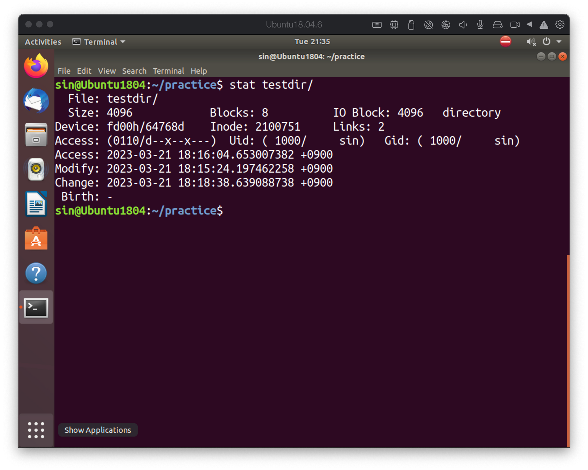
        
- touch <file>: 파일의 메타 정보를 업데이트하는 명령어이다. 주로 시간과 관련된 정보를 업데이트 한다. 만약 file이 없다면, 새로운 파일을 생성한다.
- file directory [expression]
    - n: 조건히 n 인 경우를 검색
    - +n: n보다 큰 경우를 검색(n 포함)
    - -n: 보다 작은 경우를 검색(n 포함)
    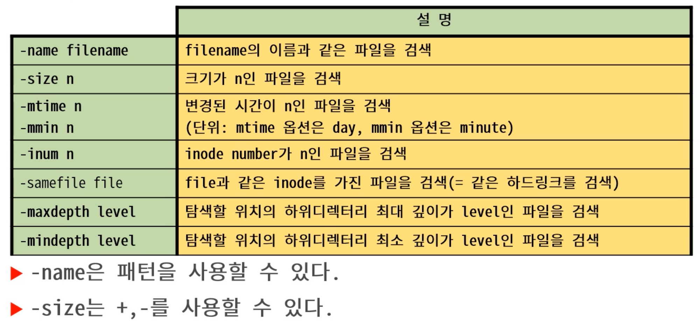
    
```text
alt + . ⇒ 마지막에 입력된 parameter를 의미하며, !$도 같은 의미이다.
$ find . -name ‘[89]*k.dat’ 
⇒ [89] 괄호 안에는 옵션을 의미한다. 8또는 9가 존재하는 데이터를 찾는다는 의미이다.
$ find -name ‘*.dat’ -a -size 1M
⇒ -a(and), -o(or)
$ find -name ‘*.dat’ -size 1M
⇒ and는 생략이 가능하다.
-size 옵션은 +와 -를 통해서 이상, 이하에 관한 설정이 가능하다.
-mtime -1 은 24시간 이전에 변경된 파일들을 검색한다. size와 마찬가지로 +, - 지정이 가능하다.
-maxdepth <number>: 최대 파일의 깊이를 설정하는 옵션으로 옵션들 중에 가장 처음에 와야한다.
```

- 검색 후 작업지시
    - find …. -exec 명령어 \;
    - find …. -exec 명령어 \+

```bash
$ find . -name “*.tmp” -exec rm {} \;
⇒ rm 명령이 검색된 파일 개수만큼 수행된다. {}에는 find의 결과가 들어온다.
$ find . -name “*.tmp” -exec rm {} \+ 
⇒ rm 명령이 한번만 수행된다.
```

# stdio (Standard Input/Output)

- file channel:
    - 파일을 입출력하기 위한 통로를 의미한다. 하드웨어에 직접 접근하지 않고, 표준화된 입출력 방식을 통하도록 하는 가상화 레이어의 일종이다. 때문에 하드웨어를 몰라도 접근이 가능하다. C언어의 I/O 인터페이스의 심플함을 가능하게 한다. 파일 입출력을 위한 메타 정보를 가지를 객체로 프로세스가 끝나면 사라진다.
- file descriptor(파일서술자):
    - 파일 채널에게 붙여지는 유일한 식별자(idenrifier), 숫자로 명명하며 숫자 0부터 시작한다. 예약된 파일서술자 3가지가 존재한다. 0: stdin (standard input, 표준입력), 1: stdout(standard output, 표준출력), 2: stderr(standard error, 표준에러)
        
    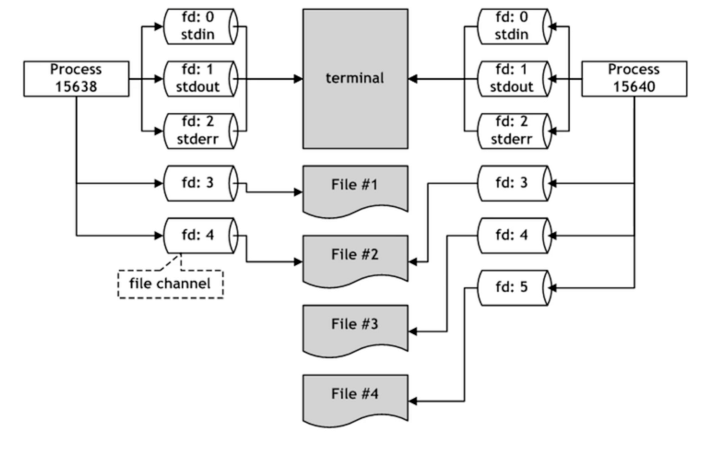
        
    - fd는 하나의 프로세스 안에서만 존재하기 때문에 번호가 같더라도 다른 파일을 가르키고 있을 수 있다.
    - fd는 가장 작은를 우선적으로 배정한다.

# PIPE
- 프로세스 사이의 통신을 지원
    - IPC(Inter Process Communication)의 일종
    - shell에서도 많이 사용하는 기능
- pipe는 이름의 유무에 따라서 두 종류로 구분된다.
    - named pipe ⇒ temporary
    - anonymous pipe ⇒ persistency
        - 프로세스들을 직렬 연결하며, 명령행에서 Vertical bar(|)로 사용한다.
        - A | B | C ⇒ A의 출력이 B의 입력으로 들어가고 B의 출력이 C의 입렬으로 들어간다.

```bash
- pipe를 이용한 명령 수행, find 명령의 출력이 fd1 이라면, wc의 입력은 fd0이 될 수 있다.
$ find ~ | wc -l

pipe를 사용하지 않고 위 명령을 수행하는 경우
$ find ~ > tmp.txt; wc -l < tmp.txt; rm tmp.txt
```


# Redirection (방향재지정)

- 채널의 방향을 다른 곳으로 연결
```bash
# ls 명령의 출력 filelist.txt 파일로 저정한다.
$ ls > filelist.txt 
# 예약 파일 서술자인 stderr을 통해서 파일로 저장하라는 의미이다. >은 1>과 같다.
$ strace ls 2> strace.txt
```
    

# 파일 압축(compress)과 보관(archive)

- 아카이브 유틸:
    - tar(tape archive) [ctxv] [f archive-file] filese
        - c(create), t(test), x(extract), v(verbose): 디버깅이나 확인 용도로만 권장
        ``` 
        $ tar c *.c > arc_c.tar
        # f 옵션을 통해 방향재지정 없이 명령을 수행할 수 있다.
        $ tar cf arc_c.tar *.c
        ```

    - cpio

- 압축 유틸: xa(텍스트 압축률 우수), zstd(멀티 스레드 지원으로 속도가 빠름),
    - gzip [-cdflrv] <file>
        - -d: 압축해제, -c: 표준 출력(stdout)으로 결과를 출력, -1 ~ 9 (fase, better): 압축 레벨 지정
    
    <aside>
    💡 # 압축
    $ tar c /etc/*.conf | gzip -c > etc.tar.gz
    # 해제
    $ gzip -cd etc.tar.gz | tar x
    
    </aside>
    
    - bzip [-cdfv] <file>
        - gzip과 옵션은 비슷하며 멀티스레스 사용에 관한 옵션이 추가적으로 사용된다(-T0은 자동판단 , 개수를 입력하면 개수만큼 스레드 사용).
    - zstd [options] [-| input-file] [-o output-file]
        - xz와 옵션은 비슷
        - -#: 압축 레벨을 지정(기본 압축률이 높음)
    
    <aside>
    💡 # 모던 명령어, a 옵션을 넣어주면 파일 확장자를 통해 압축 방식을 자동으로 결정한다.
    $ tar cfa bak_data.tar.xz ./data ./exp
    $ tar cfa bak_data.tar.zst ./data ./exp
    
    # 하지만, 위 방법은 멀티스레드를 사용할 수 없다. 그래서 다음과 같은 명령을 통해 해결한다.
    $ tar c ./data ./exp | xz -T0 > bab_data.tar.xz
    $ tar c ./data ./exp | zstd -T0 > bak_data.tar.zst
    
    </aside>
    

# Link

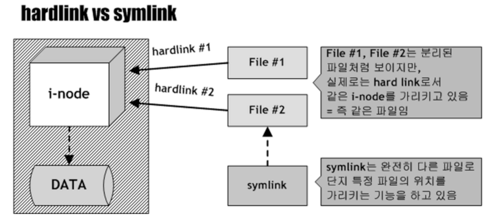

- i-node:
    - 파일당 하나있 존재하며, 실제 물리 데이터에 접근할 수 있도록 도와주는 역할을 수행한다. i-node number를 통해 관리되며, disk partition(or volume) 내에서 유일한 식별자이기 때문에 식별자가 같더라도 디스크가 다르면 다른 파일을 가르킨다. 그 외 시간 관련 정보, 사이즈, 소유권, 권한 등의 meta 정보를 가지고 있다.
- Hard link:
    - 동일 파티션 내에서만 생서잉 가능하다.
    - i-node에 접근하는 통로 역할을 수행하며, 실제 파일이라고 볼 수 있다.
    - regular file에 대해서만 생성이 가능하기 때문에 directory나 device file 등은 생성할 수 없다.
        
    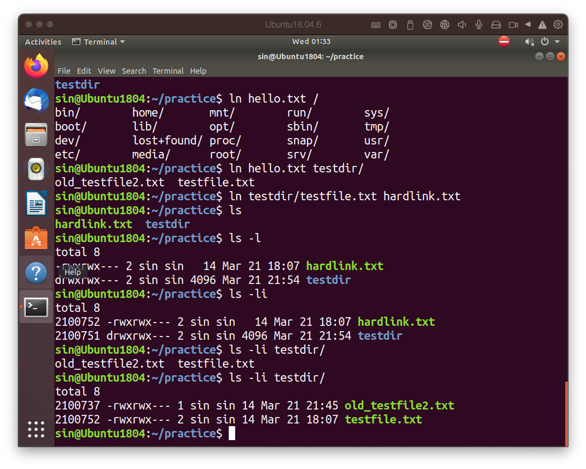
            
    ```bash
    # hard link 만들기
    $ ln <target file> <link file>
    
    # i-node 번호 확인
    $ ls -li
    ```
        
- Symbolic link(symlink):
    - 어떤 파일의 특정 경로명을 가르키는 역할을 수행, 원본 파일이 삭제되었다 다시 만들어져도 잘 동작하는 특징이 있다.
    - 위치만 가르키기 때문에 다른 파티션, 모든 종류의 file에 대한 파일 생성이 가능하다.
    - 가르기는 대상의 mod를 따라가며, symlink의 mod는 항상 777로 나타난다.
            
    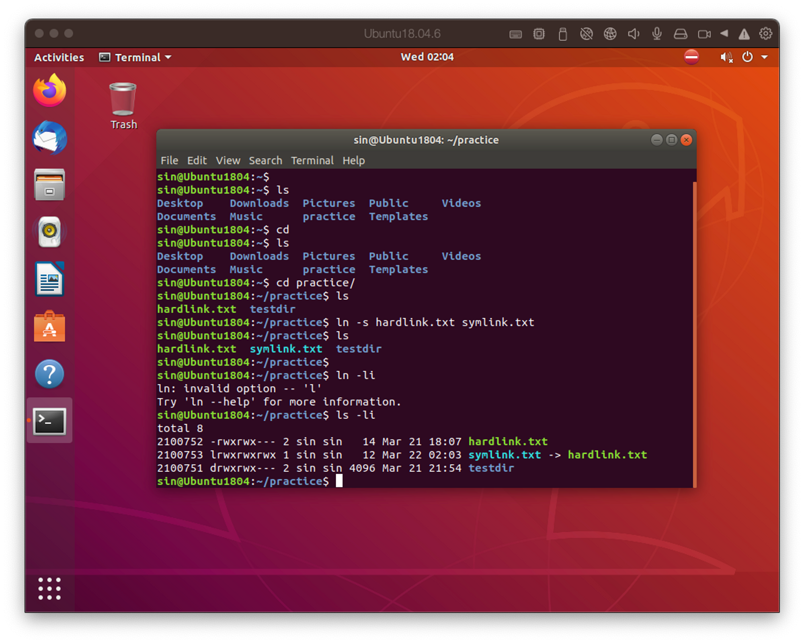
        
    ```bash
    # symbolic link 만들기
    $ ln -s <target file> <link file>
    
    # i-node 번호 확인
    $ ls -li
    ```
    
    ```bash
    # symbolic 링크를 만드는 경우 상대 경로로 지정하면 링크가 깨질 수 있다.
    $ ln -s testfile.txt ../symbolic.txt
    # 따라서 다음과 같이 r 옵션을 붙여주면 자동으로 상대 경로를 계산해준다.
    $ ln -sr testfile.txt ../symbolic.txt
    # 가장 좋은 방법은 링크를 만들 디렉토리로 이동해서 링크를 생성하는것이 좋다.
    ```
        
- readlink
    - Symlink가 여러 단계에 걸쳐 링크가 링크를 가르키고 있는 경우에 마지막 링크의 이전 혹은 마지막 링크까지 모두 정상적으로 연결되어 있는지를 확인하는 명령이다. 이렇게 연결된 것을 canonical path 라고 한다.
    - readlink -f <symlink>
    - readlink -e <symlink>
        - e.g. A→B→C→D→E 와 같이 여러 링크를 걸쳐 링크가 연결된 경우, -f 옵션의 경우 D까지 존재하는 경우 확인, -e 옵션의 경우 모든 링크가 존재하는지를 확인한다.
        
        ```
        canonicalization이란?
        옆집 주소와 같은 상대적인 개념은 ~의 옆집 이라는 ~가 정의되지 않으면 어디를 가르키고 있는지 정확하게 알 수 없다. symlink 또한 실체를 가르키고 있는 개념이 아니기 때문에 실제로 링크를 따라가면서 실체를 확인해야 한다. 이때 여러 링크에 걸쳐 연결된 경우 이를 확인하는 과정을 canonicalize 라고 한다.
        ```
 
    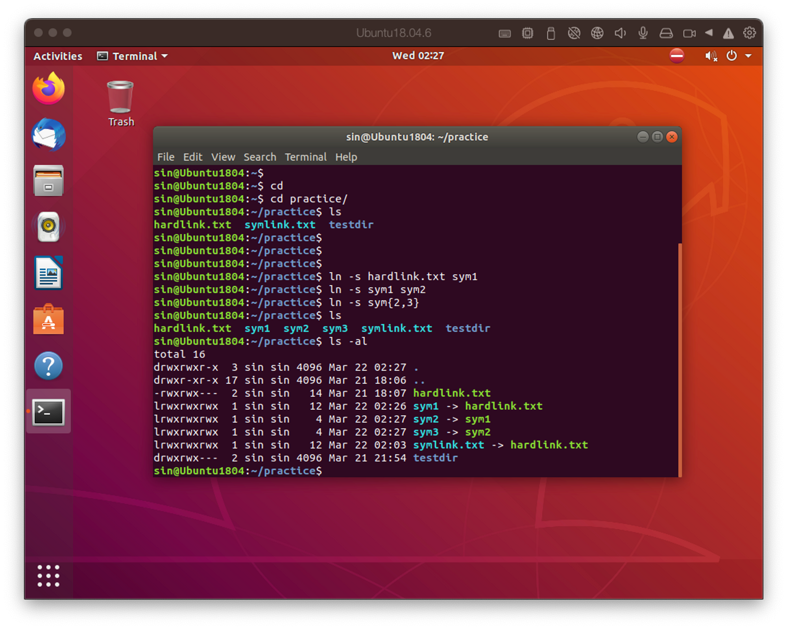

# kill

- 시그널은 전달하는 명령, 프로세스 중단 외에도 다양한 기능을 포함하고 있다.

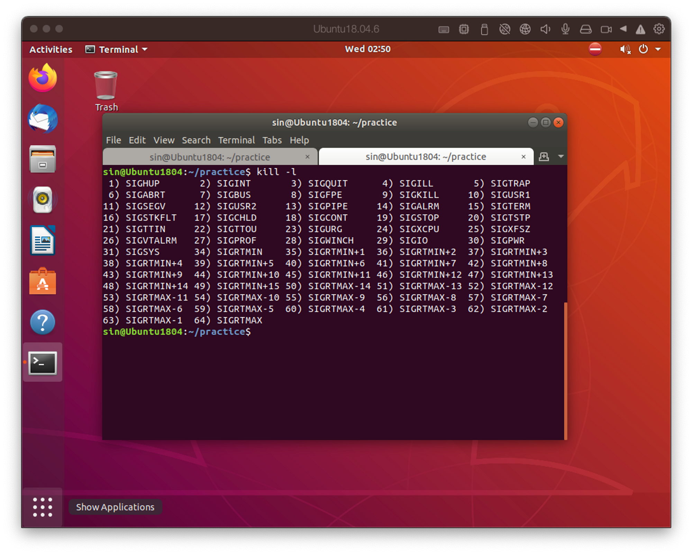

- SIGHUP: Hang up ⇒ 중단
- SIGINT: Intertupt <CTRL-C>
- SIGQUIT: Quit <CTRL-\> ⇒ 메모리를 덤프하기 때문에 디버깅 과정에서 사용될 수 있다.
- SIGKILL: kill ⇒ 프로세스를 강제로 종료
- SIGTERM: Terminate ⇒ 프로세스 종료 요청
- SIGSEGV: Segment violation ⇒ 메모리 침범에 의한 종료
- SIGTSTP: Temporary stop <CTRL-Z> ⇒ 일시 중지

```bash
$ kill <PID>
$ kill -QUIT <PID>
$ kill -9 <PID>
```

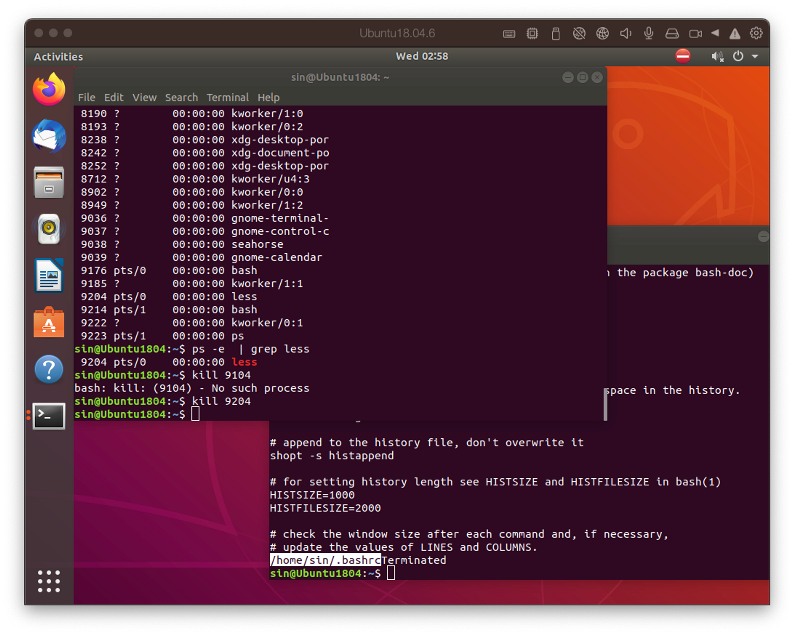

# Process control

- fore-ground process: 현재 **session**에서 제어 터미널(**controlling terminal**)을 가진 프로세스
- back-ground process: 현재 **session**에서 제어 터미널(**controlling terminal**)을 잃어버린 프로세스

## Session

- 세션은 멀티유저 시스템에서 통신 객체(seat or remote)를 구별하기 위해 사용된다. 세션은 제어 터미널을 가질 수 도 있다.
- SID(Session ID)와 PID(Process ID)가 같은 경우에는 Session learder라고 하며, 동시에 Process Gruop Leader가 된다. Leader는 시그널 전파 기능을 갖는다. kill 명령에서 PID에 -를 붙이면 프로세스 그룹에 시스널을 전파하는 것이다.
- 세션 Leader로 파생된 자식 프로세스는 모두 같은 세션을 갖는다. 이는 Session에 속한 제어 터미널을 소유할 수 있다는 의미로, logout하는 경우 세션에 속한 모든 프로세스들은 종료된다.

## Controlling terminal

- 사용자의 제어(키보드 입력과 같은)를 받는 터미널 장치를 의미한다. 제어 터미널을 소유한 프로세스는 키보드 입력을 받을 수 있다. 이런 프로세스를 fore-ground process라고 한다.

```
deamon이란?
Orphan process 혹은 Session leader로써 stdio를 모두 /dev/null로서 출력이 없으며, 제어 터미널을 소유하지 않는 프로세스를 의미한다. 주로 back-ground에서 동작하는 프로세스의 형태를 갖는다.
```

## Commands

- jobs
    - stoped, back-ground process의 리스트 출력
- fg %#
    - 지정한 프로세스를 fore-ground로 전환
    - %는 생략 가능하며, #은 작업 번호
- bg %#
    - 정지된 백그라운드 프로세스를 running 상태로 변경
- command &
    - command를 back-ground에서 running 상태로 실행