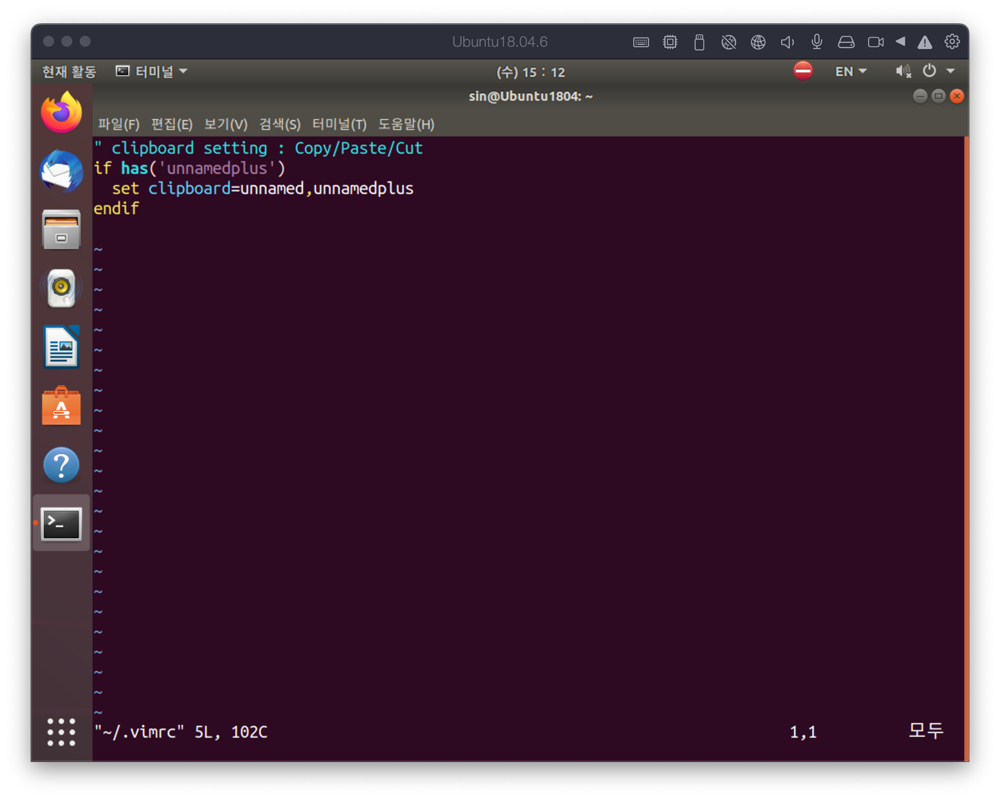
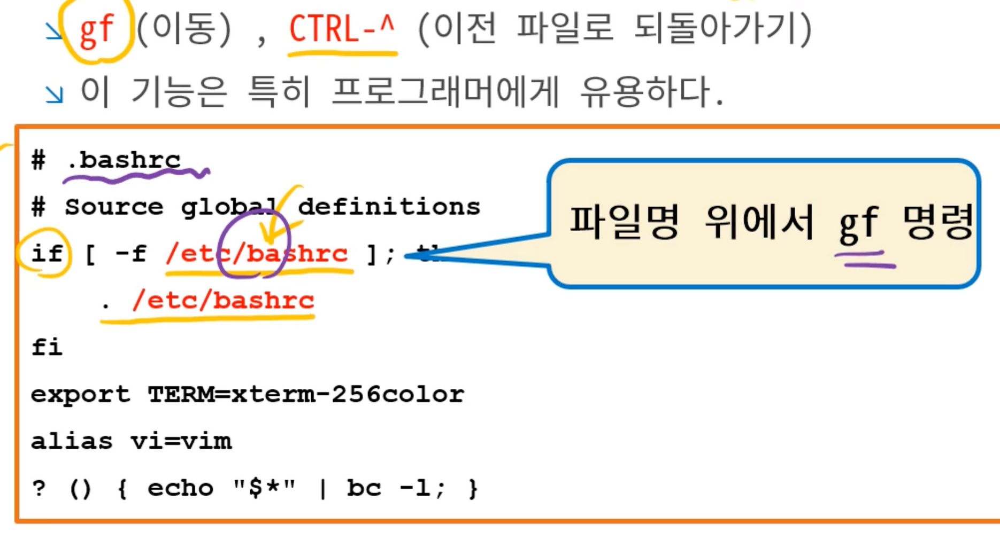
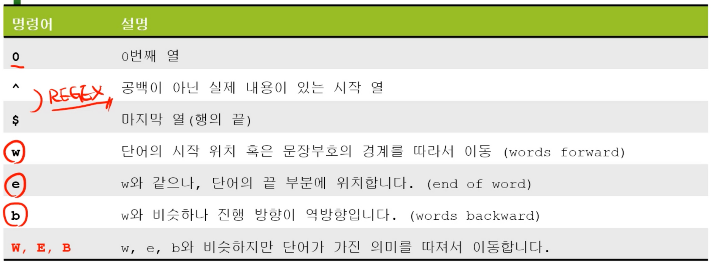

# Vim editor
{: .no_toc }

## Table of contents
{: .no_toc .text-delta }


# vi (visual editor)
UNIX와 Linux에서 가장 많이 사용하는 에디터로 1976년 BSD의 Bill joy가 개발했다. vi가 없던 시절에는 ed(line editor)를 사용해서 개발을 했는데 이때는 선언된 모든 함수를 외우고 있어야 개발이 가능했다.


# vim (vi improved)
- vim은 vi의 모든 기능을 포함하며, 추가적인 확장 기능을 가지고 있었다. 또한 대부분의 UNIX에서 complementary package로 제공되었다.
- vim은 Linux, UNIX, Mac OSX, winsdows을 지원한다.
- 기본적으로 깔려있는 vim은 최소한의 기능을 가지고 있기 때문에 추가적으로 설치를 수행해야 한다.

```bash
$ sudo apt install vim
```

- vim 설치 과정에서 의존성 문제가 발생하는 경우

```bash
$ sudo apt edit-sources
```


## vim [filename]

```bash
$ vim mytext.txt
```

```bash
# '-' stdin을 의미하며, pipe로 넘어온 결과를 받을 때 사용한다.
$ find . -name "*.txt" | vim -
```

# Modes


vim에는 일반 모드(nomal mode), 입력 모드(insert mode), 명령행 모드(command line mode)가 존재한다.

## Keys

- a, A(append): 현재 커서 위치에서 한 칸 뒤로 이동한 후 입력 모드로 전환
- i, I(insert): 현재 커서 위치에서 입력 모드로 전환
- o, O(open line): 현재 행의 맨 앞으로 이동 후, 입력 모드로 전환
- R(replace): 수정 모드로 입력하는 문자로 현재 입력된 문자를 대치하는 모드로 전환


- 대소문자에 따라 동작이 다르다.


- 일반 모드에서 앞에 숫자를 붙이면 해당 명령의 반복 횟수를 의미한다.
- [#]h: 좌로 #만큼 이동
- [#]j: 아래로 #만큼 이동
- [#]k: 위로 #만큼 이동
- [#]l : 우로 #만큼 이동
- ^: 행의 맨 처음으로 이동
- $: 행의 맨 끝으로 이동
- CTRL+B: 위로 한 화면 스크롤
- CTRL+F: 아래로 한 화면 스크롤
- CTRL+U: 위로 1/2화면 스크롤
- CTRL+D: 아래로 1/2화면 스크롤
- [#]gg, [#]G, :# : #행으로 이동
- :file: 형재 문서 위치 정보를 하단에 표시

```
vi와 vim의 차이? 
vi의 3가지 모드? 일반모드, 입력모드, 명령행모드
cursor 이동
```

# 일반 모드 기능

## buffer: delete, cut
vi에서의 삭제는 임시 버퍼에 저장된다.

- x: 커서에 위치한 문자 삭제
- :d, dd: 커서가 위치한 행을 삭제
- D: 현재 컬럼 위치에서 행의 끝부분까지 삭제
- J: 아래 행을 현재 행의 끝에 붙임

## buffer: paste
- p: 현재 행에 붙여 넣음
- P: 현재 행 위에 붙여 넣음
- :pu:

## buffer: copy
- y, yy(yank), :y: 커서가 위치한 행을 복사

## buffer: undo/redo
- u(undo): 이전에 수행한 한 명령을 취소
- CTRL-R(redo): 이전에 취소했던 명령을 다시 실행

## range
행의 범위를 지정

| 기호 | 의미 |
| --- | --- |
| . | 현재 행을 의미 |
| $ | 마지막 행을 의미 |
| +# | 현재 위치에서 #만큼 아래 행을 의미 |
| -# | 현재 위치에서 #만큼 위 행을 의미 |
| % | 문저(파일) 전체를 의미 |
| :20 | 20번 행 |
| :10, 25 | 10부터 25번 행을 의미 |
| :10, $ | 10행부터 마지막 행을 의미 |
| :., +20 | 현재 행 부터 아래로 20행까지를 의미 |
| :-10, +5 | 현재 행부터 위로 10행, 아래로 5행을 의미 |
| :40pu | 40번 행에 레지스터의 내용 붙여넣기 |

## visual mode: drag
- 범위를 지정한 상태에서 ‘:’을 눌러 범위 기호들을 사용할 수 있다.

| 명령 | 설명 |
| --- | --- |
| v | 일반 비주얼 모드로 현재 커서 위치에서 블록을 지정 |
| V | 현재 커서가 위치한 행에서 행 단위로 블록을 지정 |
| CTRL-V | 열 단위로 블록을 지정 |

```
buffer 사용 방법?
visual mode 전환 방법?
```

# Clipboard
vimx는 vim+clipboard, X window clipboard 기능이 포함된 데이터이다. clipboard 기능을 사용하기 위해서는 vimx를 설치해야 한다.

## 설치 방법

- 일반 vi

```bash
# RedHat
$ yum install vim-X11
$ yum remove vim-X11
# Debian
$ sudo apt install vim-gnome
$ sudo apt --auto-remove remove vim-gnome
```

- vim 설치 후 추가된 기능을 확인할 수 있다.


- vimx 설치 후, ~/.vimrc 파일을 다음과 같이 입력한다.



- 해당 설정을 마무리 하고 나면, gedit와 vim 사이에 클립보드가 공유되는 것을 확인할 수 있다.


# vim의 옵션

## .vimrc의 옵션들

| 명령어 | 설명 |
| --- | --- |
| :set | 현재 옵션 설정을 보여줌 |
| :set all | 모든 옵션 설정을 보여줌 |
| :set [no]name | name에 해당하는 옵션을 on/off함, no가 붙은 경우 off 상태를 의미 |
| :set name! | name 옵션의 on, off를 toggle |
| :set name=value | name 옵션에 value의 값을 할당 |


- 옵션 설정

| :set nu | 라인 번호를 출력 |
| --- | --- |
| :set rnu | 현재 행을 기준으로 상하의 상대적 행번호를 표시 |
| :set ai | (auto indent) 자동 들여쓰기 |
| :set cindent | C언어 스타일의 들여쓰기 |
| :set ts=value | (tabstop) 화면에 표시 될 탭 크기를 지정, 기본 8칸 |
| :set sw=value | (shiftwidth)자동 블록 이동시 열의 너비 |
| :set fencs=value | (fileencodings) 지원할  파일 인고딩 방식 리스트 |
| :set fence=value | (fileencoding) 현재 파일 인코딩 방식을 지정 |

# 문자열 관련 기능

## Formatting
- center #, right, left: 커서가 위치하는 행의 문자열을 중앙 혹은 좌우로 배치한다.

## Find

| 명령어 | 설명 |
| --- | --- |
| fo | 문자 o를 전방 방향으로 검색 |
| Fo | 문자 o를 후방 방향으로 검색 |
| ; | 최근 검색을 재검색, 검새 |
| , | 최근 검색을 반대 방향으로 재검색 |
| /string | string을 전방 방향으로 검색 |
| ?string | string을 후방 방향으로 검색 |
| * | 현재 커서에 위치한 단어를 전방 방향으로 검색 |
| # | 현재 커서에 위치한 단어를 후방 방향으로 검색 |
| n | 다음 탐색 결과를 탐색 |
| N | 다음 탐색 결과를 반대 방향으로 탐색 |
| % | 괄호의 짝으로 이동 |
| /\cstring
/\Cstring
:set ignorecase
:set noignorecase | 대소문자 구분없이 string을 탐색한다는 의미
 |
| /[a-g]re | a,b,c,d,g중 하나와 re가 붙은 단어 검색 |
| /\M [string] | 정규표현식인 []를 문자열로 해석 |

## 개행문자

DOS,Winsows와 UNIX의 개행 문자가 다르기 때문에 문자가 한줄로 출력되거나 소스 코드의 제대로 동작하지 않을 수 있다. 이때, :set ff=dos 혹은 :set ff=unix로 설정 후 저장하는 방법을 사용한다.

# File

## Buffer와 Register

- buffer: 파일을 편집하기 위한 임시 공간, 파일명을 입력하지 않고 vi 명령을 수행하면 작성되는 파일이 저장되는 공간을 의미한다.
- register: 텍스트 일부를 저장하고 있는 임시 공간, vi에서 삭제한 정보들이 임시 저장되는 공간이다.
- vim에서 다른 파일을 편집하려고 할 때,

| :e [filename] | filename을 편집 모드로 불러옴 |
| --- | --- |
| :e #[count] | count번째 파일을 불러옴 |
| :find filename | filename에 해당하는 파일을 검색하여 불러옴 |
| CTRL-^ | 명령어 단축키로서 “:e #”과 동일 |

## 파일 저장

| :up | 변경된 부분이 있는 경우에만 :w 명령을 수행 |
| --- | --- |
| :x, ZZ | up + quit을 합친 명령 |

# Split

vim의 화면을 분할하여 하나의 파일 혹은 여러 파일을 동시에 열어 편집이 가능하다.

| CTRL-W + s | 수평 분할 |
| --- | --- |
| CTRL-W + v | 수직 분할 |
| CTRL-W +  w | 다음 분할 화면으로 커서 이동 |
| sp [filename] | filename에 해당하는 파일을 수평 분할하여 불러옴 |
| vs [filename] | filename에 해당하는 파일을 수직 분할하여 불러옴 |
| new
CTRL-W + n | 수평 분할 후, 위에 새로운 창을 생성 |
| vnew
CTRL-W + v | 수직 분할 후, 왼쪽에 새로운 창을 생성 |
| CTRL-W + = | 모든 창의 크기를 동일하게 조절 |
| CTRL-W + [#]+ | # 크기 만큼 창의 크기를 늘림 |
| CTRL-W + [#]- | # 크기 만큼 창의 크기를 줄임 |
| vim -d file1 fil2 | file1과 file2를 동시에 열어서 두 파일이 다른 부분을 강조
소스코드 비교 혹은 설정 파일을 비교할 떄 많이 사용 |

# Tabpage

화면 분할은 모니터가 작은 경우에 문서를 편집하기가 어렵다. 이럴때 사용하면 좋은 방법이 탭으로 여러 문서를 여는 것이다.

```bash
vim -p file1 file2 file3
```

| [#]tabe[dit] file | #번째 탭에 파일을 연다, #이 생략된 경우 현재 탭 바로뒤에 생성 |
| --- | --- |
| [#]tabnew file | #번째 위치에 비어있는 탭을 생성 |
| [#]tabc[lose] | #번째 탭을 종료, :q를 통해서도 가능 |
| [#]gt | #번째 탭으로 이동, #이 지정되지 않으면 다음 탭으로 이동 |
| [#]gT | #번째 탭으로 이동, #이 지정되지 않으면 이전 탭으로 이동 |

# Goto file

경로를 인식해서 해당 파일을 바로 열어 확인할 수 있도록 도와준다.



| gf | 커서 위치의 파일을 불러옴 |
| --- | --- |
| CTRL-W f | 커서 위치의 파일명을 분할된 창에 불러옴 |
| CTRL-W gf | 커서 위치의 파일명을 새로운 탭에 불러옴 |
| CTRL-^ | 이전 파일로 되돌아 감 |

# Encoding


## fileencodings (fencs)

파일을 읽을 때 확인할 encoding list를 읽고 encoding을 처리하기 때문에 .vimrc에 미리 설정되어 있어야 multi-bytes 기반의 인코딩 파일을 읽을 수 있다.

```bash
:set fencs=ucs-bom,utf-8,korea,latin-1
# BOM -> utf-8 -> korea -> ASCII 순서로 확인
```

## Linux to Windows

리눅스에서 작성된 파일을 윈도우로 그냥 옮기게 되면 인코딩 문제로 파일 내용이 제대로 표시되지 않을 수 있다. 이러한 문제를 해결하기 위해서는 두 가지 변환 과정을 거쳐야 한다. 먼저 개행 문자를 윈도우 스타일에 맞게 변경 해주어야 한다. 다음으로 한글에 관한 인코딩을 수정해야 한다.

1. :set ff=dos
2. :set fenc=korea
3. :wq or :sav new_dosfile.txt

## Windows to Linux

fencs가 제대로 설정 되어있다면 실행시 자동으로 변환되지만, 설정되있지 않다면 다음과 같은 과정을 통해 수동으로 변활할 수 있다.

1. :set ff=unix
2. :set fenc=utf8
3. :wq or :sav new_unixfile.txt

# 편리한 기능

## 단어 단위 이동

w와 e를 통해 단어 단위의 커서 이동이 가능하다. w의 경우 다음 문자의 앞에서 멈추는 특징이 있고, e는 현재 문자의 끝에서 멈추는 특징이 있다.

