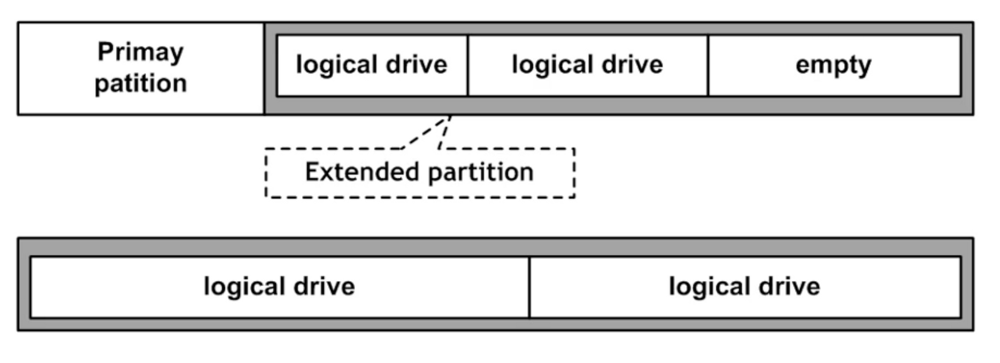
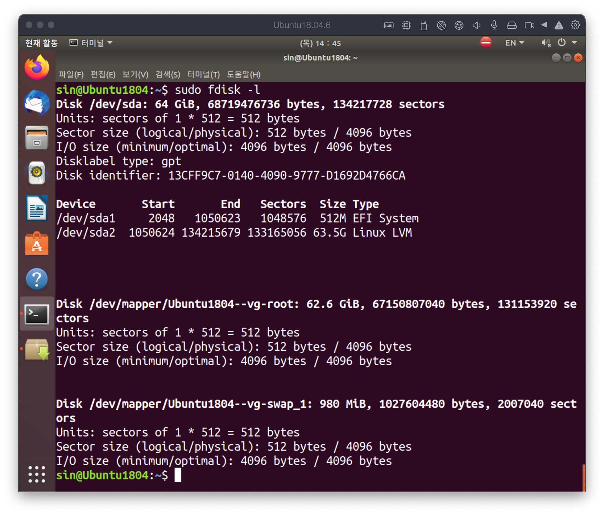
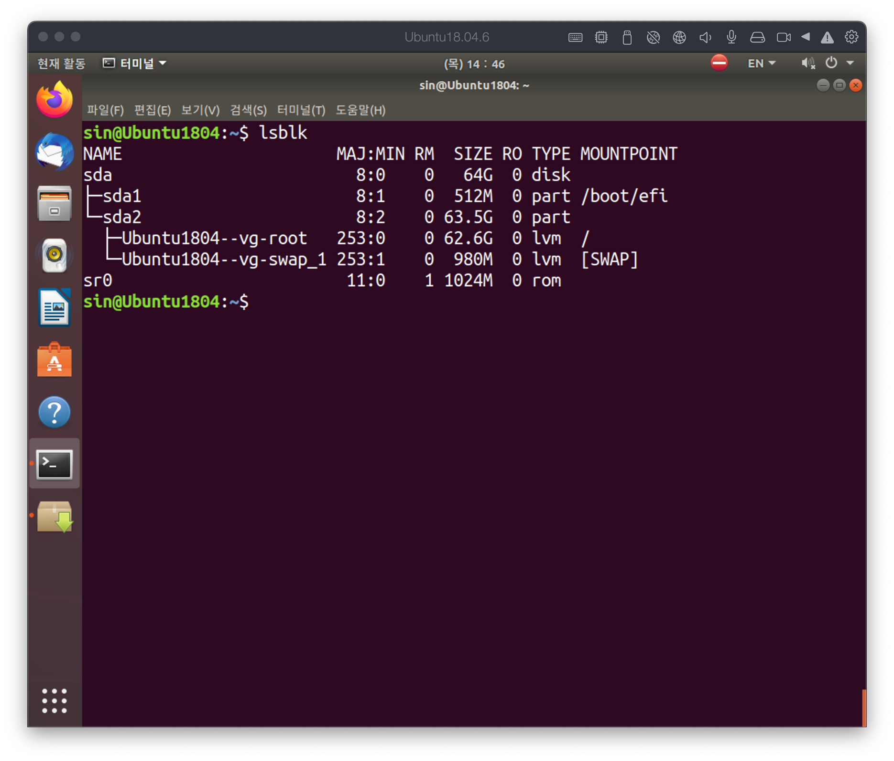
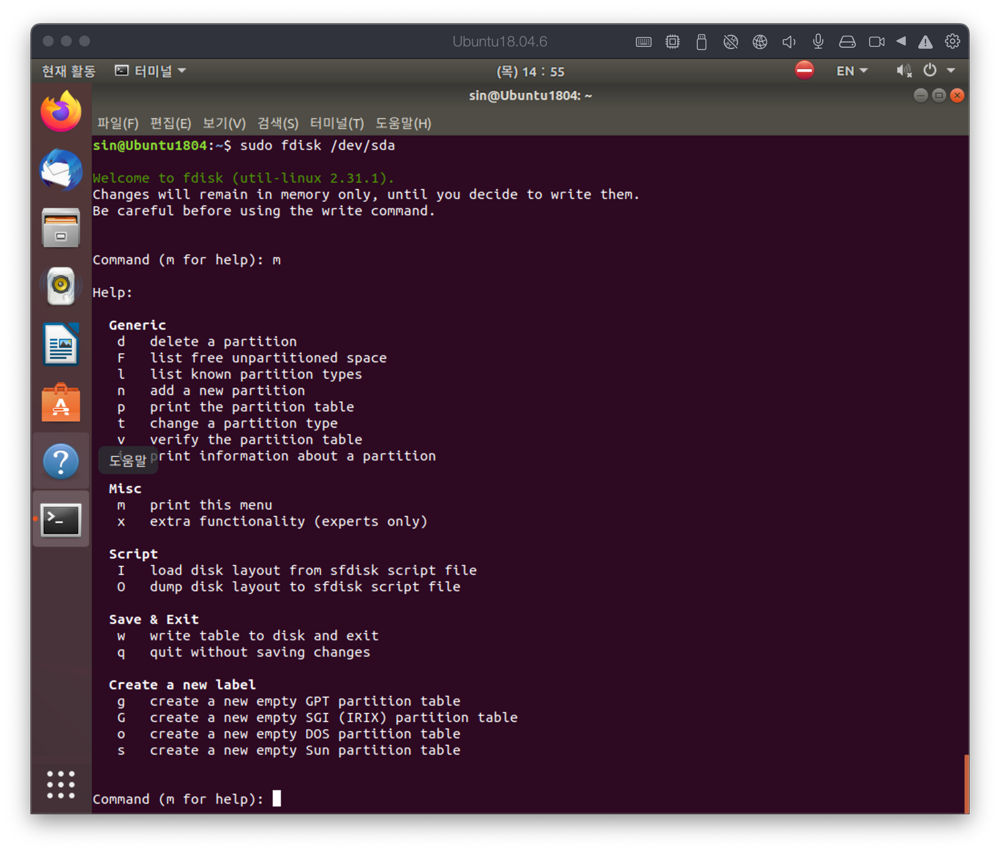
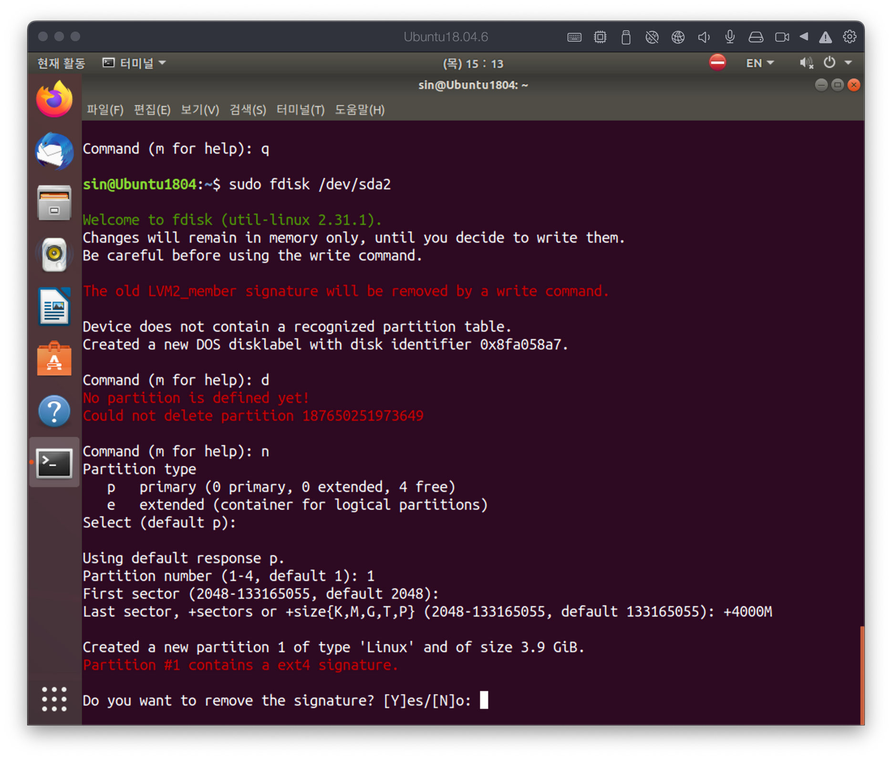
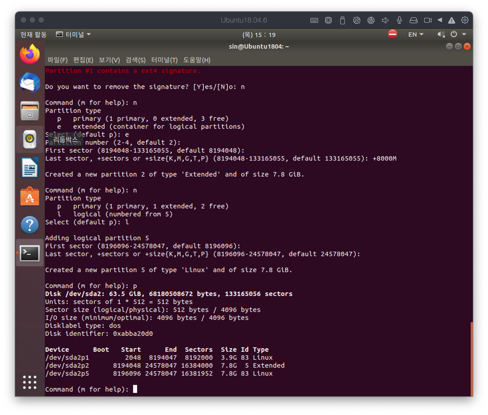
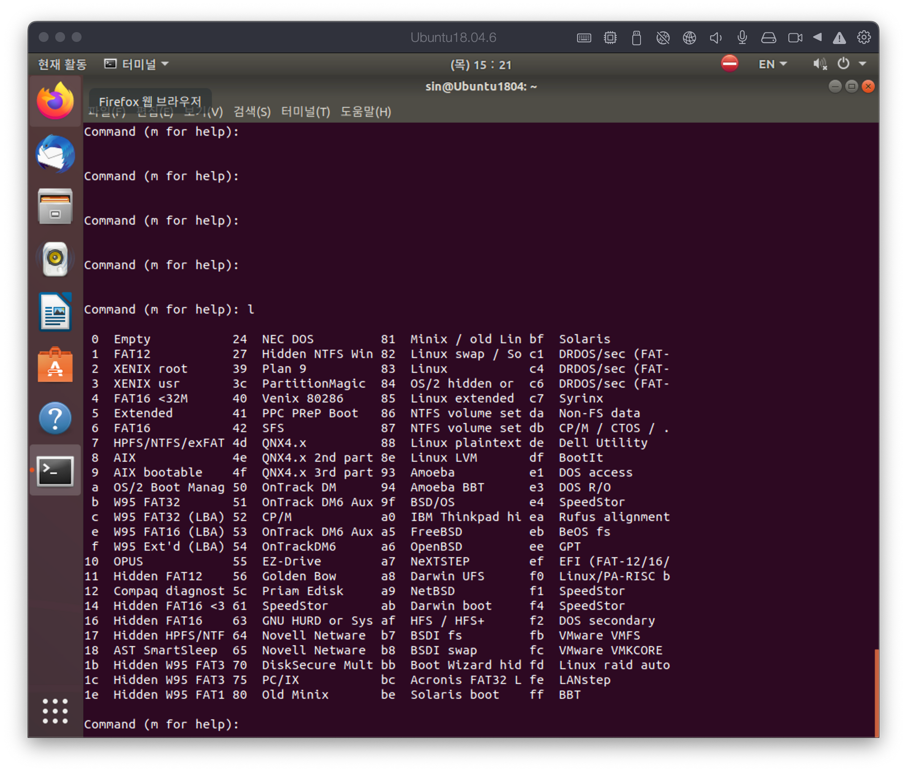
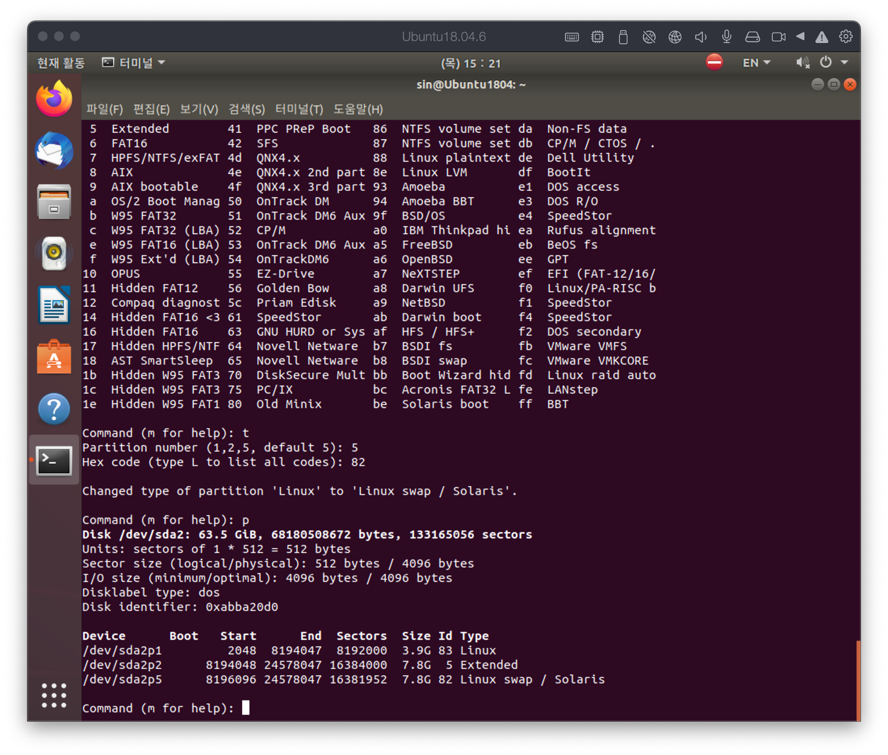

# File system
{: .no_toc }

## Table of contents
{: .no_toc .text-delta }

1. TOC
{:toc}

---

# FS(File System)

- 파일 시스템은 OS에서 큰 부분을 차지한다.
- 파일 시스템은 넓게 보면 데이터베이스의 하나로 볼 수 있다.
- Linux:
    - xfs: 실리콘 그래픽스의 저널링 파일 시스템
    - exf4:  리눅스 고유 파일 시스템
    - zfs: 솔라리스의 기본 파일 시스템
    - Btrfs: zfs와 비슷한 컨셉의 파일 시스템
- Windows:
    - ntfs: 윈도우즈 NT 계열에서 사용하는 파일 시스템
    - exfat: FAT 32비트 확장 버전의 파일 시스템
    - fat32: FAT 32비트 버전의 파일 시스템
    - fat16: Windows 9x 계열의 파일 시스템
- 새로운 파일 시스템을 만드는 방법
    1. Partitioning: 
        - `fdisk` 혹은 `parted` 을 통해 파이션 작업을 수행
    2. Make File System: 
        - `mkfs`을 이용하여 `format` 수행
        - `fsck` 혹은 `xfs_*` 을 통해 파일 시스템을 확인
    3. Mount: 기존 파일 시스템위에 새로운 파일 시스템이 올라탄다는 것을 의미한다.
        - `mount` / `unmount` 명령을 통해 수행
        - /etc/fstab : 마운트를 자동으로 수행하기 위한 정보를 가지고 있는 파일의 위치를 나타낸다. tab의 table의 약자이다.

# Partition

파티션에는 physical partition과 logical partition이 존재한다. 최근에는 Logical partition을 선호하며, 물리적 한계를 가진 디스크를 묶어서 보다 큰 용량의 파티션을 구성할 수 있는 장점이 있다.

- LVM은 Logical Volume Manager의 약자로 가장 많이 사용되는 파티션닝 방법이다.

## Disklabel type

Physical disk의 disklabel type은 두 가지로 분류된다.

- DOS 방식 (msdos)는 고전적인 방식으로 2TB의 용량 제한을 가지고 있으며, fdisk을 통해 관리가 가능하다.
- GPT 방식은 DOS 방식의 문제를 개선하기 위해 나온 방식으로 용량 제한이 없다. parted, gparted or gdisk를 사용해서 관리가 가능하다. 또한 최근에는 fdisk도 지원하기 때문에 이를 사용할 수 있다.

## DOS labeled disk (MBR)

- Primary partition은 주 파티션으로 한 디스크 당 4개까지 파티션을 구성할 수 있다.
- Extended partition은 확장 파티션으로 주 파티션의 파티션 제약을 해소하는 방법으로 주 파티션 하나를 확장 파티션으로 바꾼 다음 내부에 여러 개의 logical drive로 나눌 수 있다.
- Logical drive



위 그림은 파티션은 주 파티션, 확장 파티션, 논리 드라이브로 3개로 구성되며, 실제 데이터가 저장되는 공간은 주 파티션 1개, 논리 드라이브 2개라고 볼 수 있다.

# Fdisk: 파티션 만들기

```bash
$ fdisk -l
```



- /dev/sd[abcd…]에서 볼 수 있듯이 모든 장치들은 /dev 밑에 존재하며, sd가 prefix로 붙는 경우 SATA, USB 처럼 Serial type으로 동작하는 장치이거나 SCSI disk 유형을 의미한다.

```bash
# 최신 명령어
$ lsblk
```



- block device는 저장 장치를 의미한다.

> character device는 입출력 장치를 의미한다.


```bash
$ fdisk <block device>
```



## Command

- a: 부트 활성 플래그를 지정한다. DOS나 Windows 계열에서 boot 드라이브를 지정한다. Linux 계열에서는 큰 의미는 없다.
- d: 파티션을 삭제하는 명령이다.
- l: fdisk는 다른 운영체제에서 사용하는 파티션을 생성할 수 있다. 이 명령은 다른 운영체제에서 사용되는 파티션 타입(번호)를 확인하는 명령이다.
- n: 새로운 파티션을 생성한다.
- p: 현재 파티션 상태를 출력한다.
- t: 파티션 타입(번호)를 변경하는 명령이다.
- q: 변경된 상태를 저장하지 않고 종료하는 명령이다.
- w: 변경된 상태를 저장하고 종료하는 명령이다.

## 실습: 파티션 나눠보기



- n을 누르면 파티션 종류를 선택하는 단계가 나온다.
- 여기서 p는 주 파티션을 e는 확장 파티션을 의미한다.
- 이 과정에서는 p를 통해 주 파티션을 생성했다.
- 다음 단계에서는 파티션의 번호와 시작 섹션번호 그리고 파티션의 용량을 입력하면 파티션 생성 과정이 끝난다.



- 해당 과정은 확장 파티션을 만들고, 그 안에 논리 드라이브를 생성하는 과정을 실습한 것이다.



