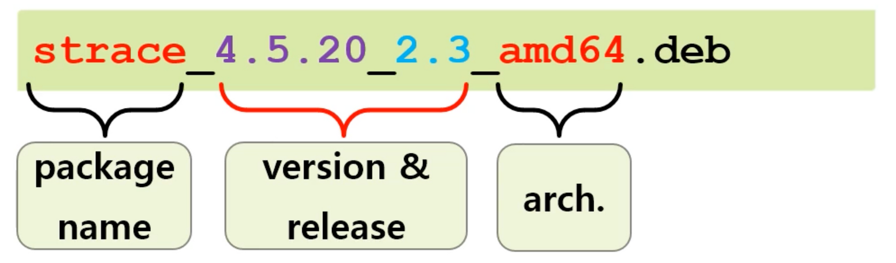
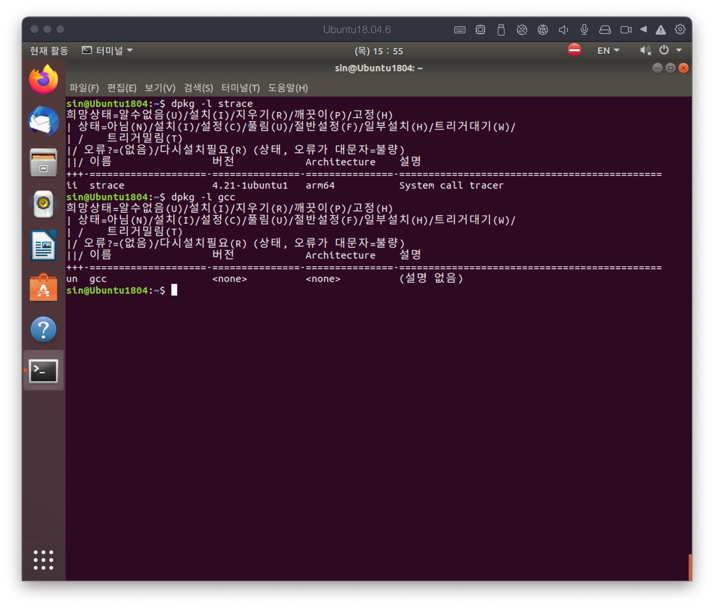
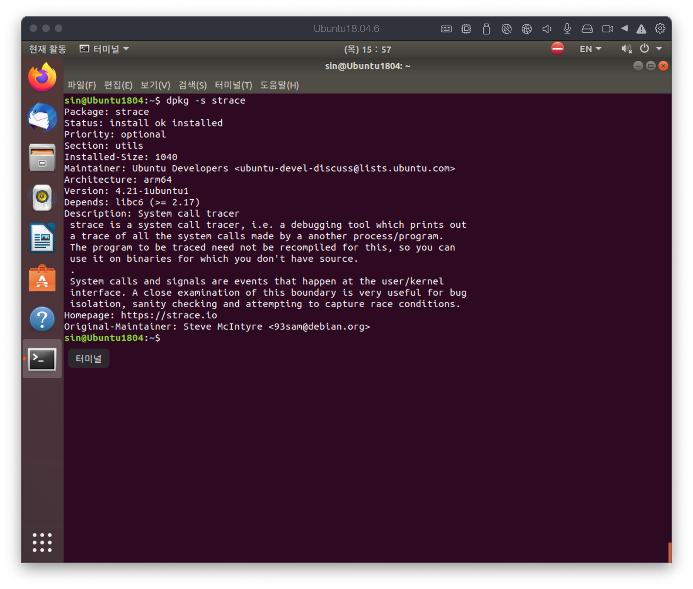
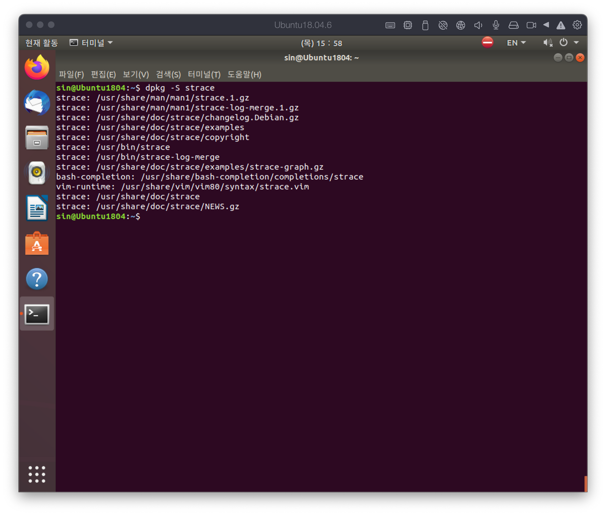
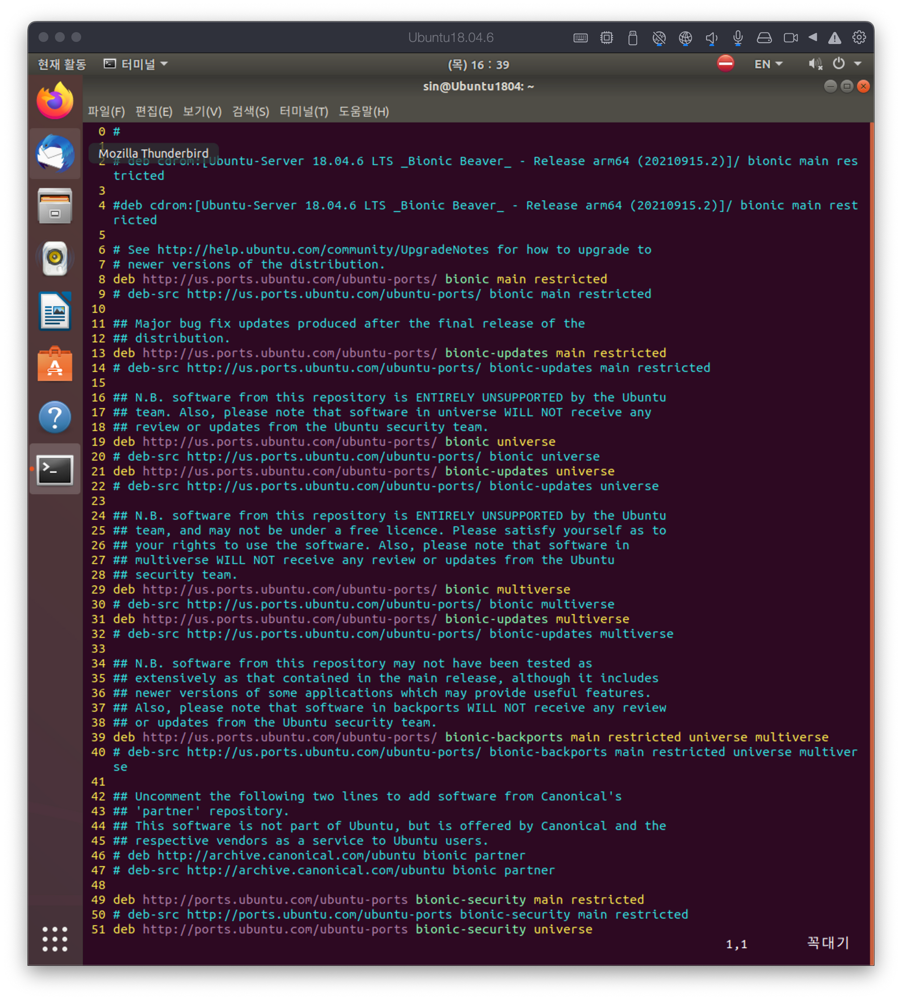
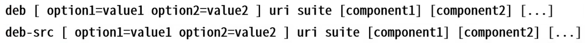

# Package manager
{: .no_toc }

## Table of contents
{: .no_toc .text-delta }

1. TOC
{:toc}

---

# Package
과거 다른사람이 만든 기능을 사용하기 위해서는 직접 소스코드를 직접 다운받아 빌드를 해서 설치 했어햐 하는데 그에 방해 패키지는 시스템을 구성하는 파일의 묶음으로 컴파일이 완료된 형태를 띄고있서 소프트웨어의 설치, 삭제, 관리 등의 편리함을 가지고있다.

## dpkg
dpkg는 데비안 계열의 패키지 관리를 위한 시스템의 기초가 되는 소프트웨어이다.

- release는 같은 버전에서 약간의 수정(오타, 오류)등을 수정한 경우에 사용된다. 같은 버전에서 배보하면 버전이 같아 업데이트기 안되기 때문이다.
- dependency 관리와 검색이 어려웠다. 또한 네트워크 설치를 제대로 지원하지 않았다. 이러한 문제를 해결하기 위해 apt가 등장하게 되었다.

### `dpkg -l`
패키지 리스트를 확인하는 명령으로 다음 그림과 같이 설치된 패키지의 경우 버전을 보여주며, 설치되지 않은 패키지의 경우 맨 앞에 un을 표시한다.

### `dpkg -s`
패키지의 상태를 확인하는 명령으로 설치 과정에서 실패한 경우 해당 명령을 통해 확인이 가능하다.

### `dpkg -S`
패키지가 설치된 파일들의 경로를 확인하는 명령이다.

### `dpkg --audit`
에러가 방생한 경우 해결하는 방법으로 사용된다.

## apt (Advanced Packaging Tool, APT)
데비안 GNU/리눅스 배포판 계열 배포판에서 소프트웨어를 설치하고 제거하는 일을 한다. dpkg를 랩핑함 front-end tool이다. mirror 탐색 기능이 있어 네트워크 설치를 지원한다. 또한 dependency 탐색 및 설치 기능을 가지고 있는것이 특징이다.

- binary
    - `apt-get`: install / remove / upgrade ….
    - `apt-cache`: query
- binary-extensions
    - `apt-file`
- new binary
    - `apt`: 기존에 분산된 명령들을 하나로 통합하였으며, 최근 많이 사용되는 명령이다.
- source list: apt가 package를 다운받기 위한 경로들을 가지고 있는 파일이다. CD-ROM, Disk같은 로컬 경로 혹은 인터넷 URL이 존재한다.
    - /etc/apt/sources.list에 파일이 존재하며, 새로운 리스트를 추가하는 경우에는 /etc/apt/sources.list.d에 *.list 라는 파일명으로 추가하는 것이 권장된다.
    - 파일을 직접 vi 열여서 편집이 가능하지만, apt edit-sources 명령으로도 편집이 가능하다.

- source  list는 크게 두 가지로 분류할 수 있다.

    - deb: 패키지를 다운받는 경로
    - dep-src: 소스 코드를 다운받는 경로
    - uri: 사이트의 주소
    - suite: 패키지를 제공하는 사이트에서 가져올 특정 버전을 지정(16.04 = xenial, 18.04 = bionic 등)
    - component: suite의 구성 요소 및 라이선스 종류별 분류로 최소 1개 이상의 컴포넌트를 지정해야 한다.
        
        
        

## 카카오 mirror 설정하기

1. `sudo select-editor`: 편집에 사용할 editor 지정하기
2. `sudo apt edit-sources kakao.list`: 새로운 파일을 만들어서 카카오 미러를 설정한다.
3. 미러 링크 정보를 파일에 업데이트한다.
`deb [http://mirror.kakao.com/ubuntu/](http://mirror.kakao.com/ubuntu/) bionic main restricted universe
deb [http://mirror.kakao.com/ubuntu/](http://mirror.kakao.com/ubuntu/) bionic main-updates restricted universe
deb [http://mirror.kakao.com/ubuntu/](http://mirror.kakao.com/ubuntu/) bionic main-security restricted universe`
4. `sudo apt update`: source list를 갱신한다.

### `apt list [options] [package pattern]`

패키지 목록을 출력한다.

- `sudo apt list`: 모든 패키지를 출력한다.
- `sudo apt list —installed`: 설치된 패키지만 출력한다.
- `sudo apt list —upgradeable`: 업그레이드가 가능한 패키지만 출력한다.
- `sudo apt list —all-versions`: 모든 버전의 패키지를 출력한다.
- `sudo list bash*`: pattern 사용법으로 bash로 시작하는 패키지들만 출력한다.

### `apt search [-n] <regex>`

패키지를 키워드로 검색한다.

- `sudo apt search bash`: 패키지 설명에 bash가 들어간 경우에도 검색을 한다.
- `sudo apt -n bash`: 검색을 name 필드로 한정한다. 이름 중간에 단어가 들어가도 검색된다.
- `sudo apt -n ‘^bash’`: ^는 시작 부분을 의미한다.

### `apt show <package name> [=version]`

패키지의 정보를 출력한다.

- `apt list —all-versions bash`: 모든 버전에 대한 설치된 bash 패키지를 볼 수 있다.
- `apt show bash=4.4.18-2bubuntu1`: 특정 버전의 정보를 볼 수 있다.

### `apt <remove | purge | auturemove> <package> [=version]`

패키지를 삭제하는 명령이다.

- remove: 패키지만 삭제한다. config 파일은 그대로 남겨둔다.
- purge: 패키지와 관련된 설정파일까지 삭제한다.
- autoremove: 의존성이 꺠지거나 버전 관리로 인해 쓰이지 않는 패키지를 자동으로 제거한다.

### `apt install curl libcurl3-gnutls=7.47.0-1ubuntu2`

패키지를 설치하는 과정에서 의존성에 의해 설치어야 하는 패키지 중에 이미 더 상위 버전이 설치된 경우에는 위와 같은 명령을 통해서 의존성 패키지를 다운그래이드 시켜주어야 한다.