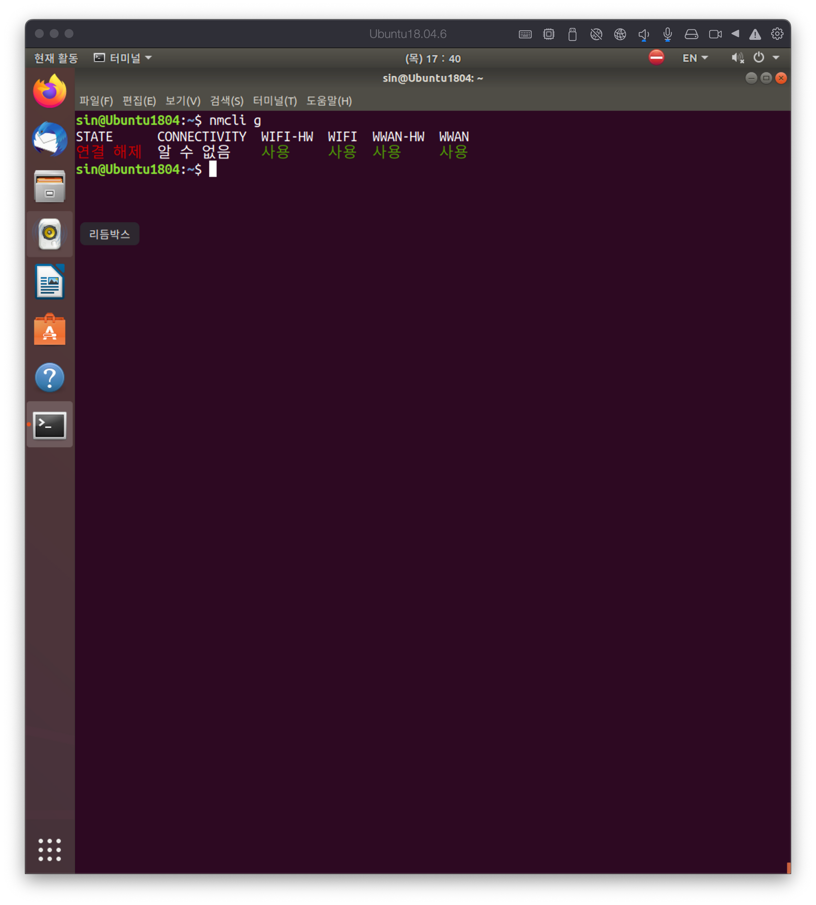
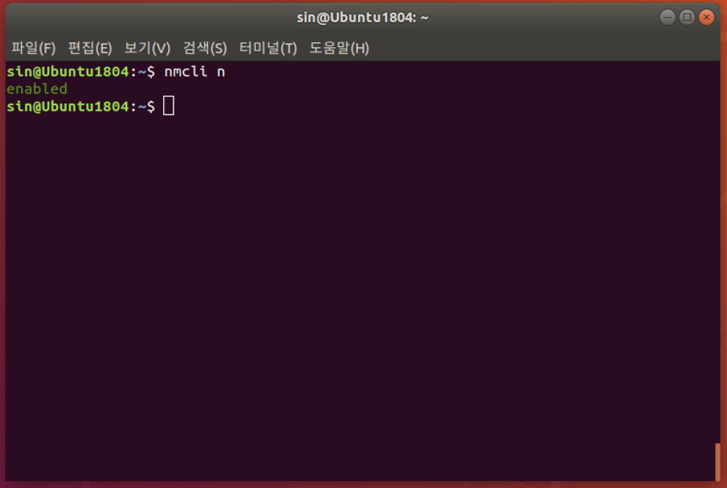
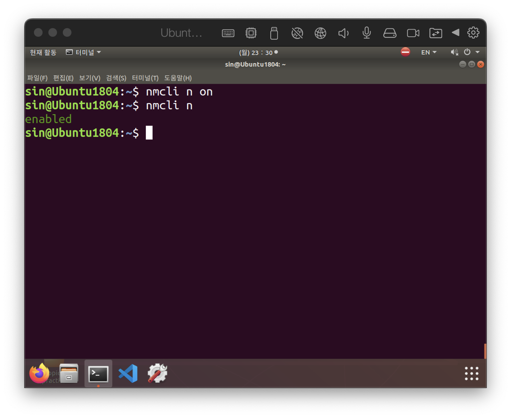
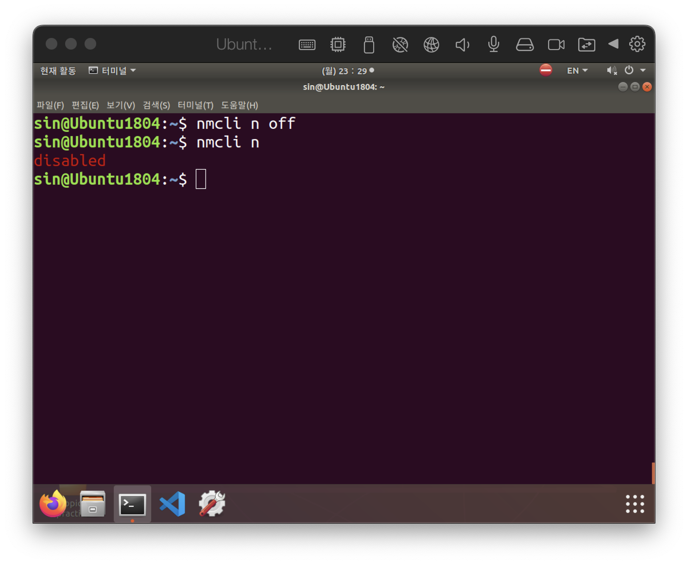
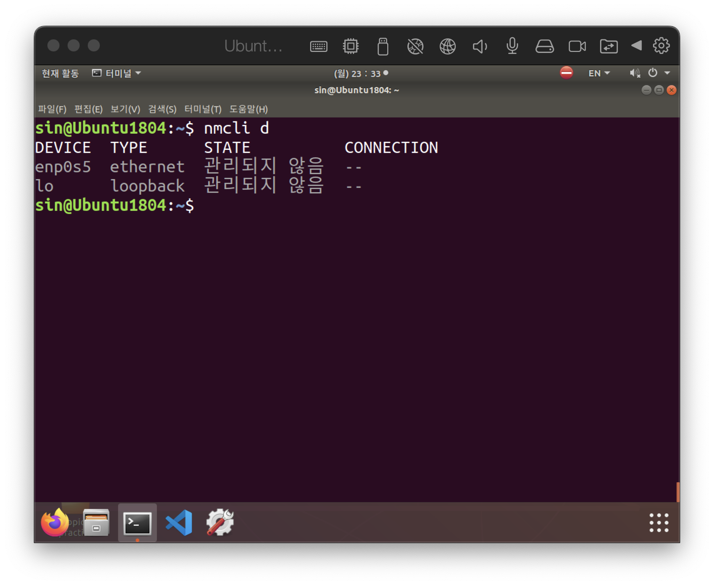

# Network manager
{: .no_toc }

## Table of contents
{: .no_toc .text-delta }

# Network manager 란?
Network manager는 daemon으로 동작하면서 네트워크의 설정을 관장한다. 연결 감지 및 해제, 재시도와 같은 연결부터 다른 애플리케이션이나 daemon에게 네트워크 정보를 제공 또는 관리를 위한 권한 부여 등을 수행한다.

# nmcli

## 네트워크의 전반적인 상태 조회(`nmcli g[eneral]`)

정상적인 경우 full 혹은 enabled이 출력된다.

## 네트워크 상태 조회(`nmcli n[etwork]`)

## 네트워크 켜기(`nmcli n on`)

## 네크워크 끄기(`nmcli n off`)

## 네트워크 장치와 연결 상태 조회(`nmcli d[ev]`)

# IP 변경

## `nmcli c mod ens33 ipv4.method manual ipv4.addr 192.168.0.2/24 ipv4.gateway 192.168.0.1 +ipv4.dns 8.8.8.8`

## `nmcli c down ens33 && nmcli c up ens33` ens33을 껏다가 다시 킨다.

# 기존 설정 제거

## `nmcli c del ens33`