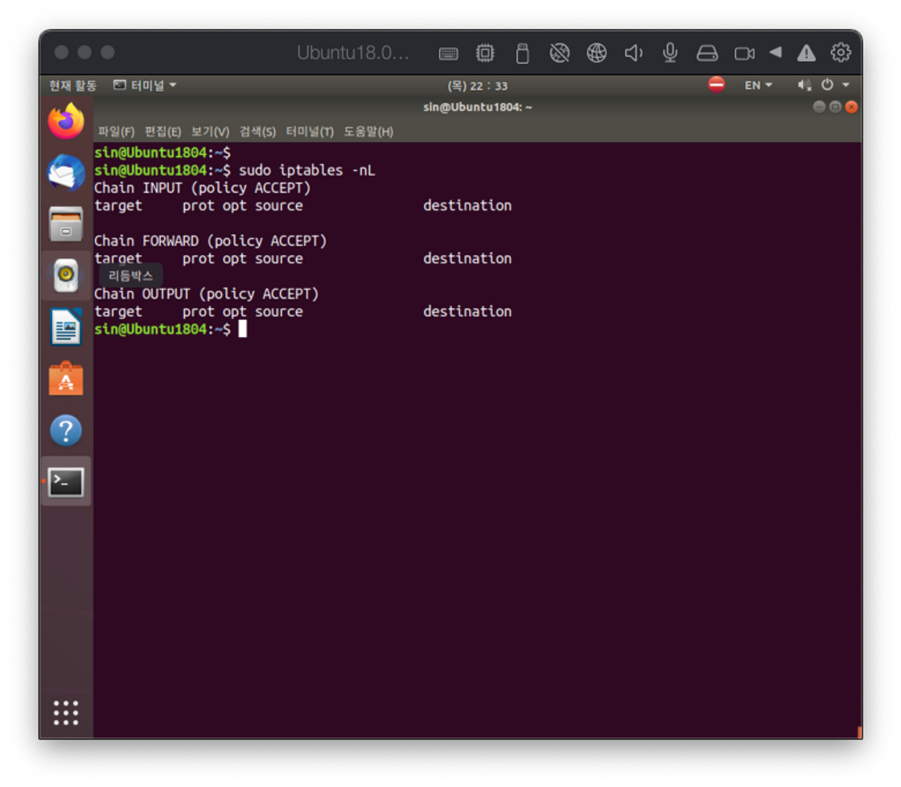
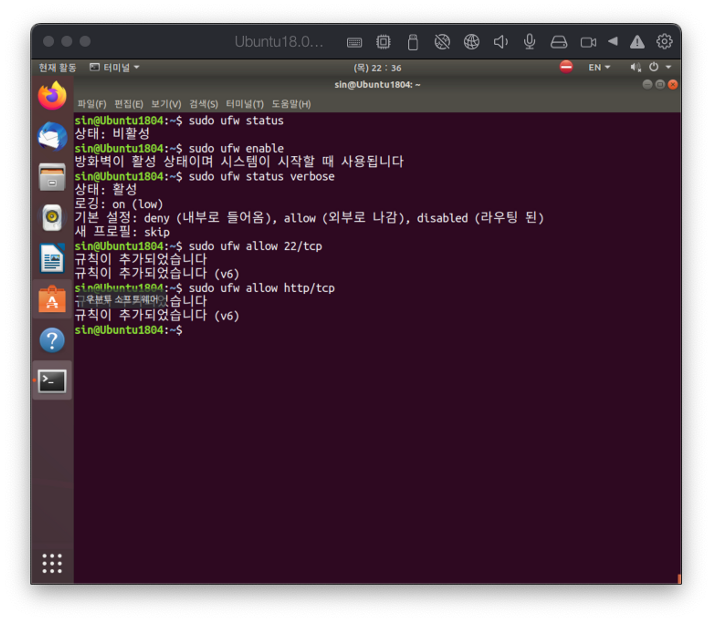
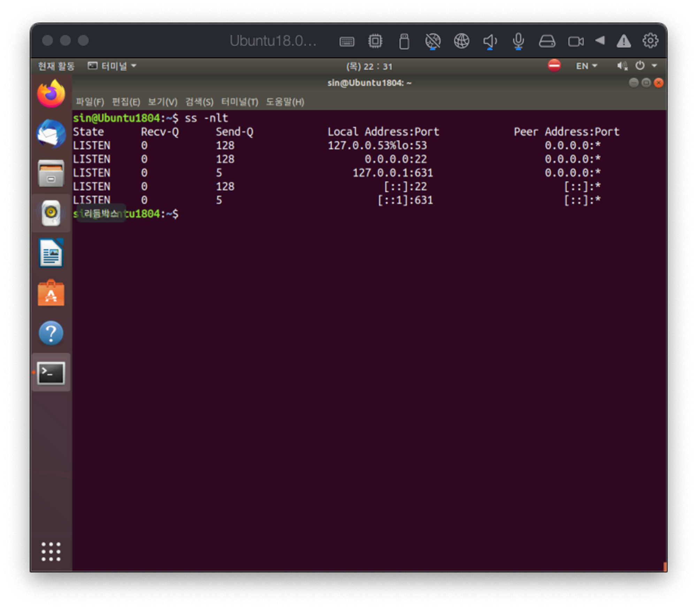
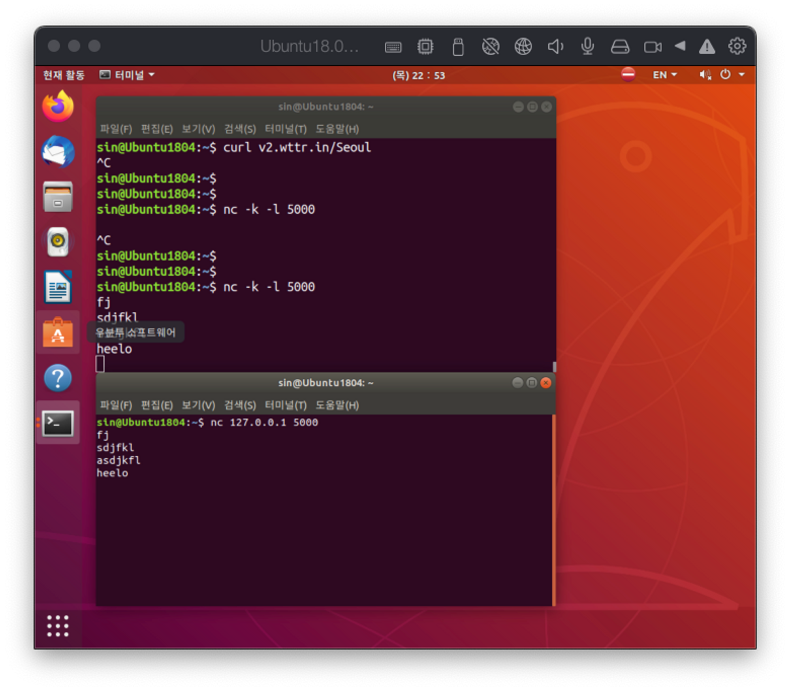

# Network tools
{: .no_toc }

## Table of contents
{: .no_toc .text-delta }

1. TOC
{:toc}

---

# ssh(secure shell)
기존 암호화 되지 않은 통신을 사용하던 telnet을 대체하는 방법이다. ssh는 리눅스 서버에 기본으로 탑제되어 있으며 Linux는 openSSH를 사용한다.

## sshd
ssh daemon, 즉 ssh server를 의미한다. 

- 서버 준비 작업
    1. 서버의 설치 여부 확인
        - `sudo apt list openssh*`
        - 설치가 안되어 있다면, `sudo apt install openssh-server`
    2. 서비스가 실행 중인지 확인
        - `systemctl status sshd`
        - 실행중이 아니라면, `systemctl start sshd`
    3. 방화벽에 ssh 포트가 허용되어 있는지 확인
        - `iptables -nL`
        - `ss -nlt`  or `ss -nltp`
        
                
        
        
        
        
        
    4. 부팅할 때 sshd 서비스를 자동으로 실행
        - `systemctl enable sshd`
        - `systemctl enable --now sshd`, 바로 시작

## ssh
ssh clinet이며, ssh 명령어가 바로 ssh client CLI 유틸리디 

- 접속 방법
    - `ssh [-p port] [username@]<host address>`
    - 기본 포트는 22번이다.
- 공개키 기반 연결 방법
    1. `ssh-keygen -N “”`, 키 생성
    2. `ssh-copy-id username@192.168.0.2`, 접속할 서버에 키 복사
    3. `ssh username@192.168.0.2`, ssh 접속
    4. `ssh -t username@192.168.0.2 w`, 일회성 명령을 수행하고 결과를 받아옴

# HTTP/others utils

## curl
url을 기반으로 통신하는 기능을 제공한다. 

- 사용 방법
    - `curl [options] <URL>`
    - `curl -o <filename> <URL>`, filename에 결과를 저장
    - `curl -O <URL/index.html>`, index.html이라는 파일로 결과 저장
    - `curl -c <URL>`, 중간에 중단되 경우 중간부터 다시 다운받음

## `wget <URL>`
파일 다운로드에 특화된 명령으로 curl과 대부분의 기능이 비슷하나, curl 보다 기능이 적다.

## nc (netcat)
네트워크를 이용한 cat 명령이라고 생각할 수 있다. server 와 clinet 기능을 둘 다 가지고 있기 때문에 간단한 서버 기능을 실험할 수 있다.

