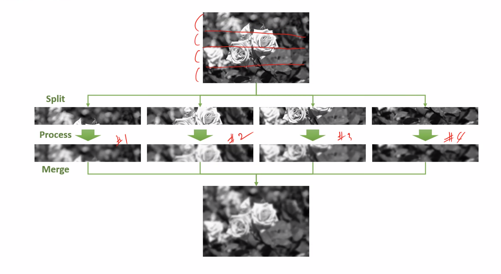
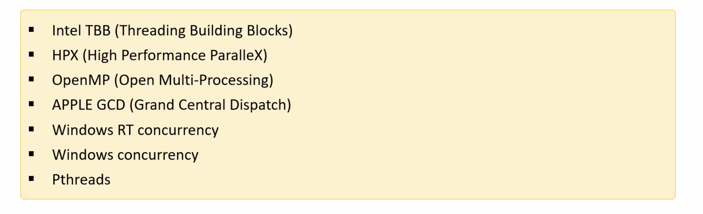

#  병렬 프로그래밍
{: .no_toc }

## Table of contents
{: .no_toc .text-delta }

1. TOC
{:toc}

---


# 영상의 병렬 처리
for loop를 이용해 직접적인 접근을 해야 하는 경우가 생길 수 있다. c++에서는 그냥 사용해도 빠르게 처리가 가능하지만 pyhon에서는 많은 시간이 걸릴 수 있다.

## 영상을 일정 구역을 나눠서 처리하는 방법
나눠진 영상을 한 코에어 한 부분씩 나눠서 처리할 수 있다. 이 경우 이론상 4배의 성능 향상을 기대할 수 있다.


## OpenCV에서 지원하는 병렬 프로그래밍 기법들



```cpp
parallel_for_()
룩업 테이블 

```