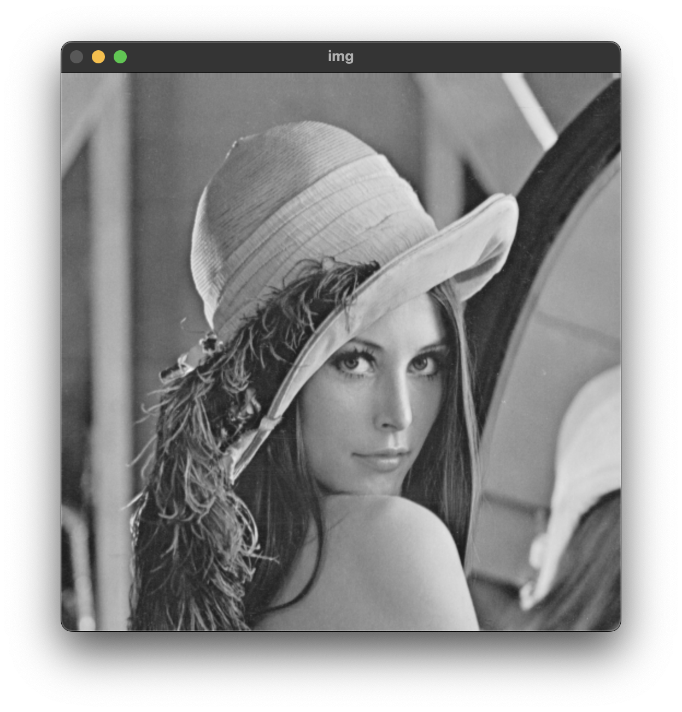
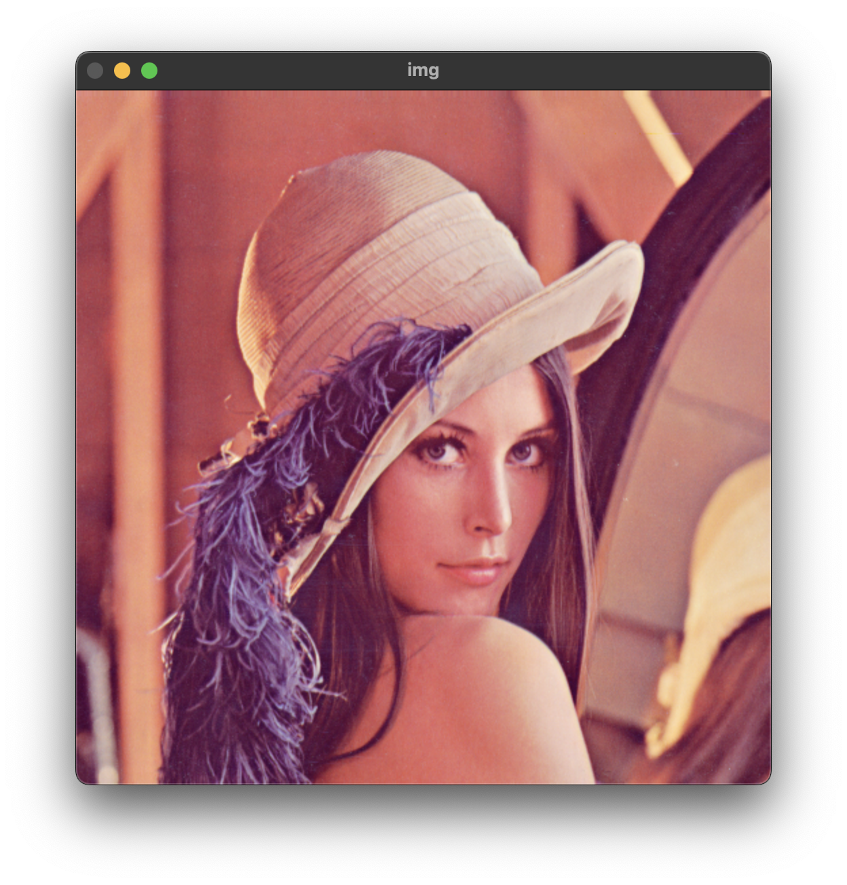

# 파일 입출력
{: .no_toc }

## Table of contents
{: .no_toc .text-delta }

1. TOC
{:toc}

---

## Summary

| Method        | Explanation      |
|:-------------|:------------------|
| `Mat imread( const String& filename, int flags = IMREAD_COLOR );` | 이미지 파일을 불러온다. |


## Mat class
행렬을 표현하기 위한 용도로 단일 채널 또는 n차원의 채널을 나타낼 수 있다. Mat 클래스는 정수, 실수 또는 복소수 벡터 및 행렬, 회색조 또는 컬러 이미지, 복셀 볼륨, 벡터 필드, 포인트 클라우드, 텐서, 히스토그램을 저장하는데 사용된다.

### Mat class의 자료형

| 재정의 이름 | 의미	| Depth_mask | 범위 |
|:------|:---------------------------------------------------|:-|:---------------------------|
|CV_8U  |    unsigned char   8-bit unsigned integers 	     |0|	0 ~ 255|
|CV_8S  |    signed char     8-bit signed integers           |1|	-128 ~ 127|
|CV_16U |    unsigned short  16-bit unsigned integers	     |2|	0 ~ 65535|
|CV_16S |    signed short    16-bit signed integers	         |3|	-32768 ~ 32767|
|CV_32S |    int             32-bit signed integers	         |4|	-2147483648| ~ 2147483647|
|CV_32F |    float           32-bit floating-point numbers   |5|	-FLT_MAX ~ FLT_MAX, INF, NAN|
|CV_64F |    double          64-bit floating-point numbers   |6|	-DBL_MAX ~ DBL_MAX, INF, NAN|
|CV_16F |    float16         16-bit floating-point numbers   |7|	-OpenCV 4부터 지원 / 정보 없음|

### Mat 객체 생성 방법
Mat class는 다양한 생성자와 초기화 방법이 구현되어 있다. 가장 먼저 빈 객체를 생성하는 방법이다. 카메라로 부터 받을 데이터를 저장하는 용도로 사용될 수 있다.
```cpp
Mat img1;
// empty matrix
```
다음 방법은 행렬의 크기와 저장할 데이터의 타입을 지정하여 객체를 생성하는 방법이다. 정수 타입의 인자로 Mat 객체를 생성하는 경우 height, width 순서대로 넣어주어야 한다.
```cpp
Mat img2(480, 640, CV_8UC1);
// unsigned char, 1-channel
Mat img3(480, 640, CV_8UC3);		
// unsigned char, 3-channels
```
정수 형태의 인자 대신 Size() 객체를 이용해서 초기화가 가능하다. Size()는 영상 또는 사각형의 크기를 정의위해 사용되는 템플릿 클래스이다. 이때 위 방법과 달리 width, height 순으로 입력할 수 있다.
```cpp
Mat img4(Size(640, 480), CV_8UC3);	
// Size(width, height)
```

### Mat 객체 초기화 방법
먼저 생성과 동시에 데이터를 초기화 하는 방법이다. Scalar()는 크기 4의 double 타입의 배열을 가지고 있는 클래스이다. 각각 영상의 색을 나타내는 B G R A을 저장하며, 배열과 마찬가지로 []연산자를 통해 데이터에 접근이 가능하다.
```cpp
Mat img5(480, 640, CV_8UC1, Scalar(128));		
// initial values, 128
Mat img6(480, 640, CV_8UC3, Scalar(0, 0, 255));	
// initial values, red
Mat mat5 = (Mat_<float>(2, 3) << 1, 2, 3, 4, 5, 6);
Mat mat6 = Mat_<uchar>({2, 3}, {1, 2, 3, 4, 5, 6});
```
Mat의 멤버 함수를 이용한 초기화 방법이다. zeros, ones, eye는 각각 행렬 전체를 0이나 1로 혹은 단위 행렬 형태로 초기화 하는 기능을 수행한다.
```cpp
Mat mat1 = Mat::zeros(3, 3, CV_32SC1);	
// 0's matrix
Mat mat2 = Mat::ones(3, 3, CV_32FC1);	
// 1's matrix
Mat mat3 = Mat::eye(3, 3, CV_32FC1);	
// identity matrix
```
이미 생성된 객체에 데이터를 추가하거나, 다른 크기, 데이터 타입의 형태로 변수를 초기화하는 방법이다.
```cpp
mat4.create(256, 256, CV_8UC3);	// uchar, 3-channels
mat5.create(4, 4, CV_32FC1);	// float, 1-channel
mat4 = Scalar(255, 0, 0);
mat5.setTo(1.f);
```
마지막으로 1차원 배열을 통해 데이터를 초기화 할 수 있다. 다만 행렬 전체 크기와 배열의 크기가 일치해야 한다.
```cpp
float data[] = {1, 2, 3, 4, 5, 6};
Mat mat4(2, 3, CV_32FC1, data);
```

### Mat 객체의 유용한 멤버 함수들
```cpp
cout << frame.depth() << endl;
// 행렬의 원소의 자료형을 반환하는 매크로 상수이다.
// 8:1byte, U: unsigned, S: signed
// #define CV_8U   0
// #define CV_8S   1
// #define CV_16U  2
// #define CV_16S  3
// #define CV_32S  4
// #define CV_32F  5
// #define CV_64F  6
// #define CV_16F  7

cout << frame.channels() << endl;
// 이미지의 채널 수를 출력하는 매크로 상수이다.
// 흑백의 경우 1채널, 컬러 영상의 경우 3채널이다.

cout << frame.type() << endl;
// 행렬의 깊이와 채널을 한 번에 출력하는 매크로 상수이다.

```

## 창 띄우기
OpenCV는 기본적으로 영상을 다루는 라이브러리이다. 때문에 영상을 시각화 해야하는 경우가 많은데 이때 창을 띄우는 방법이다.
```cpp
void ex_windows(){
    Mat frame(200, 200, CV_8UC1, 255);

    namedWindow("img", WINDOW_NORMAL);
    // enum WindowFlags {
    //    WINDOW_NORMAL     = 0x00000000, 
    //!< the user can resize the window (no constraint) / also use to switch a fullscreen window to a normal size.
    //    WINDOW_AUTOSIZE   = 0x00000001, 
    //!< the user cannot resize the window, the size is constrainted by the image displayed.
    //    WINDOW_OPENGL     = 0x00001000, 
    //!< window with opengl support.
    //    WINDOW_FULLSCREEN = 1,          
    //!< change the window to fullscreen.
    //    WINDOW_FREERATIO  = 0x00000100, 
    //!< the image expends as much as it can (no ratio constraint).
    //    WINDOW_KEEPRATIO  = 0x00000000, 
    //!< the ratio of the image is respected.
    //    WINDOW_GUI_EXPANDED=0x00000000, 
    //!< status bar and tool bar
    //    WINDOW_GUI_NORMAL = 0x00000010, 
    //!< old fashious way
    // };
    moveWindow("img", 200, 200);
    // 지정된 창의 위치를 이동한다.

    imshow("img", frame);
    // 입력 이미지의 타입이 InputArray인 이유는 Mat 형식 외에도 다양한 타입의 데이터를 시각화할 수 있도록 하기 위함이다.\
    //! Imread flags
    // enum ImreadModes {
    //    IMREAD_UNCHANGED            = -1, 
    //!< If set, return the loaded image as is (with alpha channel, otherwise it gets cropped). Ignore EXIF orientation.
    //    IMREAD_GRAYSCALE            = 0,  
    //!< If set, always convert image to the single channel grayscale image (codec internal conversion).
    //    IMREAD_COLOR                = 1,  
    //!< If set, always convert image to the 3 channel BGR color image.
    //    IMREAD_ANYDEPTH             = 2,  
    //!< If set, return 16-bit/32-bit image when the input has the corresponding depth, otherwise convert it to 8-bit.
    //    IMREAD_ANYCOLOR             = 4,  
    //!< If set, the image is read in any possible color format.
    //    IMREAD_LOAD_GDAL            = 8,  
    //!< If set, use the gdal driver for loading the image.
    //    IMREAD_REDUCED_GRAYSCALE_2  = 16, 
    //!< If set, always convert image to the single channel grayscale image and the image size reduced 1/2.
    //    IMREAD_REDUCED_COLOR_2      = 17, 
    //!< If set, always convert image to the 3 channel BGR color image and the image size reduced 1/2.
    //    IMREAD_REDUCED_GRAYSCALE_4  = 32, 
    //!< If set, always convert image to the single channel grayscale image and the image size reduced 1/4.
    //    IMREAD_REDUCED_COLOR_4      = 33, 
    //!< If set, always convert image to the 3 channel BGR color image and the image size reduced 1/4.
    //    IMREAD_REDUCED_GRAYSCALE_8  = 64, 
    //!< If set, always convert image to the single channel grayscale image and the image size reduced 1/8.
    //    IMREAD_REDUCED_COLOR_8      = 65, 
    //!< If set, always convert image to the 3 channel BGR color image and the image size reduced 1/8.
    //    IMREAD_IGNORE_ORIENTATION   = 128 
    //!< If set, do not rotate the image according to EXIF's orientation flag.
    //  };

    resizeWindow("img", 500, 500); 
    // 창 생성시 WINDOW_NORMAL flag 속성으로 생성되어야 동작한다.
    // 또한 imshow() 함수보다 나중에 실행 되어야 정상적으로 동작한다.

    int keycode = waitKey();
    // 열린 창을 유지 시켜주는 역할을 수행한다.
    // 인자로 정수 형태의 milliseconds를 받으며, 키 입력이 들어올 때까지 대기하고 입력된 키 값을 반환한다.

    destroyAllWindows();
    // 열려있는 모든 창을 닫는다.
    // destroyWindow();    
    // 창 이름을 인자로 넘겨주면 해당 이름의 창만 닫는다.

}
```

## 이미지 불러오기
이미지 파일을 Mat 객체로 반환하는 함수이다. flags는 이미지 파일을 불러올 때, 색상 옵션을 설정하는 부분이다. 주로 `IMREAD_UNCHANGED`, `IMREAD_GRAYSCALE` 그리고 `IMREAD_COLOR`를 주로 사용한다. 각 옵션은 원본 이미지의 색상 특성을 그대로 반영해서 불러오는 방법이며, 흑백 그리고 색상 모드로 이미지를 불러오는 방법이다.

```cpp
Mat imread( const String& filename, int flags = IMREAD_COLOR );
```

```cpp
//! Imread flags
enum ImreadModes {
       IMREAD_UNCHANGED            = -1, 
       //!< If set, return the loaded image as is (with alpha channel, otherwise it gets cropped). Ignore EXIF orientation.
       IMREAD_GRAYSCALE            = 0,  
       //!< If set, always convert image to the single channel grayscale image (codec internal conversion).
       IMREAD_COLOR                = 1,  
       //!< If set, always convert image to the 3 channel BGR color image.
       IMREAD_ANYDEPTH             = 2,  
       //!< If set, return 16-bit/32-bit image when the input has the corresponding depth, otherwise convert it to 8-bit.
       IMREAD_ANYCOLOR             = 4,  
       //!< If set, the image is read in any possible color format.
       IMREAD_LOAD_GDAL            = 8,  
       //!< If set, use the gdal driver for loading the image.
       IMREAD_REDUCED_GRAYSCALE_2  = 16, 
       //!< If set, always convert image to the single channel grayscale image and the image size reduced 1/2.
       IMREAD_REDUCED_COLOR_2      = 17, 
       //!< If set, always convert image to the 3 channel BGR color image and the image size reduced 1/2.
       IMREAD_REDUCED_GRAYSCALE_4  = 32, 
       //!< If set, always convert image to the single channel grayscale image and the image size reduced 1/4.
       IMREAD_REDUCED_COLOR_4      = 33, 
       //!< If set, always convert image to the 3 channel BGR color image and the image size reduced 1/4.
       IMREAD_REDUCED_GRAYSCALE_8  = 64, 
       //!< If set, always convert image to the single channel grayscale image and the image size reduced 1/8.
       IMREAD_REDUCED_COLOR_8      = 65, 
       //!< If set, always convert image to the 3 channel BGR color image and the image size reduced 1/8.
       IMREAD_IGNORE_ORIENTATION   = 128 
       //!< If set, do not rotate the image according to EXIF's orientation flag.
     };
```
### Example

```cpp
void ex_imread() { 
    Mat frame;
    frame = imread("../data/lenna.bmp", IMREAD_UNCHANGED);

    // CV_Assert(!frame.empty());
    // CV_Assert는 예외처리 방법 중 하나로 Assert의 인자가 true가 아니면 프로그램을 중단한다.
	if (frame.empty()) {
        // Mat 객체가 비어있는지를 확인하는 함수이다.
        // 객체가 비어있으면 1을 아니면 0을 반환한다.
		cerr << "Image laod failed!" << endl;
		return ;
	}


    namedWindow("img", WINDOW_AUTOSIZE);

    imshow("img", frame);
    waitKey(0);
}
```





## 이미지 파일로 저장하기
```cpp
bool imwrite( const String& filename, InputArray img,
              const std::vector<int>& params = std::vector<int>());
```

```cpp
void ex_imwrite(){
    Mat frame;
    frame = imread("../data/lenna.bmp", IMREAD_GRAYSCALE);

    bool ret = imwrite("../data/lenna_out.png", frame);
    // 마지막 params는 JPG로 저장할 경우, 압축율을 지정할 때 사용되는 인자이다.
    // e.g. {IMWRITE_JEPG_QUARITY, 90} : 압축율을 90%로 지정
    // 파일 저장이 정상적으로 이루어지면, true 그렇지 않으면 false를 반환한다.
    if (ret){
        cout << "파일 저장이 정상적으로 이루어졌습니다." << endl;
    }else{
        cout << "파일 저장이 이루어지지 않았습니다." << endl;
    }

}
```