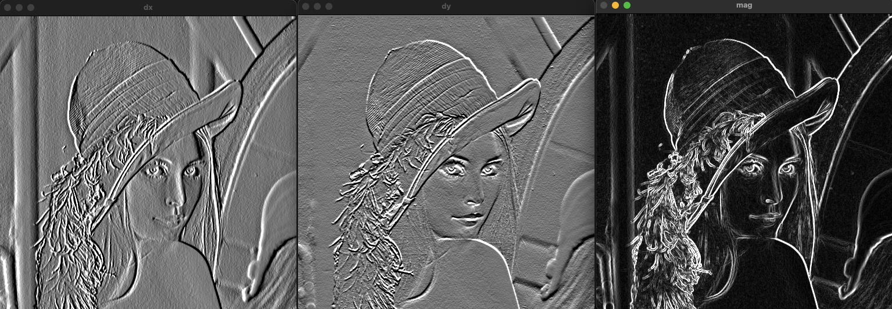
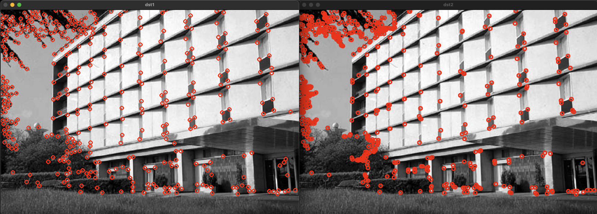

# 영상 특징 추출
{: .no_toc }

## Table of contents
{: .no_toc .text-delta }

1. TOC
{:toc}

---


# 소벨 필터를 이요한 엣지 검출(Edge detection) 
엣지는 영상에서 픽셀의 밝기가 급격하게 변하는 부분을 의미한다. 일반적으로 객체의 경계를 의미한다. 보통 기울기(Gradient)를 이용해서 엣지를 찾는다. 기울기는 1차 미분(1st derivative)를 이용한다.


사람의 눈으로는 객체의 경계를 쉽게 찾을 수 있지만 실제 영상에서는 기울기가 크지 않을 수 있다.


고정된 y 지점에서 x의 변화를 봤을 때, 엣지 부근에서 함수 그래프처럼 급격한 변화나 나타나고 미분을 이용해서 순간 변화량을 구한다. 이렇게 구한 변화량에 특정 임계(T) 이상을 찾으면 그게 엣지가 된다.


원본 영상에 그대로 미분을 하게 되면 노이즈 변화에 의해 엣지가 아닌 부분에서도 급격한 변화가 감지된다.


원본 영상에 blur를 수행한 다음에 미분을 적용하면 엣지 부근에서 원하는 결과를 얻을 수 있다.


 
 중앙 차분을 응용해서 구현된 에지 검출을 위한 마스크이다. 이전 픽셀에서 다음 픽셀을 빼기위한 구조는 동일하며 가중치의 크기에 따라 필터 마스크의 이름이 달라진다. sobel 필터의 경우 중앙으로부터 멀어질수록 가중치가 작아지는 가우시안 형태의 필터 마스크이다.
 


```cpp
void ex_edge_detection(){
	Mat src = imread("../data/lenna.bmp", IMREAD_GRAYSCALE);

	if (src.empty()) {
		cerr << "Image load failed!" << endl;
		return;
	}

	Mat dx = Mat::zeros(src.size(), CV_8UC1);
	Mat dy = Mat::zeros(src.size(), CV_8UC1);

	for (int y = 1; y < src.rows - 1; y++) {
		for (int x = 1; x < src.cols - 1; x++) {
			int v1 = src.at<uchar>(y - 1, x + 1)
				+ src.at<uchar>(y, x + 1) * 2
				+ src.at<uchar>(y + 1, x + 1)
				- src.at<uchar>(y - 1, x - 1)
				- src.at<uchar>(y, x - 1) * 2
				- src.at<uchar>(y + 1, x - 1);
			int v2 = src.at<uchar>(y + 1, x + 1)
				+ src.at<uchar>(y + 1, x) * 2
				+ src.at<uchar>(y + 1, x + 1)
				- src.at<uchar>(y - 1, x + 1)
				- src.at<uchar>(y - 1, x) * 2
				- src.at<uchar>(y - 1, x + 1);
			dx.at<uchar>(y, x) = saturate_cast<uchar>(v1 + 128);
			dy.at<uchar>(y, x) = saturate_cast<uchar>(v2 + 128);
		}
	}


	imshow("src", src);
	imshow("dx", dx);
	imshow("dy", dy);

	waitKey();
	destroyAllWindows();
}
```


## 그래디언트(Gradient)
다변수 함수에서 각 변수를 편미분한 결과를 백터 형태로 표현한 것이다. 
$$
\nabla f=\begin{bmatrix}
f_{x}\\
f_{y}
\end{bmatrix} =f_{x}\begin{bmatrix}
1\\
0
\end{bmatrix} +f_{y}\begin{bmatrix}
0\\
1
\end{bmatrix}
$$
### 그래디언트의 크기
기울기의 차이로 주변 픽셀과의 차이의 정도를 나타낸다.
$$
|\nabla f|=\sqrt{f_{x}^{2} +f_{y}^{2}} \ ( L2Norm)
$$

### 그래디언트의 방향
픽셀값의 급격한 차이를 보이는 방향을 나타낸다.
$$
\theta =tan^{-1}\begin{pmatrix}
f_{y}\\
f_{x}
\end{pmatrix}
$$


```cpp
void ex_edge_detection(){
	Mat src = imread("../data/lenna.bmp", IMREAD_GRAYSCALE);

	if (src.empty()) {
		cerr << "Image load failed!" << endl;
		return;
	}

	Mat dx = Mat::zeros(src.size(), CV_8UC1);
	Mat dy = Mat::zeros(src.size(), CV_8UC1);
	Mat mag = Mat::zeros(src.size(), CV_8UC1);

	for (int y = 1; y < src.rows - 1; y++) {
		for (int x = 1; x < src.cols - 1; x++) {
			int v1 = src.at<uchar>(y - 1, x + 1)
				+ src.at<uchar>(y, x + 1) * 2
				+ src.at<uchar>(y + 1, x + 1)
				- src.at<uchar>(y - 1, x - 1)
				- src.at<uchar>(y, x - 1) * 2
				- src.at<uchar>(y + 1, x - 1);
			int v2 = src.at<uchar>(y + 1, x + 1)
				+ src.at<uchar>(y + 1, x) * 2
				+ src.at<uchar>(y + 1, x + 1)
				- src.at<uchar>(y - 1, x + 1)
				- src.at<uchar>(y - 1, x) * 2
				- src.at<uchar>(y - 1, x + 1);
			dx.at<uchar>(y, x) = saturate_cast<uchar>(v1 + 128);
			dy.at<uchar>(y, x) = saturate_cast<uchar>(v2 + 128);
			mag.at<uchar>(y, x) = saturate_cast<uchar>(sqrt(v1 * v1 + v2 * v2));
		}
	}

	Mat edge = mag > 120;

	imshow("src", src);
	imshow("dx", dx);
	imshow("dy", dy);
	imshow("mag", mag);
	imshow("edge", edge);

	waitKey();
	destroyAllWindows();
}
```





## sobel() 함수
```cpp
void Sobel( InputArray src, OutputArray dst, int ddepth,
                         int dx, int dy, int ksize = 3,
                         double scale = 1, double delta = 0,
                         int borderType = BORDER_DEFAULT );
```
```
src: 입력 영상
dst: 출력 영상, src와 같은 데이터 타입, 크기 반환
ddepth: 출력 영상의 깊이를 지정 (-1은 입력과 같은 데이터 타입)
dx: 미분 차수 (1이면 해당 방향으로 1차 미분, 0이면 미분 안함)
dy: 미분 차수 (1이면 해당 방향으로 1차 미분, 0이면 미분 안함)
ksize: 커널 크기 (it must be 1, 3, 5, or 7)
scale: 연산 결과에 곱할 값
delta: 연산 결과에 더할 값
borderType: pixel extrapolation method, see #BorderTypes. #BORDER_WRAP is not supported.
```
```cpp
void ex_edge_detection(){
	Mat src = imread("../data/lenna.bmp", IMREAD_GRAYSCALE);

	if (src.empty()) {
		cerr << "Image load failed!" << endl;
		return;
	}

    Mat dx, dy;
	Sobel(src, dx, CV_32FC1, 1, 0);
	Sobel(src, dy, CV_32FC1, 0, 1);

	Mat mag;
	magnitude(dx, dy, mag);
	mag.convertTo(mag, CV_8UC1);

	Mat edge = mag > 150;

	imshow("src", src);
	imshow("mag", mag);
	imshow("edge", edge);

	waitKey();
	destroyAllWindows();
}
```


## 엣지 검출 과정
sobel 필터를 이용한 엣지 검출 방법은 검출된 엣지가 두껍게 나타나느 것을 확인할 수 있다.


# 캐니 엣지 검출기를 이요한 엣지 검출(Edge detection) 
sobel 필터의 경우 비교적 적은 연산으로 엣지를 검출할 수 있다는 장점이 있다. 반면 기울기 정보만 이용하기 때문에 엣지가 두껍게 나타날 수 있다.

* 정확한 검출(Good detection): 엣지가 아닌 점을 엣지로 찾거나 검출하는 못하는 확률을 최소화
* 정확한 위치(Good localizatoin): 실제 엣지의 중심을 검출
* 단일 엣지(Single edge): 하나의 엣지는 하나의 점으로 표현
캐니 엣지는 위와같은 조건을 주안점을 두고 제안되었다.
> 캐니 엣지 검출기는 그래디언트에서 가장 큰 값(극대값)을 통해 한 점 형태의 엣지를 검출한다.

## 캐니 엣지의 검출 과정
1. 가우시안 필터링
영상의 노이즈를 제거하기 위해 가우시안 필터링을 수행한다.
$$
G_{\sigma }( x,\ y) =\frac{1}{2\pi \sigma ^{2}} e^{-\frac{x^{2} +y^{2}}{2\sigma ^{2}}}
$$

2. 그래디언트 계산
sobel 필터를 이용해서 그래디언트를 계산한다. 특히 그래디언트의 방향을 4개로 나눠서 구분한다.


3. 비최대 억제(Non-maximum suppression)
하나의 엣지가 여러개의 픽셀로 표현되어 두꺼워지는 것을 제거하기 위해 사용된댜. 영상의 그래디언트 방향을 따라가면서 그래디언트의 수직 방향에 있는 픽셀들과 비교하여 가장 큰 값(Local maximum)을 엣지로 선택한다. 


4. 이중 임계값을 통한 히스테리시스 엣지 트래킹
기존의 임계값을 이용한 검출 방법은 밝기의 변화(조명)에 민감하게 반응하는 문제가 있다. 캐니 엣지에서는 두 개의 임계값을 이용해서 엣지를 찾는다. 그 중 큰 임계값보다 큰 픽셀은 무조건 엣지에 포함하고 작은 임계값보다 작은 픽셀은 무조건 엣지에 포함하지 않는다. 또한 두 임계값의 사이에 있는 픽셀의 경우 약한 엣지로 정의하여 강한 엣지와 연결된 경우에만 엣지로 포함한다.


```cpp
void Canny( InputArray image, OutputArray edges,
                         double threshold1, double threshold2,
                         int apertureSize = 3, bool L2gradient = false );
```
```
image: 8-bit input image. 입력 영상
edges: output edge map; single channels 8-bit image, which has the same size as image. 출력 영상(엣지 영상)
threshold1: first threshold for the hysteresis procedure. 하단 임계값
threshold2: second threshold for the hysteresis procedure. 상단 임계값 (하단과 상단의 비율은 1:2또는 1:3을 권장)
apertureSize: aperture size for the Sobel operator. (소벨 연산을 위한 커널 크기)
L2gradient: True인 경우 L2 norm, False인 경우 L1 norm을 사용
```


```cpp
#pragma once
// 중복해서 include 되는것을 방지
#include "opencv2/core.hpp"
// "opencv2/opencv.hpp"를 대신해서 "opencv2/core.hpp"를 쓰는 이유
// 현재 파일에서 Mat class만 사용하기 때문에 더 작은 단위의 헤더 파일을 사용
void myCanny(const cv::Mat& src, cv::Mat& dst, double threshold1, double threshold2);
```
```cpp
#include <iostream>
#include <algorithm>
#include "opencv2/opencv.hpp"
#include "mycanny.h"

using namespace std;
using namespace cv;

void myCanny(const Mat& src, Mat& dst, double threshold1, double threshold2)
{
	// 1. Gaussian filter
	Mat gauss;
	GaussianBlur(src, gauss, Size(), 0.5);

	// 2. Gradient by Sobel operator
	Mat dx, dy;
	Sobel(gauss, dx, CV_32F, 1, 0);
	Sobel(gauss, dy, CV_32F, 0, 1);

	Mat mag = Mat::zeros(src.rows, src.cols, CV_32F);
	Mat ang = Mat::zeros(src.rows, src.cols, CV_32F);
	
	for (int y = 0; y < src.rows; y++) {
		float* pDx = dx.ptr<float>(y);
		float* pDy = dy.ptr<float>(y);
		float* pMag = mag.ptr<float>(y);
		float* pAng = ang.ptr<float>(y);

		for (int x = 0; x < src.cols; x++) {
			pMag[x] = sqrt(pDx[x] * pDx[x] + pDy[x] * pDy[x]);

			if (pDx[x] == 0)
				pAng[x] = 90.f;
			else
				pAng[x] = float(atan(pDy[x] / pDx[x]) * 180 / CV_PI);
		}
	}

	// 3. Non-maximum suppression
	enum DISTRICT { AREA0 = 0, AREA45, AREA90, AREA135, NOAREA };
	const int ang_array[] = { AREA0, AREA45, AREA45, AREA90, AREA90, AREA135, AREA135, AREA0 };

	const uchar STRONG_EDGE = 255;
	const uchar WEAK_EDGE = 128;

	vector<Point> strong_edges;
	dst = Mat::zeros(src.rows, src.cols, CV_8U);

	for (int y = 1; y < src.rows - 1; y++) {
		for (int x = 1; x < src.cols - 1; x++) {
			float mag_value = mag.at<float>(y, x);
			if (mag_value > threshold1) {
				int ang_idx = cvFloor((ang.at<float>(y, x) + 90) / 22.5f);

				bool local_max = false;
				switch (ang_array[ang_idx]) {
				case AREA0:
					if ((mag_value >= mag.at<float>(y - 1, x)) && (mag_value >= mag.at<float>(y + 1, x))) {
						local_max = true;
					}
					break;
				case AREA45:
					if ((mag_value >= mag.at<float>(y - 1, x + 1)) && (mag_value >= mag.at<float>(y + 1, x - 1))) {
						local_max = true;
					}
					break;
				case AREA90:
					if ((mag_value >= mag.at<float>(y, x - 1)) && (mag_value >= mag.at<float>(y, x + 1))) {
						local_max = true;
					}
					break;
				case AREA135:
				default:
					if ((mag_value >= mag.at<float>(y - 1, x - 1)) && (mag_value >= mag.at<float>(y + 1, x + 1))) {
						local_max = true;
					}
					break;
				}

				if (local_max) {
					if (mag_value > threshold2) {
						dst.at<uchar>(y, x) = STRONG_EDGE;
						strong_edges.push_back(Point(x, y));
					} else {
						dst.at<uchar>(y, x) = WEAK_EDGE;
					}
				}
			}
		}
	}

#define CHECK_WEAK_EDGE(x, y) \
	if (dst.at<uchar>(y, x) == WEAK_EDGE) { \
		dst.at<uchar>(y, x) = STRONG_EDGE; \
		strong_edges.push_back(Point(x, y)); \
	}

	// 4. Hysterisis edge tracking
	while (!strong_edges.empty()) {
		Point p = strong_edges.back();
		strong_edges.pop_back();

		CHECK_WEAK_EDGE(p.x + 1, p.y)
		CHECK_WEAK_EDGE(p.x + 1, p.y + 1)
		CHECK_WEAK_EDGE(p.x, p.y + 1)
		CHECK_WEAK_EDGE(p.x - 1, p.y + 1)
		CHECK_WEAK_EDGE(p.x - 1, p.y)
		CHECK_WEAK_EDGE(p.x - 1, p.y - 1)
		CHECK_WEAK_EDGE(p.x, p.y - 1)
		CHECK_WEAK_EDGE(p.x + 1, p.y - 1)
	}

	for (int y = 0; y < src.rows; y++) {
		for (int x = 0; x < src.cols; x++) {
			if (dst.at<uchar>(y, x) == WEAK_EDGE)
				dst.at<uchar>(y, x) = 0;
		}
	}
}
```


```cpp
void ex_cannyedge(){
	Mat src = imread("../data/circuit.bmp", IMREAD_GRAYSCALE);

	if (src.empty()) {
		cerr << "Image load failed!" << endl;
		return;
	}

	Mat dst1, dst2;
	Canny(src, dst1, 50, 150);
	myCanny(src, dst2, 50, 150);

	imshow("src", src);
	imshow("OpenCV Canny", dst1);
	imshow("My Canny", dst2);

	waitKey();
}
```


# 허프 변환(Hough tranform)
2차원 영상 좌표에서 직선의 방정식의 파라미터 공간(Parameter space)으로 변환하여 직선을 찾는 알고리즘이다.


MinLine은 찾을 선분의 최소 길이를 나타내는 인자로, 0인 경우 모든 길이의 선분을 찾고, 0이 아닌 경우 해당 픽셀 이상 길이의 선분만 찾는다. 
MaxLineGap은 선분간의 최대 간격으로 특정 값을 입력하면 입력된 크기의 픽셀보다 떨어져 있으면 두 선분으로 인식한다.


```cpp
void ex_houghline(){
	Mat src = imread("../data/building.jpg", IMREAD_GRAYSCALE);

	if (src.empty()) {
		cerr << "Image load failed!" << endl;
		return;
	}

	Mat src_edge;
	Canny(src, src_edge, 50, 150);

	TickMeter tm;
	tm.start();

	vector<Vec2f> lines1;
	HoughLines(src_edge, lines1, 1, CV_PI / 180, 250);

	tm.stop();

	cout << "HoughLines(): " << tm.getTimeMilli() << "ms." << endl;

	Mat dst1;
	cvtColor(src_edge, dst1, COLOR_GRAY2BGR);

	for (size_t i = 0; i < lines1.size(); i++) {
		float r = lines1[i][0], t = lines1[i][1];
		double cos_t = cos(t), sin_t = sin(t);
		double x0 = r*cos_t, y0 = r*sin_t;
		double alpha = 1000;

		Point pt1(cvRound(x0 + alpha*(-sin_t)), cvRound(y0 + alpha*cos_t));
		Point pt2(cvRound(x0 - alpha*(-sin_t)), cvRound(y0 - alpha*cos_t));
		line(dst1, pt1, pt2, Scalar(0, 0, 255), 1, LINE_AA);
	}

	tm.reset();
	tm.start();

	vector<Vec4i> lines2;
	HoughLinesP(src_edge, lines2, 1, CV_PI / 180, 160, 50, 5);

	tm.stop();

	cout << "HoughLinesP(): " << tm.getTimeMilli() << "ms." << endl;

	Mat dst2;
	cvtColor(src_edge, dst2, COLOR_GRAY2BGR);

	for (size_t i = 0; i < lines2.size(); i++) {
		Vec4i l = lines2[i];
		line(dst2, Point(l[0], l[1]), Point(l[2], l[3]), Scalar(0, 0, 255), 2, LINE_AA);
	}

	imshow("src", src);
	imshow("dst1", dst1);
	imshow("dst2", dst2);
	waitKey();
}
```


# 허프 변환을 이용한 원 검출
원의 방정식 $(x-a)^2 + (y-b)^2 = c^2$을 사용해서 축적 행렬을 구현할 수 있지만 3차원으로 연산량이 많아 비효율적이다. 때문에 속도 향상을 위해 입력 영상과 동일하 2차원 평명 공간에서 엣지 그래디언트로 얻은 직선을 누적하는 방법으로 구현한다. 

원의 중심을 먼저 찾고, 적절한 반지름을 검출하는 순서로 진행된다. 여러개의 동심월을 검출하지 못하고 가장 작은 원 하나만 검출되는 단점이 있다.


```cpp
void ex_houghcircle(){
	Mat src = imread("../data/coins.jpg", IMREAD_GRAYSCALE);

	if (src.empty()) {
		cerr << "Image load failed!" << endl;
		return;
	}

Mat dst1, dst2;
	cvtColor(src, dst1, COLOR_GRAY2BGR);
	cvtColor(src, dst2, COLOR_GRAY2BGR);

	TickMeter tm;

	// HOUGH_GRADIENT

	Mat blr;
	GaussianBlur(src, blr, Size(), 1.0);

	tm.start();

	vector<Vec3f> circles1;
	HoughCircles(blr, circles1, HOUGH_GRADIENT, 1, 10, 150, 30, 10, 50);

	tm.stop();
	cout << "HOUGH_GRADIENT:     " << tm.getTimeMilli() << "ms." << endl;

	for (size_t i = 0; i < circles1.size(); i++) {
		Vec3i c = circles1[i];
		circle(dst1, Point(c[0], c[1]), c[2], Scalar(0, 0, 255), 2, LINE_AA);
	}

	// HOUGH_GRADIENT_ALT

	tm.reset();
	tm.start();

	vector<Vec3f> circles2;
	HoughCircles(src, circles2, HOUGH_GRADIENT_ALT, 1.5, 10, 300, 0.9, 10, 50);

	tm.stop();
	cout << "HOUGH_GRADIENT_ALT: " << tm.getTimeMilli() << "ms." << endl;

	for (size_t i = 0; i < circles2.size(); i++) {
		Vec3i c = circles2[i];
		circle(dst2, Point(c[0], c[1]), c[2], Scalar(0, 0, 255), 2, LINE_AA);
	}

	imshow("src", src);
	imshow("dst1", dst1);
	imshow("dst2", dst2);
	waitKey();
}

```


# 코너 검출 방법
코너(Corner)는 두 엣지의 교차점으로 서로 다른 방향의 엣지가 공존하는 점을 의미한다. 영상에서 픽셀의 변화가 적은 평탄한 부분과 픽셀의 변화가 큰 엣지 영역의 경우 고유한 특징을 갖는 위치를 찾기가 어렵다. 따라서 영상 내에서 이동이나 회전과 같은 변화에 강인한 특징점을 찾기위해 코너를 이용할 수 있다.

## 해리스(Harris) 코너 검출 방법
1988년 C.Harris가 제안한 방법이다. 윈도우(Window, kernel)안의 픽셀 값이 상하좌우 방향으로 모두 급격하게 변하는 위치를 코너로 정의하고 이를 효과적으로 구하는 방법을 제안했다.


다양한 수학적 접근 방법(미분, 테일러 급수, 고윳값 분석 등)을 이용해서 입력 영상으로부터 해리스 응답 함수(Harris response function)을 구하고, R(x, y)값이 충분히 큰 위치를 코너로 지정한다.


```cpp
void cornerHarris( InputArray src, OutputArray dst, int blockSize,
                                int ksize, double k,
                                int borderType = BORDER_DEFAULT );
```
* src: Input single-channel 8-bit or floating-point image. 8비트 or 실수형 단일 채널의 입력 영상
* dst: Image to store the Harris detector responses. It has the type CV_32FC1 and the same size as src. 해리스 코너 응답 계수 행렬(입력 영상 src와 같은 크기로 CV_32FC1 데이터 타입의 변수)
dst(x,y) < 0; 엣지 픽셀
|dst(x,y)| is small; 평탄한 영역
dst(x,y) > 0; 코너 픽셀. local maximum 선택
* blockSize: Neighborhood size (see the details on #cornerEigenValsAndVecs). 수학적 연산을 위한 이웃 픽셀의 크기(2, 3, 5)
* ksize: Aperture parameter for the Sobel operator. 그래디언트 계산을 위한 소벨 연산의 커널 크기 (3)
* k: Harris detector free parameter. See the formula above. 해리스 코너 검출 상수 (보통 0.04)
* borderType: Pixel extrapolation method. See #BorderTypes. #BORDER_WRAP is not supported.   


## 추적하기 좋은 특징(Good feature to track)
1994년 Shi & Tomasi가 제안한 방법이다. 해리스 코너 검출 방법을 향상시킨 코너 검출 방법으로 코너 응답 함수를 정의를 $R=\lambda_1\lambda_2-k(\lambda_1\lambda_2)^2 \rightarrow R=min(\lambda_1\lambda_2)$로 변경했다($\lambda는 고윳값$). 코너 품질 함수 값이 큰 순서대로 정렬하여 코너 점을 반환한다. 그 이후 비최대 억제 함수를 수행하는 과정을 통해 코너를 검출한다.

```cpp
void goodFeaturesToTrack( InputArray image, OutputArray corners,
                                     int maxCorners, double qualityLevel, double minDistance,
                                     InputArray mask = noArray(), int blockSize = 3,
                                     bool useHarrisDetector = false, double k = 0.04 );
```
* image: Input 8-bit or floating-point 32-bit, single-channel image. 8 혹은 32비트 실수 타입의 단일 채널 영상
* corners: Output vector of detected corners. 검출된 커너점 좌표를 반환
* maxCorners: 최대 코너 개수를 지정, `maxCorners <= 0` 이면 무제한으로 검출
* qualityLevel: 코너점 결정을 위한 임계값을 지정, 0.01~0.1 사이의 값을 사용하며 이 값이 커질수록 엄격하게 코너를 검출
* minDistance: 검출된 코너들 사이의 최소 거리를 지정
* mask: 영상의 일부분만 연산에 사용하고 싶은 경우에 마스크를 이용
* blockSize: 알고리즘 내부에서 사용할 이웃 픽셀 영역의 크기를 지정 (기본값 사용 권장)
아래 두 인자는 해리스 코너 응답 함수를 사용하는 경우 사용(기본값 사용 권장)
* useHarrisDetector: Parameter indicating whether to use a Harris detector (see #cornerHarris) or #cornerMinEigenVal.
* k: Free parameter of the Harris detector.


## FAST(Feature From Accelerated Segment Test)

2006년 Rosten & Drummond가 제안한 방법으로 가각의 픽셀에 대해 주변 16개 픽셀 값 크기를 분석하여 해당 픽셀보다 충반히 밝거나(>p+t) 또는 충분히 어두운(<p-t) 픽셀이 n개 이상 연속으로 나타나면 코너로 인식한다(n은 보통 9). 위 두 방법보다 30배 정도 빠르게 동작하는 특징이 있다.


FAST 방법이 반복 검출률이 높지만 노이즈에 민감하게 동작하는 것을 확인할 수 있다.

```cpp
void FAST( InputArray image, CV_OUT std::vector<KeyPoint>& keypoints,
                      int threshold, bool nonmaxSuppression=true );
```
* image: grayscale image where keypoints (corners) are detected.
* keypoints: keypoints detected on the image. 검출된 코너의 키 포인트
* threshold: threshold on difference between intensity of the central pixel and pixels of a circle around this pixel. 중심 픽셀과 주변 픽셀과의 차이의 임계값
* nonmaxSuppression: if true, non-maximum suppression is applied to detected corners (keypoints). 비최대 억제 수행 여부

## Example code

```cpp
void ex_processing(){
	Mat src = imread("../data/building.jpg", IMREAD_GRAYSCALE);

	if (src.empty()) {
		cerr << "Image load failed!" << endl;
		return ;
	}

	// goodFeaturesToTrack

	TickMeter tm1;
	tm1.start();

	vector<Point2f> corners;
	goodFeaturesToTrack(src, corners, 400, 0.01, 10);

	tm1.stop();
	cout << "goodFeaturesToTrack() took " << tm1.getTimeMilli() << "ms." << endl;

	Mat dst1;
	cvtColor(src, dst1, COLOR_GRAY2BGR);

	for (size_t i = 0; i < corners.size(); i++) {
		circle(dst1, corners[i], 5, Scalar(0, 0, 255), 2);
	}

	// FAST

	TickMeter tm2;
	tm2.start();

	vector<KeyPoint> keypoints;
	FAST(src, keypoints, 60);
//	Ptr<FeatureDetector> detector = FastFeatureDetector::create(60);
//	detector->detect(src, keypoints);

	tm2.stop();
	cout << "FAST() took " << tm2.getTimeMilli() << "ms." << endl;

	Mat dst2;
	cvtColor(src, dst2, COLOR_GRAY2BGR);

	for (const KeyPoint& kp : keypoints) {
		circle(dst2, Point(kp.pt.x, kp.pt.y), 5, Scalar(0, 0, 255), 2, LINE_AA);
	}

//	imshow("src", src);
	imshow("dst1", dst1);
	imshow("dst2", dst2);
	waitKey();
}
```

