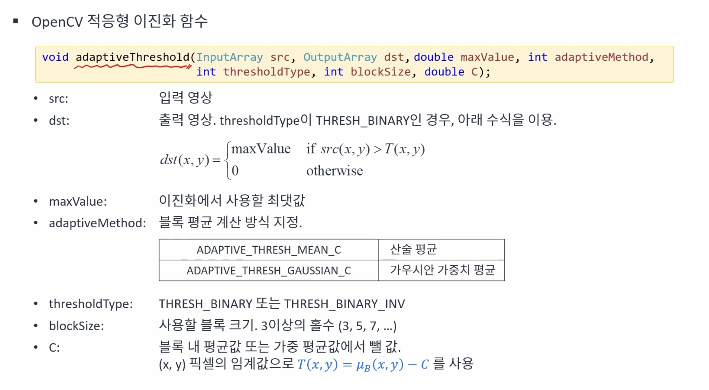

# 영상의 이진화
{: .no_toc }

## Table of contents
{: .no_toc .text-delta }

1. TOC
{:toc}

---

# 영상의 이진화(Binarization)
영상의 픽셀값은 0 또는 255(1)로 변환하는 연산을 의미한다. 배경이나 객체, 관심 영역과 관심이 없는 영역을 나누기 위한 방법으로 사용된다.

## 흑백 영상의 이진화
임계값(Threshold)을 이용한 간단한 이진화 방법을 사용한다.


히스토그램을 통해 원하는 영역의 픽셀값을 정하고 적절한 임게값을 설정하여 원하는 영역을 추출할 수 있다.

Maxval 인자의 경우 임계값 이상이 되는 픽셀을 모두 이 값으로 치환한다.
  


### EXample code
```cpp
int t_value = 128;
void on_trackbar_threshold(int, void*);
Mat src, dst;

void ex_processing(){
	String filename = "../data/neutrophils.png";

	src = imread(filename, IMREAD_GRAYSCALE);

	if (src.empty()) {
		cerr << "Image load failed!" << endl;
		return ;
	}

	namedWindow("src");
	imshow("src", src);

	namedWindow("dst");
	createTrackbar("Threshold", "dst", &t_value, 255, on_trackbar_threshold);
	on_trackbar_threshold(0, 0); // Call the function to initialize

	waitKey();
}

void on_trackbar_threshold(int, void*)
{
	threshold(src, dst, t_value, 255, THRESH_BINARY);
	imshow("dst", dst);
}

```


# 자동 임계값 결정
## Otsu 이진화 방법
입력 영상이 배경과 객체 두 개로 구성되어 있다고 가정(i.e. bimodal histogram)한다. 임의의 임계값 T에 의해 나눠지는 두 픽셀 분포 그룹의 분산이 최소가 되는 T를 선택한다.


```cpp
void ex_processing(){
	Mat src = imread("../data/rice.png", IMREAD_GRAYSCALE);

	if (src.empty()) {
		cerr << "Image load failed!" << endl;
		return ;
	}

	Mat dst;
	// double th = threshold(src, dst, 0, 255, THRESH_BINARY | THRESH_OTSU);
    // or
	double th = threshold(src, dst, 0, 255, THRESH_OTSU);

	cout << "Otsu threshold value is " << th << "." << endl;

	imshow("src", src);
	imshow("dst", dst);
	waitKey();
}

```


# 지역 이진화
픽셀 또는 영역마다 서로 다른 임계값을 사용하여 이진화 하는 방법이다. 특히 균일하지 않은 조명 환경에서 촬영된 영상의 경우에 좋은 결과를 얻을 수 있다.

## Example code
```cpp
void ex_processing(){
	Mat src = imread("../data/rice.png", IMREAD_GRAYSCALE);

	if (src.empty()) {
		cerr << "Image load failed!" << endl;
		return ;
	}

	Mat dst1;
	threshold(src, dst1, 0, 255, THRESH_BINARY | THRESH_OTSU);

	int bw = src.cols / 4;
	int bh = src.rows / 4;

	Mat dst2 = Mat::zeros(src.rows, src.cols, CV_8UC1);

	for (int y = 0; y < 4; y++) {
		for (int x = 0; x < 4; x++) {
			Mat src_ = src(Rect(x*bw, y*bh, bw, bh));
			Mat dst_ = dst2(Rect(x*bw, y*bh, bw, bh));
			threshold(src_, dst_, 0, 255, THRESH_BINARY | THRESH_OTSU);
		}
	}

	imshow("src", src);
	imshow("dst1", dst1);
	imshow("dst2", dst2);
	waitKey();
}
```


# 적응형 이진화
지역 이진화를 자동으로 수행하는 함수이다. 주어진 영상에 각 픽셀마다 서로 다른 임계치를 적용하여 이진화를 수행한다. 산술 평균 혹은 가우시안 평균을 사용해서 영상에 대한 평균 이미지를 구한 후 이를 이용해서 각 픽셀에 대한 임계치를 계산한다.




```cpp
int block_size = 51;
Mat src, dst;

void on_trackbar(int, void*)
{
	int bsize = block_size;

	if ((bsize & 0x00000001) == 0) // 마지막 비트가 1인지 아닌지를 통해 홀수 여부를 확인
		bsize--; // 짝수인 경우 1을 빼서 홀수가 되도록 만듦

	if (bsize < 3)
		bsize = 3;

	adaptiveThreshold(src, dst, 255, ADAPTIVE_THRESH_GAUSSIAN_C, THRESH_BINARY, bsize, 5);
	imshow("dst", dst);
}


void ex_processing(){
	src = imread("../data/sudoku.jpg", IMREAD_GRAYSCALE);

	if (src.empty()) {
		cerr << "Image load failed!" << endl;
		return ;
	}

	namedWindow("src");
	imshow("src", src);

	namedWindow("dst");
	createTrackbar("Block Size", "dst", &block_size, 201, on_trackbar);
	on_trackbar(0, 0); // Call the function to initialize

	waitKey();
}
```


