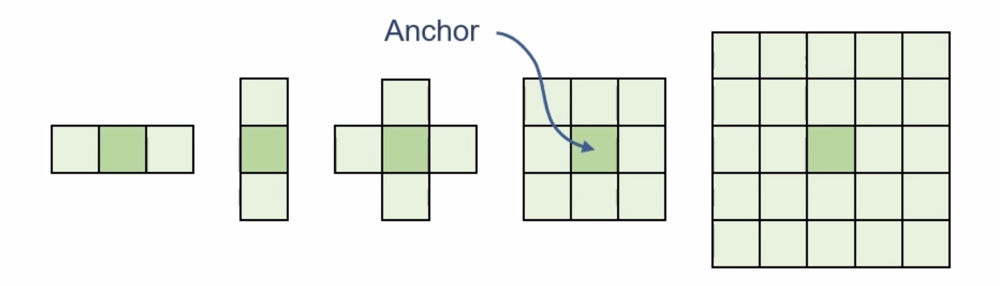
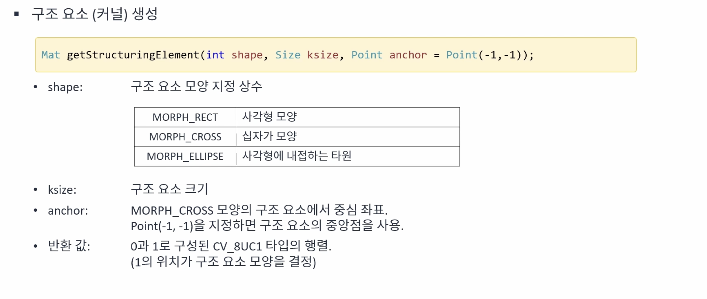
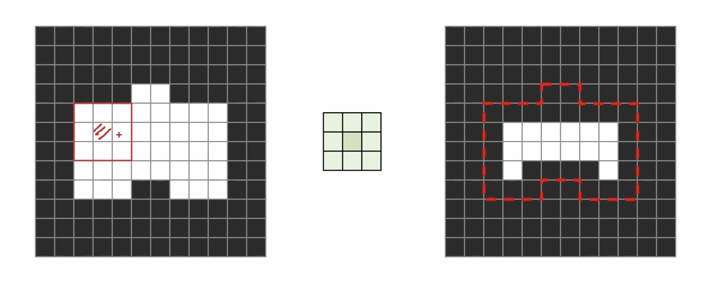
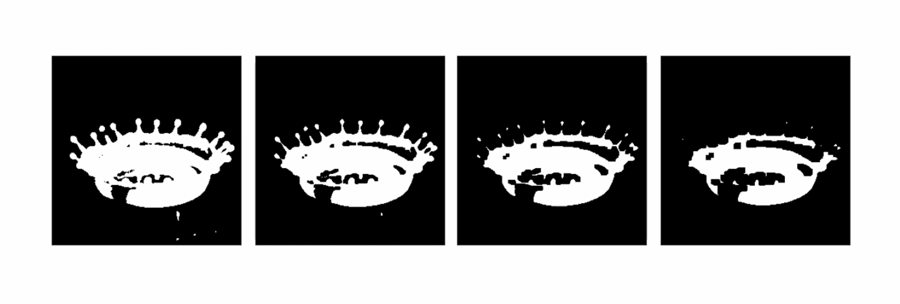
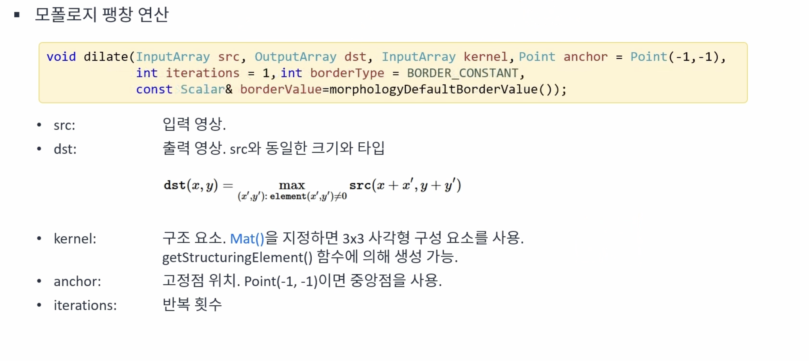
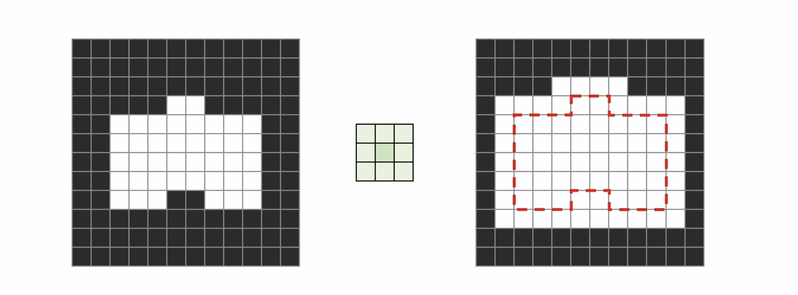
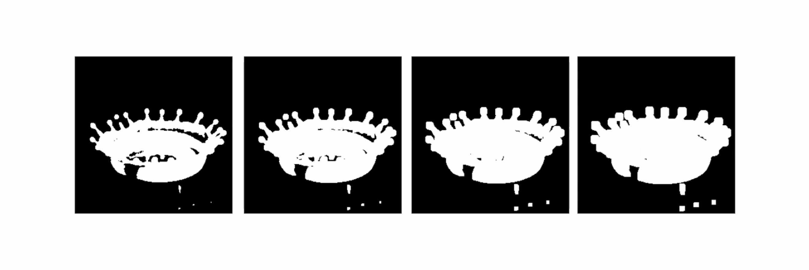
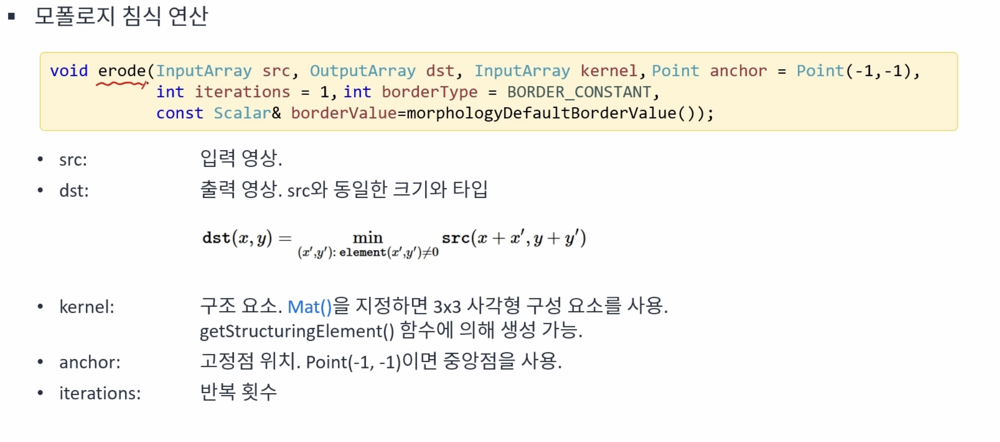
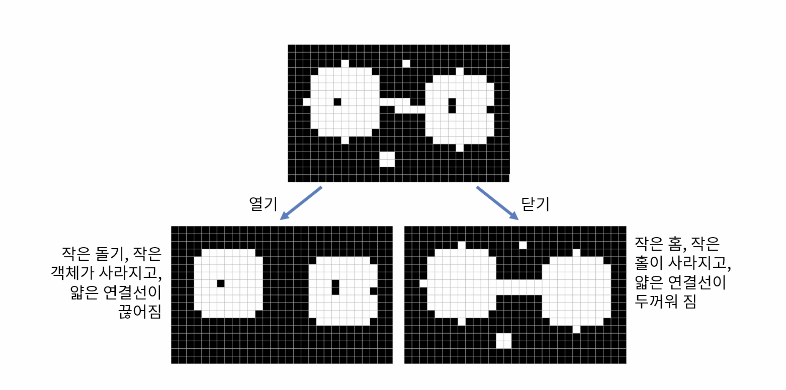
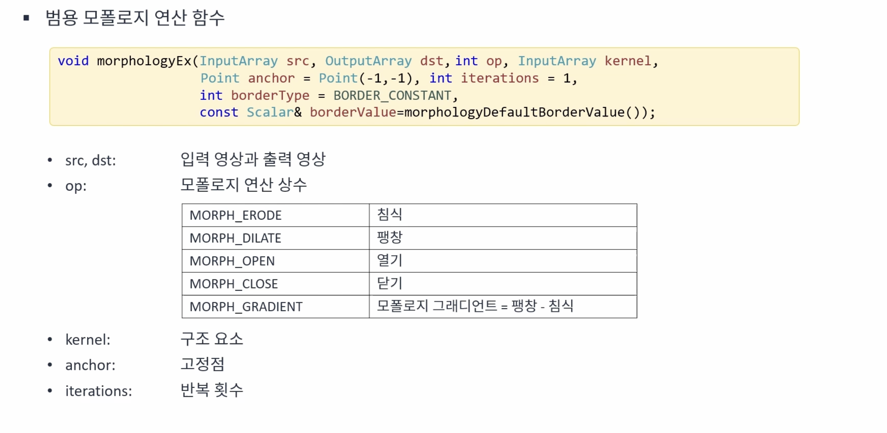

# 모폴로지
{: .no_toc }

## Table of contents
{: .no_toc .text-delta }

1. TOC
{:toc}

---

# 모폴로지(Morphology) 란?
영상을 형태학적인 측면에서 다루는 방법으로 이진 영상의 잡음을 제거하거나, 형태를 변형하는 방법이다. 외곽선 검출 혹은 레이블링을 수행하기 전에 전처리 과정으로 사용된다.

## 구조 요소(Structuring elelment)
모폴로지 연성의 결과를 결정하는 커널 혹은 마스크를 의미한다.





## 침식(Erosion) 연산
침식 연상은 객체 외각을 깍아내는 형태의 연산을 의미하며, 객체의 크기는 줄어들고 배경은 확대되는 형태로 결과나 나타난다. 작은 크기의 잡음을 제거하는 효과가 있다.



침식 영상의 경우 구조 요소가 객체에 모두 들어간 경우 구조 요소의 중심을 마스킹한다. 만약 배경과 1픽셀 이라도 겹치는 경우에 마스킹하지 않는다. 


침식 작업은 여러번 수행이 가능하며, 그 수가 증가할수록 객체의 형태는 조금씩 무너지는 것을 확인할 수 있다.




## 팽장(Dilation) 연산
팽창 연산은 객체의 외각을 확대시키는 방법이다. 


구조 요소와 객체 영역이 한 픽셀이라도 만나는 경우 마스킹을 수행한다.


팽창 작업 역시 여러번 수행이 가능하며, 그 수가 증가할수록 객체의 외관선이 증가하여 단순화된다. 반면 노이즈는 증가한다.





## 열기(Opning)와 닫기(Closing) 연산
열기와 닫기 연산은 침식과 팽창 연산을 조합해서 사용하는 방법이다. 열기 연산의 경우 `침식 연산 후 팽창 연산`을 수해하는 것이고, 닫기 연산은 `팽창 연산 후 침식 연산`을 수행하는 것이다.





## Example code

```cpp
void ex_processing(){
	Mat src = imread("../data/rice.png", IMREAD_GRAYSCALE);

	if (src.empty()) {
		cerr << "Image load failed!" << endl;
		return ;
	}

	Mat dst = Mat::zeros(src.rows, src.cols, CV_8UC1);
	int bw = src.cols / 4;
	int bh = src.rows / 4;

	for (int y = 0; y < 4; y++) {
		for (int x = 0; x < 4; x++) {
			Mat src_ = src(Rect(x*bw, y*bh, bw, bh));
			Mat dst_ = dst(Rect(x*bw, y*bh, bw, bh));
			threshold(src_, dst_, 0, 255, THRESH_BINARY | THRESH_OTSU);
			// 지역 이진화
		}
	}	

	Mat labels;
	
	int cnt1 = connectedComponents(dst, labels);
	cout << "# of objects in dst: " << cnt1 - 1 << endl;

	Mat dst2;
	morphologyEx(dst, dst2, MORPH_OPEN, Mat());
	// 열기 모폴로지 연산 수행
	// or
	// erode(dst, dst2, Mat());
	// dilate(dst2, dst2, Mat());

	int cnt2 = connectedComponents(dst2, labels);
	cout << "# of objects in dst2: " << cnt2 - 1 << endl;

	imshow("src", src);
	imshow("dst", dst);
	imshow("dst2", dst2);
	waitKey();
}
```