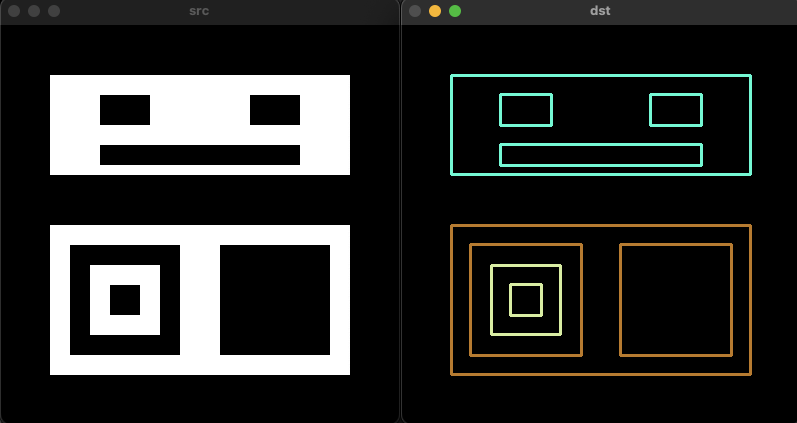

# 레이블링과 외관선 검출
{: .no_toc }

## Table of contents
{: .no_toc .text-delta }

1. TOC
{:toc}

---


# 객체 단위 분석
이진 영상의 형태로 객체를 분할해서 객체의 위치 크기 및 모양들을 분석하는 방법이다. 


## 레이블링(Connected compoent labeling)
영역 기반의 모양 분석 방법으로 서로 연결되어 있는 픽셀에 고유한 고유한 번호를 지정하여 객체에 대한 고유한 아이디를 부여한다. 이를 토앻 레이블 맵, 바운딩 박스, 픽셀 개수, 무게 중심 좌표 등을 구할 수 있다.


`CV_8UC1` 타입의 입력 데이터를 받으며, `CV_32S` 타입의 데이터를 반환한다.


```cpp
void ex_processing(){
	uchar data[] = {
		0, 0, 1, 1, 0, 0, 0, 0,
		1, 1, 1, 1, 0, 0, 1, 0,
		1, 1, 1, 1, 0, 0, 0, 0,
		0, 0, 0, 0, 0, 1, 1, 0,
		0, 0, 0, 1, 1, 1, 1, 0,
		0, 0, 1, 1, 0, 0, 1, 0,
		0, 0, 1, 1, 1, 1, 1, 0,
		0, 0, 0, 0, 0, 0, 0, 0,
	};

	Mat src(8, 8, CV_8UC1, data);

#if 0
	Mat labels;
	int num_labels = connectedComponents(src, labels);

	cout << "src:\n" << src << endl;
	cout << "number of labels: " << num_labels << endl;
	cout << "labels:\n" << labels << endl;
#else
	Mat labels, stats, centroids;
	int num_labels = connectedComponentsWithStats(src, labels, stats, centroids);

	cout << "src:\n" << src << endl;
	cout << "number of labels: " << num_labels << endl;
	cout << "labels:\n" << labels << endl;
	cout << "stats:\n" << stats << endl;
	cout << "centroids:\n" << centroids << endl;
#endif
}
```
```
src:
[  0,   0,   1,   1,   0,   0,   0,   0;
   1,   1,   1,   1,   0,   0,   1,   0;
   1,   1,   1,   1,   0,   0,   0,   0;
   0,   0,   0,   0,   0,   1,   1,   0;
   0,   0,   0,   1,   1,   1,   1,   0;
   0,   0,   1,   1,   0,   0,   1,   0;
   0,   0,   1,   1,   1,   1,   1,   0;
   0,   0,   0,   0,   0,   0,   0,   0]
number of labels: 4
labels:
[0, 0, 1, 1, 0, 0, 0, 0;
 1, 1, 1, 1, 0, 0, 2, 0;
 1, 1, 1, 1, 0, 0, 0, 0;
 0, 0, 0, 0, 0, 3, 3, 0;
 0, 0, 0, 3, 3, 3, 3, 0;
 0, 0, 3, 3, 0, 0, 3, 0;
 0, 0, 3, 3, 3, 3, 3, 0;
 0, 0, 0, 0, 0, 0, 0, 0]
stats:
[0, 0, 8, 8, 39;
 0, 0, 4, 3, 10;
 6, 1, 1, 1, 1;
 2, 3, 5, 4, 14]
centroids:
[3.615384615384615, 3.692307692307693;
 1.7, 1.2;
 6, 1;
 4.285714285714286, 4.785714285714286]
 ```


```cpp
void ex_processing(){
	Mat src = imread("../data/keyboard.bmp", IMREAD_GRAYSCALE);

	if (src.empty()) {
		cerr << "Image load failed!" << endl;
		return ;
	}

	Mat src_bin;
	threshold(src, src_bin, 0, 255, THRESH_BINARY | THRESH_OTSU);

	Mat labels, stats, centroids;
	int cnt = connectedComponentsWithStats(src_bin, labels, stats, centroids);
	cout << cnt << endl;

	Mat dst;
	cvtColor(src, dst, COLOR_GRAY2BGR);

	for (int i = 1; i < cnt; i++) {
		int* p = stats.ptr<int>(i);

		if (p[4] < 20) continue; // 면적이 너무 작은 객체는 제외 (노이즈 제거)

		rectangle(dst, Rect(p[0], p[1], p[2], p[3]), Scalar(0, 255, 255));
	}

	imshow("src", src);
	imshow("dst", dst);
	waitKey();
}

```
 


## 외관선 검출(Conture tracing)
외곽선 기반의 모양 분석 방법으로 각 객체의 외곽선 좌표를 모두 검출한다.


```cpp
void ex_processing(){
	Mat src = imread("../data/contours.bmp", IMREAD_GRAYSCALE);

	if (src.empty()) {
		cerr << "Image load failed!" << endl;
		return ;
	}

	vector<vector<Point>> contours;
	vector<Vec4i> hierarchy;
	findContours(src, contours, hierarchy, RETR_CCOMP, CHAIN_APPROX_NONE);

	Mat dst = Mat::zeros(src.rows, src.cols, CV_8UC3);
	for (int idx = 0; idx >= 0; idx = hierarchy[idx][0]) { // hierarchy[idx][0] 다음 외곽선을 의미
		Scalar color(rand() & 255, rand() & 255, rand() & 255);
		drawContours(dst, contours, idx, color, 2, LINE_8, hierarchy);
	}

	imshow("src", src);
	imshow("dst", dst);
	waitKey();
}
```




```cpp
void ex_processing(){
	Mat src = imread("../data/milkdrop.bmp", IMREAD_GRAYSCALE);

	if (src.empty()) {
		cerr << "Image load failed!" << endl;
		return ;
	}

	Mat src_bin;
	threshold(src, src_bin, 0, 255, THRESH_BINARY | THRESH_OTSU);

	vector<vector<Point>> contours;
	findContours(src_bin, contours, RETR_LIST, CHAIN_APPROX_NONE);

	Mat dst = Mat::zeros(src.rows, src.cols, CV_8UC3);
	for (unsigned i = 0; i < contours.size(); i++) {
		Scalar color(rand() & 255, rand() & 255, rand() & 255);
		drawContours(dst, contours, i, color, 1, LINE_8);
	}

	imshow("src", src);
	imshow("src_bin", src_bin);
	imshow("dst", dst);
	waitKey();
}
```

