# 영상 분할과 객체 검출
{: .no_toc }

## Table of contents
{: .no_toc .text-delta }

1. TOC
{:toc}

---


# 템플릿 매칭(Template matching)
입력 영상에서 부분 영상 위치를 찾는 방법이다. 
> 템플릿: 전체 영상 내에서 찾고자 하는 작은 이미지

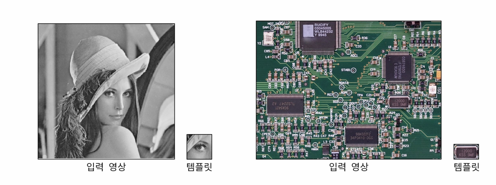


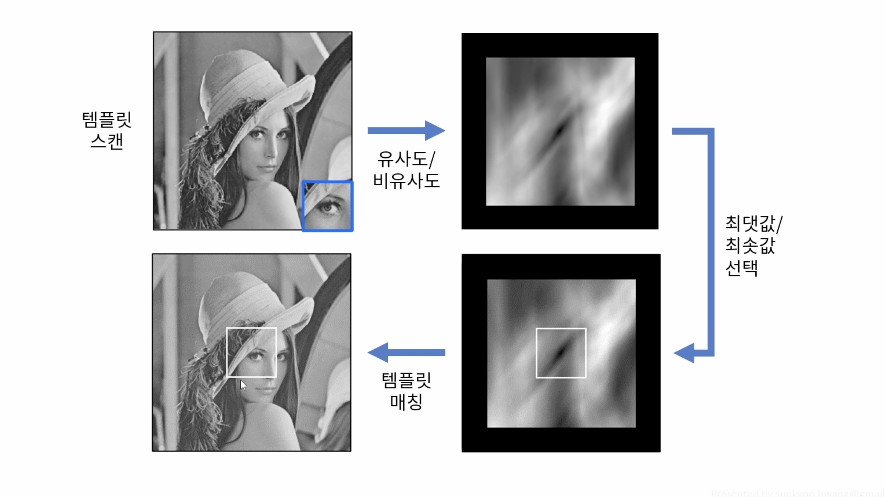
원본 영상 위를 템플리 이미지를 가지고 슬라이딩 하면서 `유사도` 혹은 `비유사도`를 구한다. 템플릿 이미지의 중심이 원본 영상과의 유사도가 되고 이미지로 표현하면 우상단의 이미지와 같다. 영상 전체에 대해서 유사도를 구했다면 그 중에서 가장 큰 값 혹은 작은 값의 위치가 해당 템플릿과 일치하는 부분이 된다. 
> 알고리즘 특성상 크기 변환이나 회전에 대해서는 안좋은 결과를 보여준다.

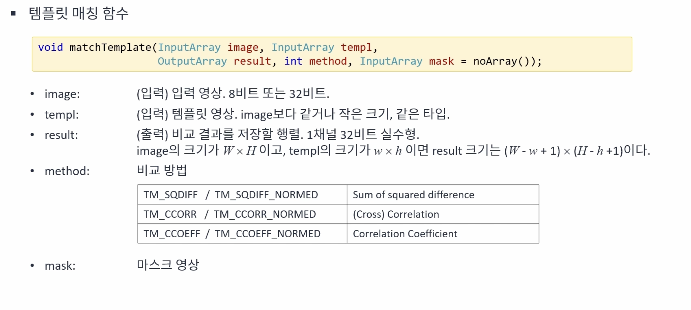

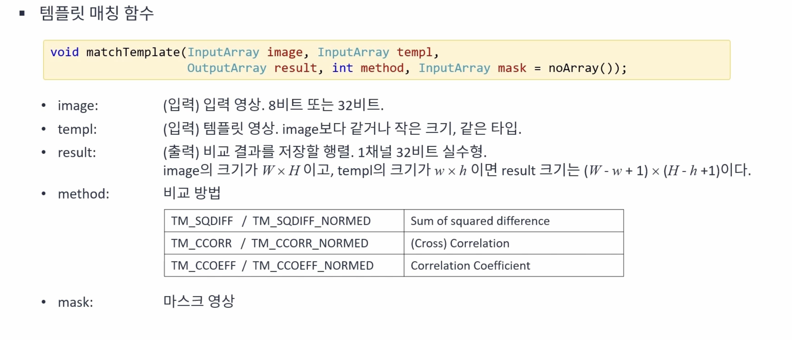
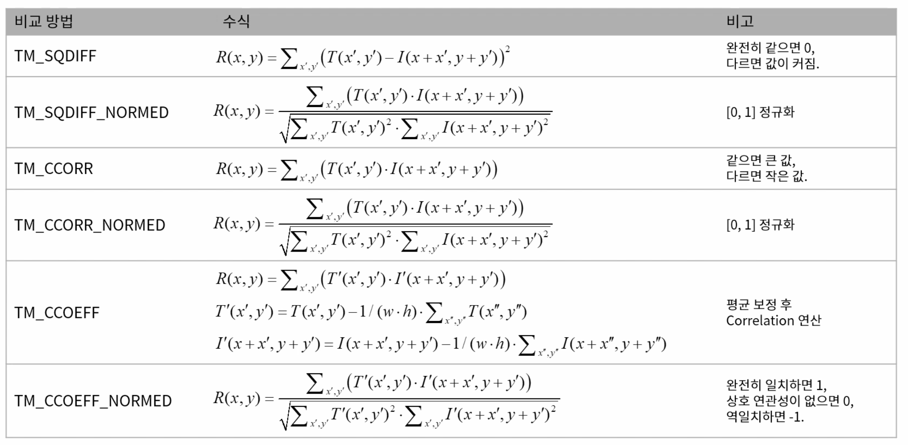


```cpp
void ex_processing(){
	Mat src = imread("../data/circuit.bmp", IMREAD_GRAYSCALE);
	Mat tmpl = imread("../data/crystal.bmp", IMREAD_GRAYSCALE);

#if 0
	src = imread("wheres_wally.jpg", IMREAD_GRAYSCALE); // IMREAD_COLOR
	tmpl = imread("wally.bmp", IMREAD_GRAYSCALE);
#endif

	if (src.empty() || tmpl.empty()) {
		cerr << "Image load failed!" << endl;
		return ;
	}

#if 1
	src = src + 50;
	// 밝기 증가
	Mat noise(src.size(), CV_32S);
	// singned 타입이기 때문에 음수 형태의 잡음도 생성이 됨
	randn(noise, 0, 10); // 10, 50, 100 
	add(src, noise, src, noArray(), CV_8U);
	// 표준 편차가 10인 잡음을 추가 
#endif

#if 0 // 노이즈 제거를 위한 가우시안 필터
	GaussianBlur(src, src, Size(), 1);
	GaussianBlur(tmpl, tmpl, Size(), 1);
#endif

#if 0 // 이미지 크기 조절
	resize(src, src, Size(), 0.9, 0.9); // 0.8, 0.7
#endif

#if 0 // 반시계 방향으로 10도 회전시키는 코드
	Point2f cp(src.cols / 2.f, src.rows / 2.f);
	Mat rot = getRotationMatrix2D(cp, 10, 1); // 20, 30
	warpAffine(src, src, rot, src.size());
#endif

	Mat res, res_norm;
	matchTemplate(src, tmpl, res, TM_CCOEFF_NORMED);
	normalize(res, res_norm, 0, 255, NORM_MINMAX, CV_8U);

	double maxv;
	Point maxloc;
	minMaxLoc(res, 0, &maxv, 0, &maxloc);

	cout << "maxv: " << maxv << endl;
	cout << "maxloc: " << maxloc << endl;

	Mat dst;
	cvtColor(src, dst, COLOR_GRAY2BGR);

	rectangle(dst, Rect(maxloc.x, maxloc.y, tmpl.cols, tmpl.rows), Scalar(0, 0, 255), 2);

	imshow("src", src);
	imshow("tmpl", tmpl);
	imshow("res_norm", res_norm);
	imshow("dst", dst);
	waitKey();
}

```

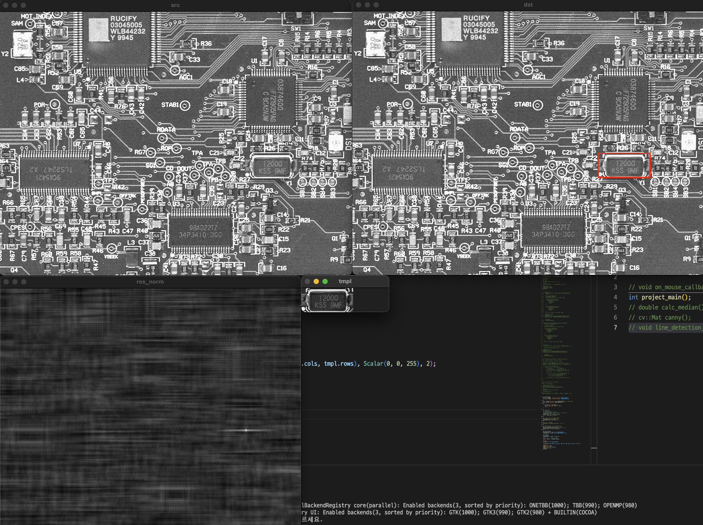


## 여러개의 템플릿을 찾는 경우
 


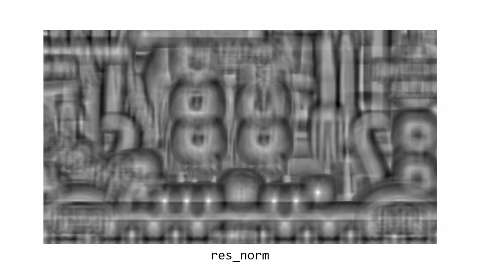

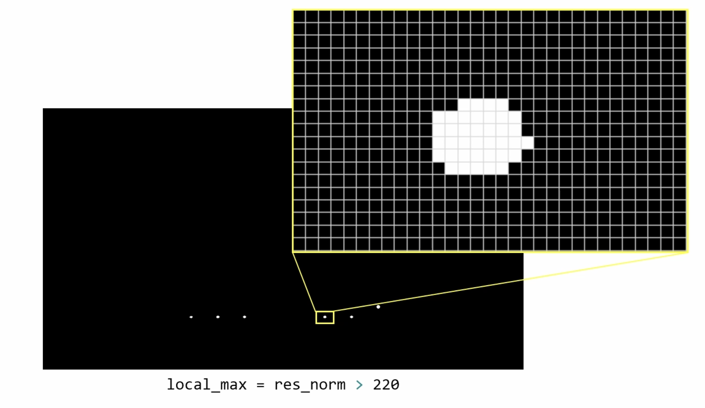

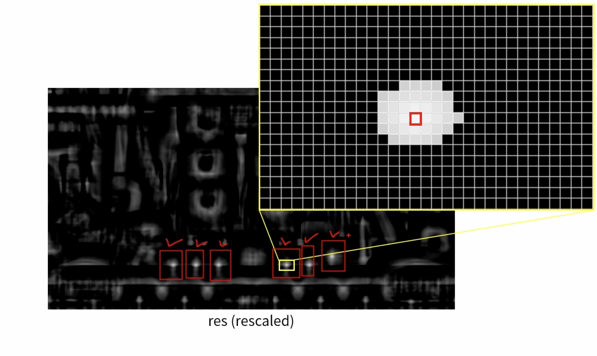
레이블링 방법을 통해서 6개의 영역을 찾고 해당 영역에 대해서 최대값을 찾는 방법으로 여러 객체에 대해서 템플릿 매칭을 수행할 수 있다.


```cpp

void ex_processing(){
	Mat src = imread("../data/cookierun.png");
	Mat tmpl = imread("../data/item.png");

	if (src.empty() || tmpl.empty()) {
		cerr << "Image load failed!" << endl;
		return ;
	}

	Mat res, res_norm;
	matchTemplate(src, tmpl, res, TM_CCOEFF_NORMED);
	normalize(res, res_norm, 0, 255, NORM_MINMAX, CV_8UC1);

	Mat local_max = res_norm > 220;

	Mat labels;
	int num = connectedComponents(local_max, labels);
	Mat dst = src.clone();

	for (int i = 1; i < num; i++) {
		Point max_loc;
		Mat mask = (labels == i);
		// 원본 이미지와 동일한 크기의 마스크로 배경은 0, 연결된 픽셀들 간에는 고유의 아이디로 표현된 마스크
		minMaxLoc(res, 0, 0, 0, &max_loc, mask);

		cout << max_loc.x << ", " << max_loc.y << endl;

		Rect b_rect = Rect(max_loc.x, max_loc.y, tmpl.cols, tmpl.rows);
		rectangle(dst, b_rect, Scalar(0, 255, 255), 2);
	}

//	imshow("src", src);
//	imshow("templ", templ);
//	imshow("res_norm", res_norm);
	imshow("local_max", local_max);
	imshow("dst", dst);
	waitKey();
}
```
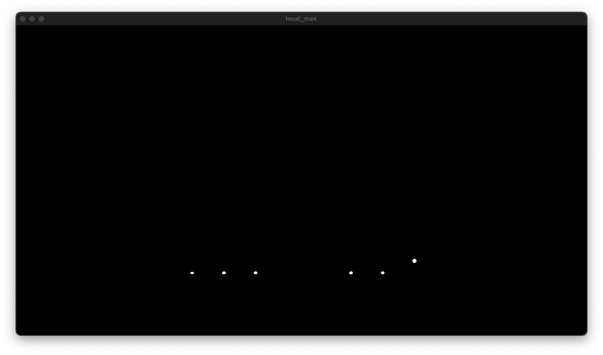

 


# 서브픽셀 에지 위치 검출하기
주행 영상에서 차선의 안과 밖의 서브픽셀 위치를 구한다.

> 서브픽셀 이란? 이미지의 픽셀의 위치는 정수를 기준으로 구성된다. 하지만 주변 픽셀들 간의 높이 차이를 통해 실수 영역에서의 픽셀 위치를 구할 수 있다. 실수 영역의 픽셀의 위치를 서브픽셀이라고 한다.

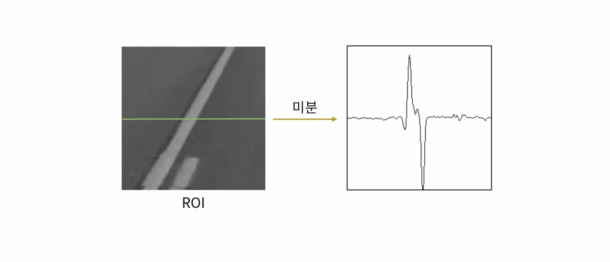

차선 인식은 ROI 설정 -> x축 미분 -> 최대와 최소 지점을 구하는 순서로 이루어진다.

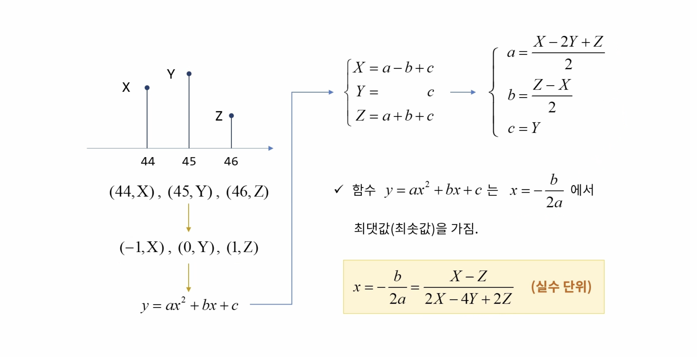

위에서 구한 극점의 앞과 뒤를 이용해서 2차 방방정식으로 근사 시킨다. 이때 함수의 미분이 0이되는 지점을 이용한다.


## 코드
```cpp

#define GETFPOINT(x,y,z) ((x-z) / ( (2.f*x)-(4.f*y)+(2.f*z) ))

float get_float_point(Mat roi, Point loc){
	float x, y, z;

	x = roi.at<float>(loc.x-1);
	y = roi.at<float>(loc.x);
	z = roi.at<float>(loc.x+1);
	return loc.x + GETFPOINT(x,y,z);
}

const Point p1(300, 600), p2(500, 600);
const Point p3(800, 600), p4(1000, 600);

vector<Point2f> find_edges(const Mat& img);
void drawCross(Mat& img, Point pt, Scalar color);

void ex_processing(){
	Mat src = imread("../data/lane01.bmp", IMREAD_COLOR);

	if (src.empty()) {
		cerr << "Image laod failed!" << endl;
		return ;
	}

	Mat gray;
	cvtColor(src, gray, COLOR_BGR2GRAY);
	
	Rect rc1(p1 + Point(0, -10), p2 + Point(0, 10));
	Rect rc2(p3 + Point(0, -10), p4 + Point(0, 10));

	

	vector<Point2f> pts1 = find_edges(gray(rc1));
	vector<Point2f> pts2 = find_edges(gray(rc2));

	Mat dst = src.clone();
	line(dst, p1, p4, Scalar(0, 255, 128), 1, LINE_AA);
	rectangle(dst, rc1, Scalar(255,0,0), 1, LINE_AA);
	rectangle(dst, rc2, Scalar(255,0,0), 1, LINE_AA);
	


	drawCross(dst, Point(cvRound(p1.x + pts1[0].x), p1.y), Scalar(255, 0, 0));
	drawCross(dst, Point(cvRound(p1.x + pts1[1].x), p1.y), Scalar(0, 0, 255));
	putText(dst, format("(%4.3f, %d)", p1.x + pts1[0].x, p1.y),
		Point(p1.x + pts1[0].x - 50, p1.y - 20),
		FONT_HERSHEY_SIMPLEX, 0.5, Scalar(255, 0, 0), 1, LINE_AA);
	putText(dst, format("(%4.3f, %d)", p1.x + pts1[1].x, p1.y),
		Point(p1.x + pts1[1].x - 20, p1.y + 30),
		FONT_HERSHEY_SIMPLEX, 0.5, Scalar(0, 0, 255), 1, LINE_AA);

	drawCross(dst, Point(cvRound(p3.x + pts2[0].x), p3.y), Scalar(255, 0, 0));
	drawCross(dst, Point(cvRound(p3.x + pts2[1].x), p3.y), Scalar(0, 0, 255));
	putText(dst, format("(%4.3f, %d)", p3.x + pts2[0].x, p3.y),
		Point(p3.x + pts1[0].x - 50, p3.y - 20),
		FONT_HERSHEY_SIMPLEX, 0.5, Scalar(255, 0, 0), 1, LINE_AA);
	putText(dst, format("(%4.3f, %d)", p3.x + pts2[1].x, p3.y),
		Point(p3.x + pts1[1].x - 20, p3.y + 30),
		FONT_HERSHEY_SIMPLEX, 0.5, Scalar(0, 0, 255), 1, LINE_AA);

	imshow("dst", dst);
	waitKey();
}


vector<Point2f> find_edges(const Mat& img)
{
	Mat fimg, blr, dx;
	img.convertTo(fimg, CV_32F);
	GaussianBlur(fimg, blr, Size(), 1.);
	Sobel(blr, dx, CV_32F, 1, 0);

	double minv, maxv;
	Point minloc, maxloc;

	int y2 = img.rows / 2;
	Mat roi = dx.row(y2);
	minMaxLoc(roi, &minv, &maxv, &minloc, &maxloc);

	// cout << maxloc << " " << maxv << endl;
	// cout << img.rows << endl;
	// cout << roi.colRange(maxloc.x-1, maxloc.x+2) << endl;
	// cout << roi.at<float>(maxloc.x) << endl;


#if 0
	vector<Point2f> pts;
	pts.push_back(Point2f(maxloc.x, y2));
	pts.push_back(Point2f(minloc.x, y2));
#else
	vector<Point2f> pts;
	pts.push_back(Point2f(get_float_point(roi, maxloc), y2));
	pts.push_back(Point2f(get_float_point(roi, minloc), y2));
	// pts.push_back(Point2f(minloc.x + hat, y2));


#endif

	return pts;
}

void drawCross(Mat& img, Point pt, Scalar color)
{
	int span = 5;
	line(img, pt + Point(-span, -span), pt + Point(span, span), color, 1, LINE_AA);
	line(img, pt + Point(-span, span), pt + Point(span, -span), color, 1, LINE_AA);
}


```

## 결과


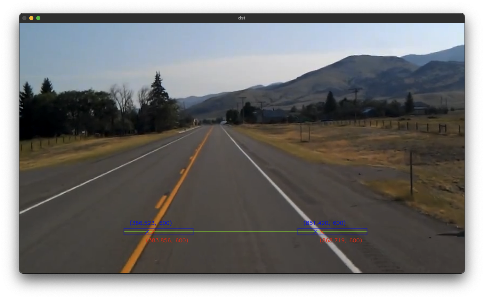