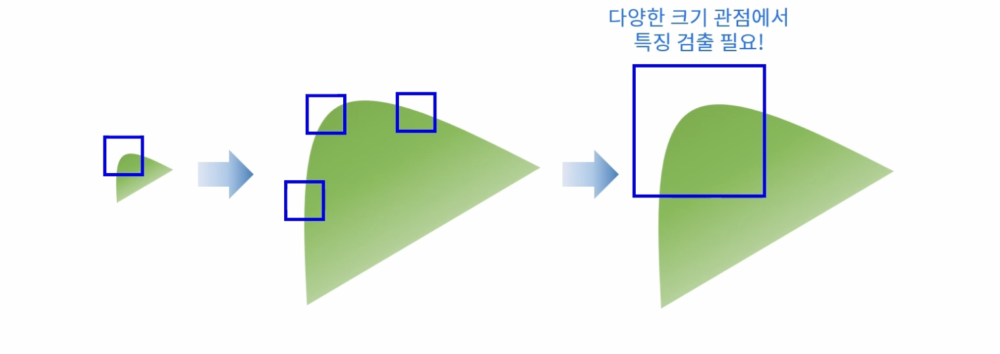
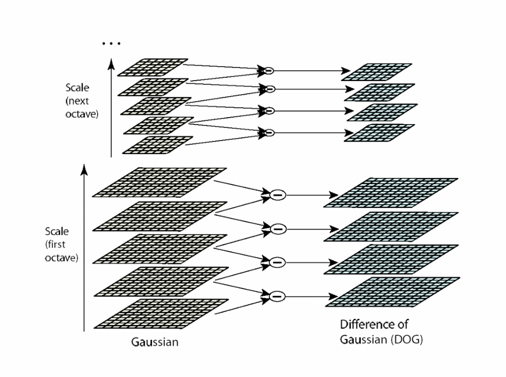
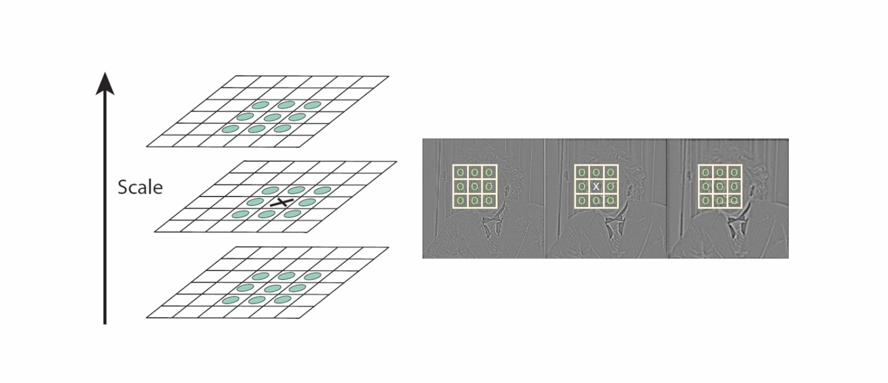
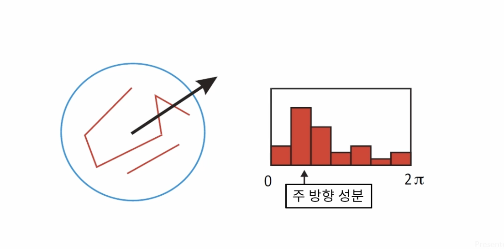
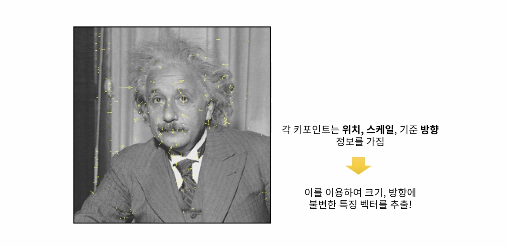
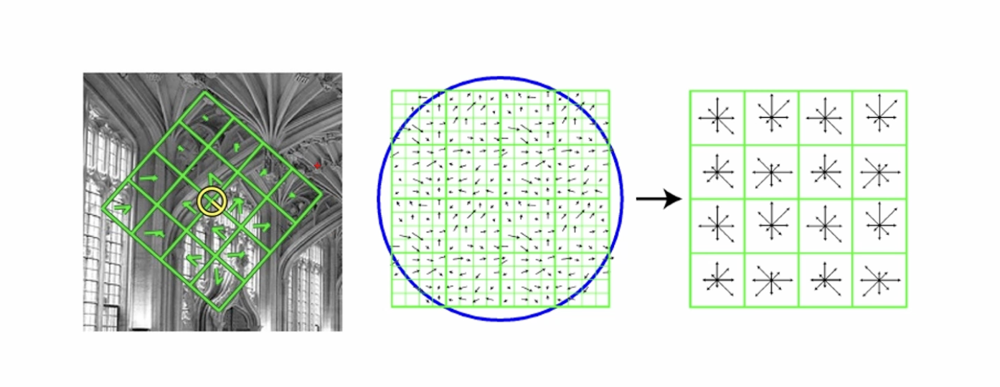
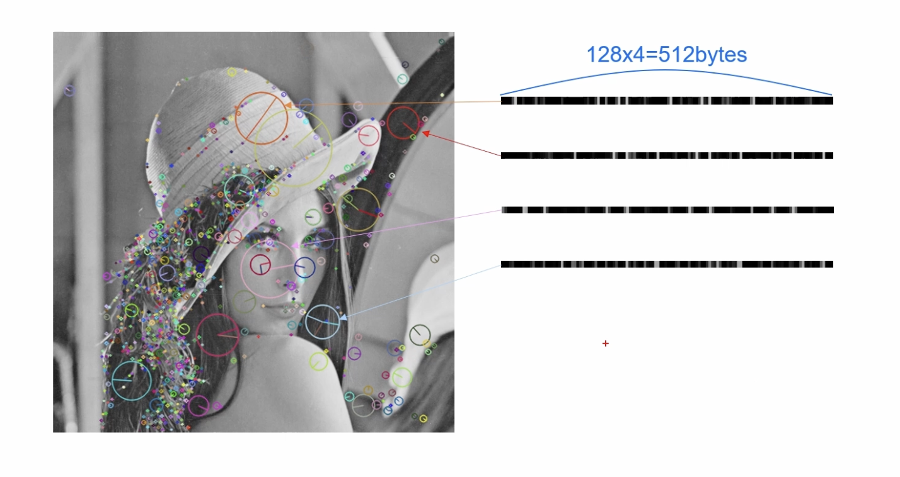
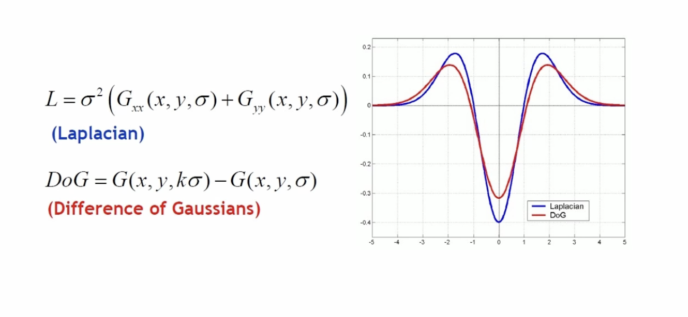
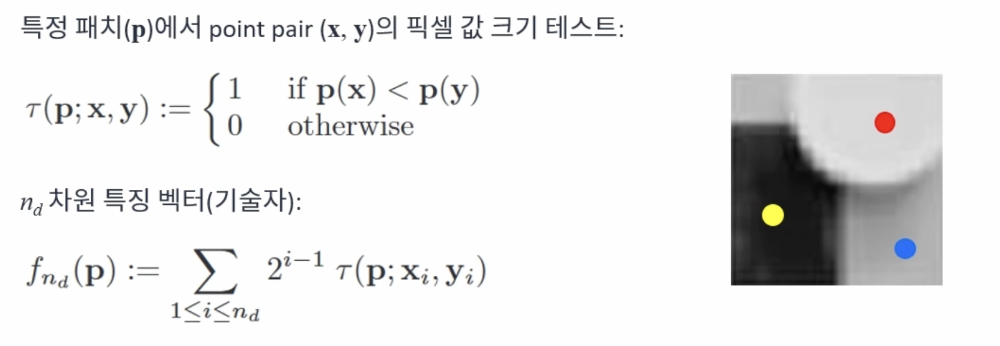

# 특징점 검출과 매칭
{: .no_toc }

## Table of contents
{: .no_toc .text-delta }

1. TOC
{:toc}

---

# 크기 불변 특징
코너의 경우 평탄한 영역이나 엣지 영역에 비해 변별력이 높다. 특히 이동이나 회전 변화에 강인하지만 크기 변화에는 취약한 특지을 갖는다.

객체를 보는 크기에 따라 코너가 엣지가 될 수 있다(크기 변화에 민감). 다양한 크기에 대한 코너를 확인하면, 크기 변화에 강인한 특징을 얻을 수 있다.

## 크기 불변 특징점
이미지에서 크기 변화에 강인한 코너 특징을 찾기 위해 스케일 스페이스(Scale-space) 또는 이미지 피라미드(Image pyramid)를 이용한다. 

> 스케일 스페이스에서 크기가 같은 이미지를 옥타브라고 한다.

# SIFT (Scale Invariant Feature Transform)
아래 네 단계를 통해 크기 불변 특징을 계산한다.

## 키 포인트를 검출하는 과정
### 1. Scale-space extrema detection
SIFT는 스케일 스페이스를 이용해서 영상에서 엣지를 찾는다.

### 2. Keypoint localization
주변보다 크거나 작은 픽셀의 위치를 찾는다. 이때 같은 크기의 영상에서 주변 8개의 점과 크고 작은 스케일 영상에 대한 픽셀과의 크기를 비교한다.

이후 후 처리를 통해 중요한 특징만 남긴다.

## 부분 영상의 특징 벡터를 추출
3. Orientation assignment
키포인트 주변의 부분 영상을 샘플링하고 부분 영상의 모든 픽셀 그래디언트의 성분(크기와 방향)을 계산한다. 방향 성분에 대한 히스토그램을 계산하며, 36개의 빈을 이용해서 10도 마다 모든 각도를 표현한다. 히스토그램 최대값 방향과 최대값의 80% 이상 크기를 갖는 빈 바양을 키포인트 방향으로 설정한다.

각도를 시각화 하면 그림과 같다. 큰 화살표의 경우 작은 크기의 이미지로부터 얻은 그래디언트이며, 반대로 작은 화살표의 경우 원본 영상에서 얻은 그래디언트이다.

4. Keypoint description
각 키포인트 위치에서 위에서 구한 스케일과 기준 방향 정보를 이용해서 새로운 영역을 선택한다.

사각형 영역은 4x4 구역으로 분할하고, 각 구역에서 8개의 빈으로 구성된 각도 히스토그램을 구한다. (4x4x8=128 차원의 실수형 벡터, float 기준으로 128 * 4byte = 512byte)

SIFT에서 사용되는 특징 기술자는 그림과 같이 벡터 형태로 나타난다.

## 블러된 영상을 통해 키포인트를 찾는 이유
가우시안 함수를 두 번 미분한 결과(Laplacian)들에서 최대점과 최소점이 이미지에서 안정적인 특징으로 사용할 수 있다. 하지만 두 번 미분하는 것은 많은 연산을 요구한다. 따라서 Laplacian과 비슷한 결과를 보여주는 DOG를 사용해서 이미지의 특징을 찾는다.

# 그 외 다른 방법들
## BRIEF(Binary Robust Independent Elementary Feature)
이진 기술자를 이용한 빠른 키포인트 기술 방법이다. 키포인트 주변 픽셀 쌍을 미리 정하고, 픽셀 값의 크기를 비교하여 0또는 1로 특징을 기술한다. 

해밍 거리를 이용해서 매칭한다.