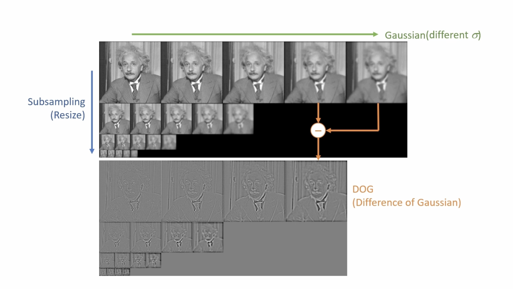
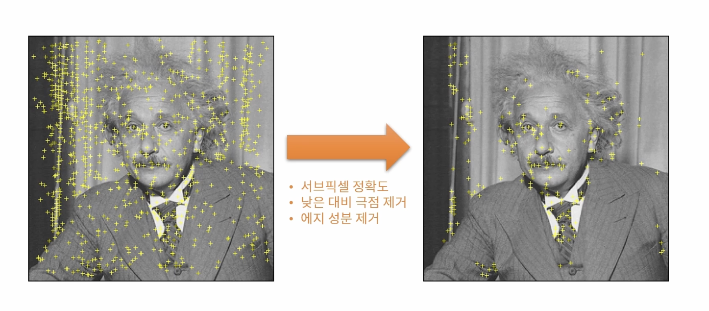

# 특징점 검출과 매칭
{: .no_toc }

## Table of contents
{: .no_toc .text-delta }

1. TOC
{:toc}

---


# 크기 불변 특징
코너의 경우 평탄한 영역이나 엣지 영역에 비해 변별력이 높다. 특히 이동이나 회전 변화에 강인하지만 크기 변화에는 취약한 특지을 갖는다.


객체를 보는 크기에 따라 코너가 엣지가 될 수 있다(크기 변화에 민감). 다양한 크기에 대한 코너를 확인하면, 크기 변화에 강인한 특징을 얻을 수 있다.

## 크기 불변 특징점
이미지에서 크기 변화에 강인한 코너 특징을 찾기 위해 스케일 스페이스(Scale-space) 또는 이미지 피라미드(Image pyramid)를 이용한다. 

> 스케일 스페이스에서 크기가 같은 이미지를 옥타브라고 한다.

# SIFT (Scale Invariant Feature Transform)
아래 네 단계를 통해 크기 불변 특징을 계산한다.

## 키 포인트를 검출하는 과정
### 1. Scale-space extrema detection
SIFT는 스케일 스페이스를 이용해서 영상에서 엣지를 찾는다.




### 2. Keypoint localization
주변보다 크거나 작은 픽셀의 위치를 찾는다. 이때 같은 크기의 영상에서 주변 8개의 점과 크고 작은 스케일 영상에 대한 픽셀과의 크기를 비교한다.



이후 후 처리를 통해 중요한 특징만 남긴다.


## 부분 영상의 특징 벡터를 추출
3. Orientation assignment
키포인트 주변의 부분 영상을 샘플링하고 부분 영상의 모든 픽셀 그래디언트의 성분(크기와 방향)을 계산한다. 방향 성분에 대한 히스토그램을 계산하며, 36개의 빈을 이용해서 10도 마다 모든 각도를 표현한다. 히스토그램 최대값 방향과 최대값의 80% 이상 크기를 갖는 빈 바양을 키포인트 방향으로 설정한다.


각도를 시각화 하면 그림과 같다. 큰 화살표의 경우 작은 크기의 이미지로부터 얻은 그래디언트이며, 반대로 작은 화살표의 경우 원본 영상에서 얻은 그래디언트이다.

4. Keypoint description
각 키포인트 위치에서 위에서 구한 스케일과 기준 방향 정보를 이용해서 새로운 영역을 선택한다.


사각형 영역은 4x4 구역으로 분할하고, 각 구역에서 8개의 빈으로 구성된 각도 히스토그램을 구한다. (4x4x8=128 차원의 실수형 벡터, float 기준으로 128 * 4byte = 512byte)
키포인트가 100개라면, 기술자 행렬은 100개의 행과 128개의 열로 구성된 행렬 형태를 갖는다.


SIFT에서 사용되는 특징 기술자는 그림과 같이 벡터 형태로 나타난다.

기술자는 실수 형태를 갖는 실수 기술자와 이진수로 구성된 이진 기술자로 나눠진다. 실수 기술자의 경우 L2 거리를 통해 유사도를 측정하며, 이진 기술자는 해밍 거리를 통해 유사도를 측정한다. 

## 블러된 영상을 통해 키포인트를 찾는 이유
가우시안 함수를 두 번 미분한 결과(Laplacian)들에서 최대점과 최소점이 이미지에서 안정적인 특징으로 사용할 수 있다. 하지만 두 번 미분하는 것은 많은 연산을 요구한다. 따라서 Laplacian과 비슷한 결과를 보여주는 DOG를 사용해서 이미지의 특징을 찾는다.


## 그 외 다른 특징점 검출 방법들


## BRIEF(Binary Robust Independent Elementary Feature)
이진 기술자를 이용한 빠른 키포인트 기술 방법이다. 키포인트 주변 픽셀 쌍을 미리 정하고, 픽셀 값의 크기를 비교하여 0또는 1로 특징을 기술한다. 


해밍 거리를 이용해서 매칭한다.


# OpenCV 특징점 검출과 관련된 클래스


`detect()` 특징점을 검출하는 함수
`compute()` 기술자를 계산하는 함수
`detectAndCompute()` 특징점 검출과 기술자 계산을 한번에 수행하는 함수

## 특징점 검출 코드
```cpp
int main(int argc, char* argv[]) {
	ocl::setUseOpenCL(false); 
  // for ORB time check
  // OpenCL 초기화와 관련된 함수 초기화

	Mat src = imread("../data/lenna.bmp", IMREAD_GRAYSCALE);

	if (src.empty()) {
		cerr << "Image load failed!" << endl;
		return -1;
	}

	TickMeter tm;
	tm.start();

	// Ptr<Feature2D> detector = SIFT::create(); 
	Ptr<SIFT> detector = SIFT::create(); 
	// Ptr<ORB> detector = ORB::create(); 
	// Ptr<AKAZE> detector = AKAZE::create(); 
  // 특징검 검출 클래스 초기화
  // SIFT, KAZE, AKAZE, ORB 클래스 사용 가능
  
	vector<KeyPoint> keypoints;
	detector->detect(src, keypoints);
  // 특징검 검출

	tm.stop();
	cout << "Elapsed time: " << tm.getTimeMilli() << "ms." << endl;
	cout << "keypoints.size(): " << keypoints.size() << endl;

  Mat desc;
  detector->compute(src, keypoints, desc);
  cout << desc.size() << endl;

	Mat dst;
	drawKeypoints(src, keypoints, dst, Scalar::all(-1), 
                DrawMatchesFlags::DRAW_RICH_KEYPOINTS);
  // 검출된 키 포인트들을 시각화 하는 함수
  // 색을 -1로 초기화하면 랜덤한 색상으로 표현


	imshow("dst", dst);
	waitKey();
  return 0;
}

```


# 특징점 매칭

두 영상에서 추출한 특징점 기술자를 비교해 유사한 기술자 끼리 선택하는 과정이다. 두 영상에서 계산된 기술자들을 모두 사용해서 유사도를 통해 유사한 기술자를 연결한다. 

## OpenCV 특징점 매칭 클래스


Brute-force(BF)는 전수 조사 방법으로 모든 기술자들 간의 유사도를 계산한다.
Fas Library for Approximate Nearest Neighor는 K-D Tree를 이용한 방법으로 가장 유사한 K개의 기술자만 계산한다.


```cpp
int main(int argc, char* argv[]) {
	ocl::setUseOpenCL(false); 
  // for ORB time check
  // OpenCL 초기화와 관련된 함수 초기화

	Mat src1 = imread("../data/lenna.bmp", IMREAD_GRAYSCALE), src2;

	if (src1.empty()) {
		cerr << "Image load failed!" << endl;
		return -1;
	}

  resize(src1, src2, Size(), 0.8, 0.8);

  Point cp(src2.cols / 2, src2.rows /2);
  Mat rot = getRotationMatrix2D(cp, 10, 1);
  warpAffine(src2, src2, rot, Size());


	TickMeter tm;
	tm.start();

	Ptr<Feature2D> detector = SIFT::create(); 
  // 특징검 검출 클래스 초기화
  // SIFT, KAZE, AKAZE, ORB 클래스 사용 가능
  
	vector<KeyPoint> kp1, kp2;
  Mat desc1, desc2;
	detector->detectAndCompute(src1, Mat(), kp1, desc1);
	detector->detectAndCompute(src2, Mat(), kp2, desc2);
  // 특징검 검출과 키포인트 계산

	tm.stop();
	cout << "Elapsed time: " << tm.getTimeMilli() << "ms." << endl;
	cout << "keypoints1.size(): " << kp1.size() << endl;
	cout << "keypoints2.size(): " << kp2.size() << endl;


	Mat dst1, dst2;
	drawKeypoints(src1, kp1, dst1, Scalar::all(-1), DrawMatchesFlags::DRAW_RICH_KEYPOINTS);
	drawKeypoints(src2, kp2, dst2, Scalar::all(-1), DrawMatchesFlags::DRAW_RICH_KEYPOINTS);
  // 검출된 키 포인트들을 시각화 하는 함수
  // 색을 -1로 초기화하면 랜덤한 색상으로 표현
 
 Ptr<BFMatcher> matcher = BFMatcher::create();
 vector<DMatch> matches;
 matcher->match(desc1, desc2, matches);
 
 Mat dst;
 drawMatches(src1, kp1, src2, kp2, matches, dst);

	// imshow("dst1", dst1);
	// imshow("dst2", dst2);
	imshow("dst", dst);
	waitKey();
  return 0;
}
```


## 특징점 매칭의 정확도를 올리는 방법

### 정렬을 이용한 방법
```cpp
bool DMatch::operator < (const DMatch &m) const
{
    return distance < m.distance;
}
```
DMatch에 정의된 비교 연산자가 오버로드 되어 있기 때문에 sort 함수를 통해 오름 차순으로 정렬 할 수 있다. 그 중에서 앞에 있는 80개만 사용하면 다음과 같이 거리가 작은(유사한) 특징점들만 걸러낼 수 있다.


### 상위 2개의 유사도 비교를 이용한 방법
가장 작은 거리의 유사도와 그 다음으로 작은 두 유사도를 비교하는 방법이다. 
$$
\frac{가장 작은 유사도}{두 번째로 작은 유사도} < threshold
$$
구분이 잘 되는 특징점의 경우 가장 작은 두 유사도의 차이가 크다는 사실을 이용한 방법이다. 


# 호모그래피(Homography)
두 평명 사이에서 일어나는 투시 변환(Perspective transform)이다. 


두 영상에 대응되는 점의 개수가 4개 이상인 경우에 사용될 수 있다. 이 점이 getPerspective 함수와의 가장 큰 차이이다. 


## RANSAN(Random SAmple Consensus)
이사치(Outlier)가 많은 원본 데이터로부터 모델 파라미터를 예측하는 방법이다. 


직선을 모델링한다고 가정했을 때, 먼저 데이터에서 랜덤하게 두 점을 선택한다. 이후 마진안에 들어오는 데이터의 개수를 샌 다음 이를 기록한다. 위 과정을 반복해서 가장 많은 데이터를 포함하는 직선을 선택하는 방법으로 직선을 찾는다.

위 `findHoumography()` 함수의 동작 과정은 다음과 같다. 80개의 특징점을 찾았다면, 4개만 이용해서 원근 변환을 수행하고, 변환된 나머지 76개의 점이 목표 영상에 존재하는 점들과의 거리를 계산하고 거리가 작은 변환을 찾는 방식으로 동작한다.


```cpp
#include <iostream>
#include "opencv_basic.h"

using namespace std;
using namespace cv;

string file1 = "../data/box.png";
string file2 = "../data/box_in_scene.png";
Ptr<Feature2D> feature;

int main(int argc, char* argv[]) {
	ocl::setUseOpenCL(false);

	// file1 = "../data/graf1.png";
	// file2 = "../data/graf3.png";

	feature = SIFT::create();
	//feature = ORB::create();

	Mat src1 = imread(file1, IMREAD_GRAYSCALE);
	Mat src2 = imread(file2, IMREAD_GRAYSCALE);

	if (src1.empty() || src2.empty()) {
		cerr << "Image load failed!" << endl;
		return -1;
	}

	TickMeter tm;
	tm.start();

	vector<KeyPoint> keypoints1, keypoints2;
	Mat desc1, desc2;
	feature->detectAndCompute(src1, Mat(), keypoints1, desc1);
	feature->detectAndCompute(src2, Mat(), keypoints2, desc2);

	Ptr<DescriptorMatcher> matcher = BFMatcher::create();

#if 1
	vector<DMatch> matches;
	matcher->match(desc1, desc2, matches);

	std::sort(matches.begin(), matches.end());
	vector<DMatch> good_matches(matches.begin(), matches.begin() + 80);
#else
	vector<vector<DMatch>> matches;
	matcher->knnMatch(desc1, desc2, matches, 2);

	vector<DMatch> good_matches;
	for (const auto& m : matches) {
		if (m[0].distance / m[1].distance < 0.7)
			good_matches.push_back(m[0]);
	}
#endif

	vector<Point2f> pts1, pts2;
	for (size_t i = 0; i < good_matches.size(); i++) {
		pts1.push_back(keypoints1[good_matches[i].queryIdx].pt);
		pts2.push_back(keypoints2[good_matches[i].trainIdx].pt);
	}

	Mat H = findHomography(pts1, pts2, RANSAC);

	tm.stop();
	cout << "time: " << tm.getTimeMilli() << endl;

	Mat dst;
	drawMatches(src1, keypoints1, src2, keypoints2, good_matches, dst,
		Scalar::all(-1), Scalar::all(-1), vector<char>(),
		DrawMatchesFlags::NOT_DRAW_SINGLE_POINTS);

	vector<Point2f> corners1, corners2;
	corners1.push_back(Point2f(0, 0));
	corners1.push_back(Point2f(src1.cols - 1.f, 0));
	corners1.push_back(Point2f(src1.cols - 1.f, src1.rows - 1.f));
	corners1.push_back(Point2f(0, src1.rows - 1.f));
	perspectiveTransform(corners1, corners2, H);

	vector<Point> corners_dst;
	for (Point2f pt : corners2) {
		corners_dst.push_back(Point(cvRound(pt.x + src1.cols), cvRound(pt.y)));
	}

	polylines(dst, corners_dst, true, Scalar(0, 255, 0), 2, LINE_AA);

	imshow("dst", dst);
	waitKey();
	destroyAllWindows();

}
```


