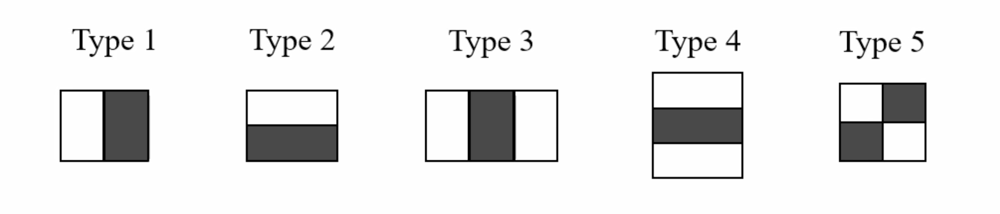
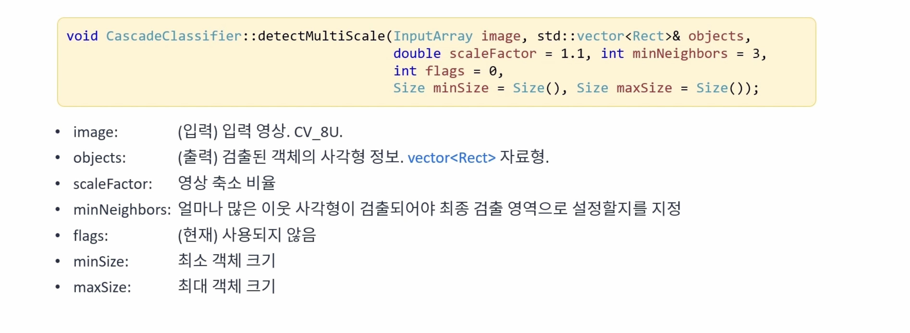
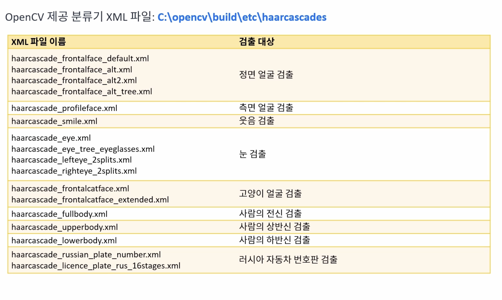
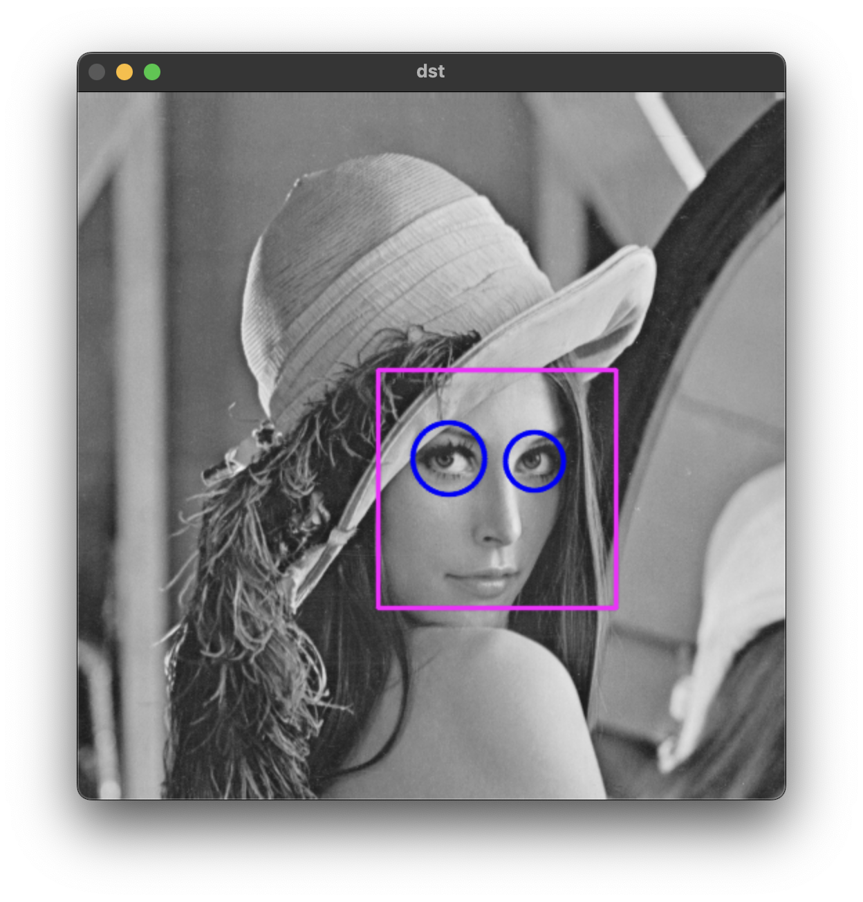

# 캐스케이드 분류기
{: .no_toc }

## Table of contents
{: .no_toc .text-delta }

1. TOC
{:toc}

---


# Harr-like features
사격형 형태의 필터를 이용하여 얻은 특징들을 의미한다. 

흰색 영역의 합에서 검정색 영역의 픽셀값을 뺀 결과 값을 추출한다.
적분 영상(Integral image)를 이용해서 빠르게 계산이 가능하다.

# AdaBoost 알고리즘
week classifier를 모아서 성능을 향상시키는 방법이다. 캐스케이드 분류기의 경우 24 크기의 필터를 통해 이미지의 특징을 추출하는데 이때, 24크기의 필터에서 나올 수 있는 특징은 180,000개 이상이다. 캐스케이드 분류기에서는 adaboost 알고리즘을 이용해서 6000개 정도의 특징만 선별한다.

# 캐스캐이드 분류기(Cascade classifier)란?
캐스케이드는 직렬 형태로 순차적으로 일어나는 일련의 과정을 의미한다. 

얼굴의 경우 영상의 전체에서 일부분을 차지하기 때문에 얼굴을 찾는 것보다 얼굴이 아닌 영역을 찾는 방법이 더 효과적일 수 있다. 때문에 적은 특징을 사용해서 얼굴이 아닌지를 판단하고, 얼굴이라고 판단되는 경우 특징의 수를 늘려 점차 정확도를 올려나간다. 위 방법을 통해 얼굴이 아닌 영역을 빠르게 걸러낼 수 있다.


## OpenCV 함수




OpenCV에서는 사전에 학습된 특징에 대한 XML 파일을 제공하고 있다.


```cpp
#include <iostream>
#include "opencv2/opencv.hpp"
#include "opencv2/core/ocl.hpp"

using namespace std;
using namespace cv;

int main(int argc, char* argv[]) {
	ocl::setUseOpenCL(false);

	Mat src = imread("../data/lenna.bmp", IMREAD_GRAYSCALE);

	if (src.empty()) {
		cerr << "Image load failed!" << endl;
		return -1;
	}

	CascadeClassifier face_cascade("../data/haarcascade_frontalface_default.xml");

	if (face_cascade.empty()) {
		cerr << "Failed to open (face) xml file!" << endl;
		return -1;
	}

	TickMeter tm;
	tm.start();

	vector<Rect> faces;
	face_cascade.detectMultiScale(src, faces);

	tm.stop();
	cout << "Face detect: " << tm.getTimeMilli() << " ms." << endl;

	Mat dst;
	cvtColor(src, dst, COLOR_GRAY2BGR);

	for (size_t i = 0; i < faces.size(); i++) {
		rectangle(dst, faces[i], Scalar(255, 0, 255), 2, LINE_AA);
	}

#if 1
	CascadeClassifier eyes_cascade("../data/haarcascade_eye.xml");
	if (eyes_cascade.empty()) {
		cerr << "Failed to open (eye) xml file!" << endl;
		return -1;
	}

	for (size_t i = 0; i < faces.size(); i++) {
		Mat faceROI = src(faces[i]); // 위에서 찾은 얼굴 안에서 눈을 찾음
		vector<Rect> eyes;
		eyes_cascade.detectMultiScale(faceROI, eyes);

		for (size_t j = 0; j < eyes.size(); j++) {
			Point eye_center(faces[i].x + eyes[j].x + eyes[j].width / 2, faces[i].y + eyes[j].y + eyes[j].height / 2);
			int radius = cvRound((eyes[j].width + eyes[j].height) * 0.25);
			circle(dst, eye_center, radius, Scalar(255, 0, 0), 2, LINE_AA);
		}
	}
#endif

//	imshow("src", src);
	imshow("dst", dst);
	waitKey();
}
```

