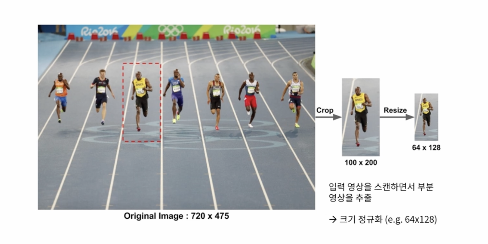
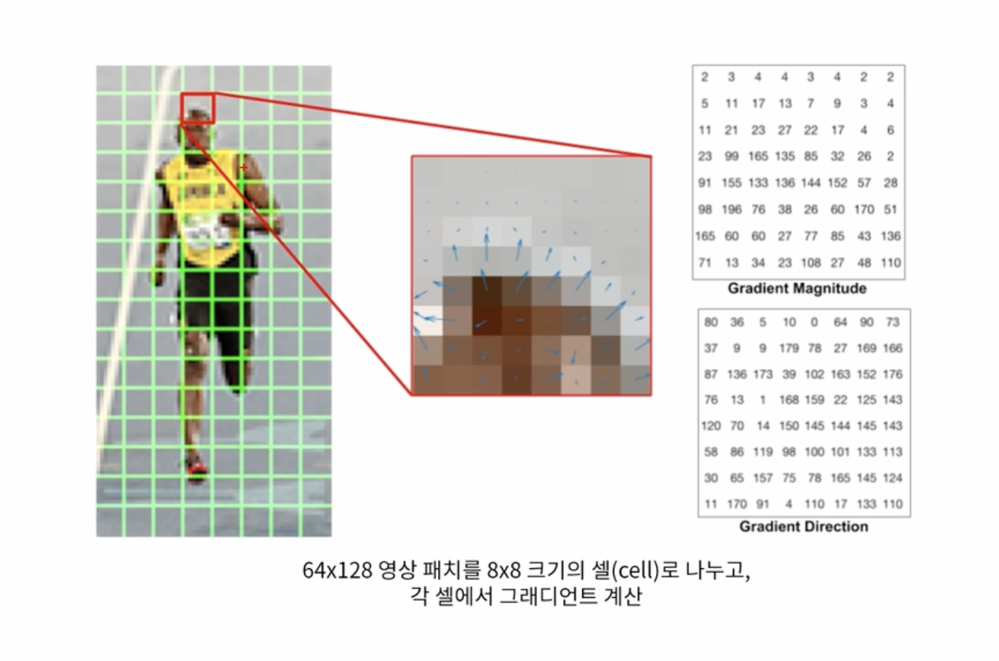
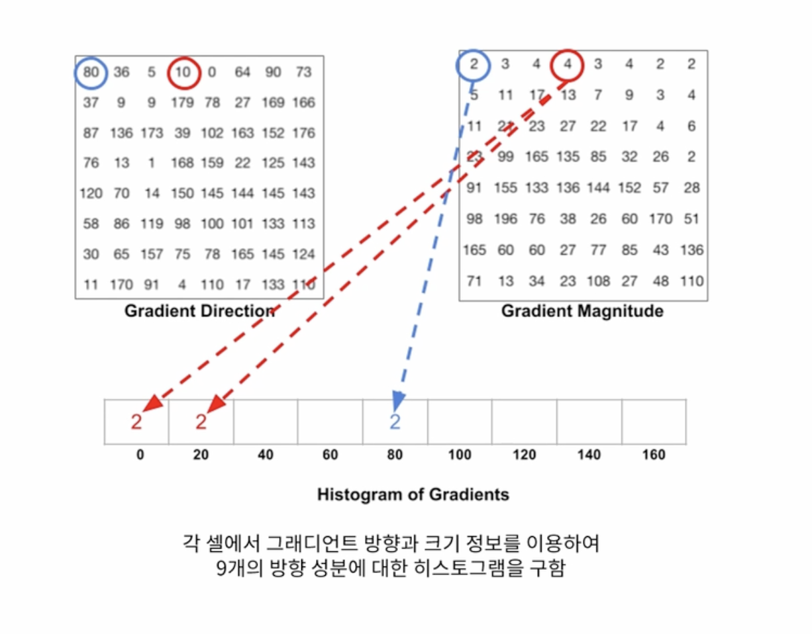
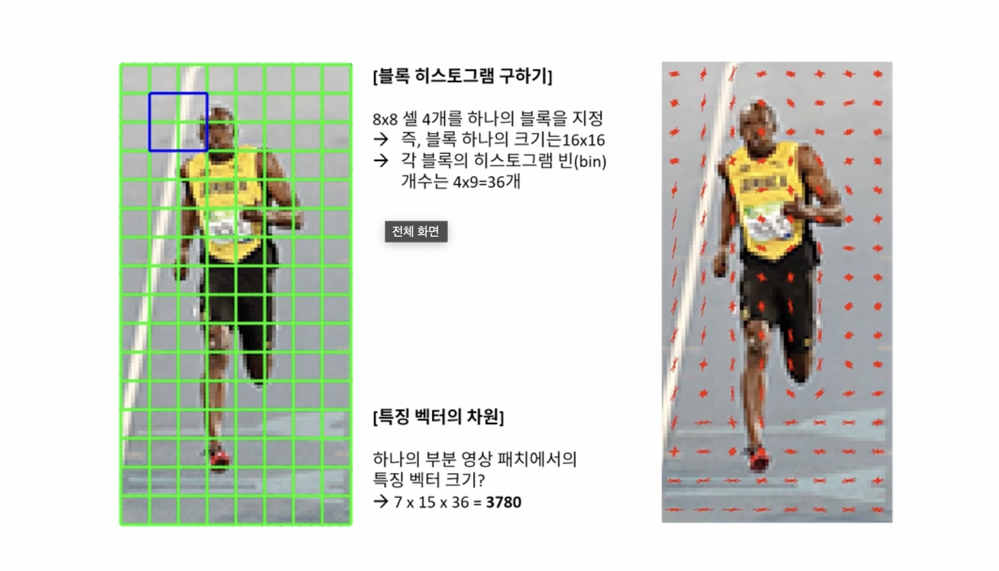
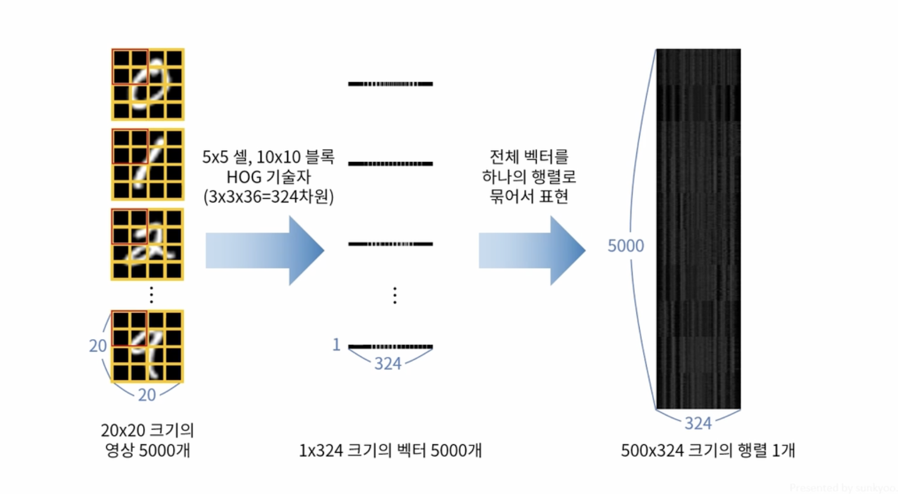

# HOG(Histogram of Oriented Gradient)
{: .no_toc }

## Table of contents
{: .no_toc .text-delta }

1. TOC
{:toc}

---


# HOG란?
영상의 지역적 그래디언트 방향 정보를 특징 벡터로 사용하여 영상 내의 객체를 찾는 방법이다. 


입력 영상에서 원하는 객체에 대한 영역을 자르고 크기를 줄여 원하는 영역만 잘라낸다.


잘라낸 객체의 영역을 8x8 크기의 셀로 나눠 각 셀 안에서 그래디언트를 계산한다.


방향에 대한 히스토그램은 20도 기준으로 나누며, 180도를 9개의 빈으로 방향의 크기 성분을 나눠서 크기 정보를 할당한다. 만약 0과 20의 중간인 10도는 0과 20에 반씩 나눠서 할당한다. 



이후 4개의 영역을 하나의 셀로 합쳐 특징 벡터로 만든다.


## 필기체 인식



```cpp
#include <iostream>
#include "opencv2/opencv.hpp"

using namespace std;
using namespace cv;
using namespace cv::ml;

Mat img;
Point ptPrev(-1, -1);

void on_mouse(int event, int x, int y, int flags, void*)
{
	if (x < 0 || x >= img.cols || y < 0 || y >= img.rows)
		return;
	if (event == EVENT_LBUTTONUP || !(flags & EVENT_FLAG_LBUTTON))
		ptPrev = Point(-1, -1);
	else if (event == EVENT_LBUTTONDOWN)
		ptPrev = Point(x, y);
	else if (event == EVENT_MOUSEMOVE && (flags & EVENT_FLAG_LBUTTON))
	{
		Point pt(x, y);
		if (ptPrev.x < 0)
			ptPrev = pt;
		line(img, ptPrev, pt, Scalar::all(255), 40, LINE_AA, 0);
		ptPrev = pt;

		imshow("img", img);
	}
}

Mat norm_digit(Mat& src)
{
	CV_Assert(!src.empty() && src.type() == CV_8UC1);

	Mat src_bin;
	threshold(src, src_bin, 0, 255, THRESH_BINARY | THRESH_OTSU);

	Mat labels, stats, centroids;
	int n = connectedComponentsWithStats(src_bin, labels, stats, centroids);

	Mat dst = Mat::zeros(src.rows, src.cols, src.type());
	for (int i = 1; i < n; i++) {
		if (stats.at<int>(i, 4) < 10) continue;

		int cx = cvRound(centroids.at<double>(i, 0));
		int cy = cvRound(centroids.at<double>(i, 1));

		double dx = 10 - cx;
		double dy = 10 - cy;

		Mat warpMat = (Mat_<double>(2, 3) << 1, 0, dx, 0, 1, dy);
		warpAffine(src, dst, warpMat, dst.size());
	}

	return dst;
}

int main(int argc, char* argv[])
{
	Mat digits = imread("digits.png", IMREAD_GRAYSCALE);

	if (digits.empty()) {
		cerr << "Image load failed!" << endl;
		return -1;
	}

#if _DEBUG
	HOGDescriptor hog(Size(20, 20), // _winSize
		Size(8, 8),		// _blockSize
		Size(4, 4),		// _blockStride,
		Size(4, 4),		// _cellSize,
		9);				// _nbins,
#else
	HOGDescriptor hog(Size(20, 20), // _winSize
		Size(10, 10),	// _blockSize
		Size(5, 5),		// _blockStride,
		Size(5, 5),		// _cellSize,
		9);				// _nbins,
#endif

	size_t descriptor_size = hog.getDescriptorSize();
	cout << "Descriptor Size : " << descriptor_size << endl;

	Mat train_hog, train_labels;

	for (int j = 0; j < 50; j++) {
		for (int i = 0; i < 100; i++) {
			Mat roi = digits(Rect(i * 20, j * 20, 20, 20)).clone();

			vector<float> desc;
			hog.compute(roi, desc);

			Mat desc_mat(desc, true);
			train_hog.push_back(desc_mat.t());
			train_labels.push_back(j / 5);
		}
	}

	Ptr<SVM> svm = SVM::create();
//	Ptr<SVM> svm = SVM::load("svmdigits.yml");

	svm->setType(SVM::C_SVC);
	svm->setKernel(SVM::RBF);

#if 1
	svm->setGamma(0.50625);
	svm->setC(2.5);
	svm->train(train_hog, ROW_SAMPLE, train_labels);
#else
	svm->trainAuto(train_hog, ROW_SAMPLE, train_labels);
#endif
//	svm->save("svmdigits.yml");

	img = Mat::zeros(400, 400, CV_8U);

	imshow("img", img);
	setMouseCallback("img", on_mouse);

	while (true) {
		int c = waitKey();

		if (c == 27) {
			break;
		} else if (c == ' ') {
			Mat img_blur, img_resize;
			GaussianBlur(img, img_blur, Size(), 1);
			resize(img_blur, img_resize, Size(20, 20), 0, 0, INTER_AREA);

			vector<float> desc;
			hog.compute(img_resize, desc);

			Mat desc_mat(desc, true);
			float res = svm->predict(desc_mat.t());
			cout << cvRound(res) << endl;

			img.setTo(0);
			imshow("img", img);
		} else if (c == 'c') {
			img.setTo(0);
			imshow("img", img);
		}
	}
}
```