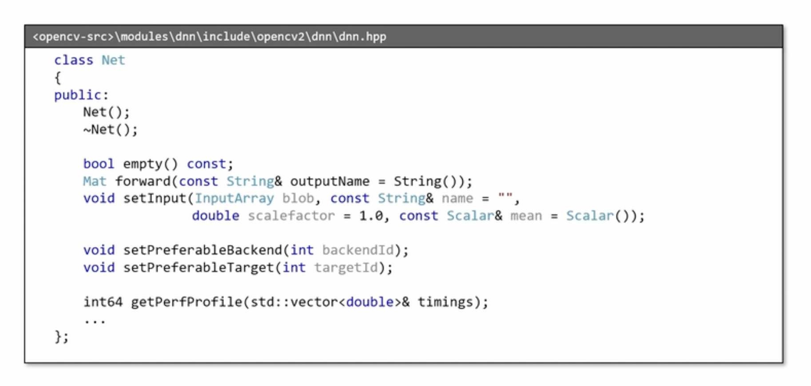
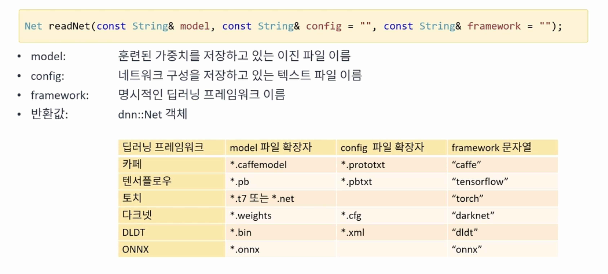
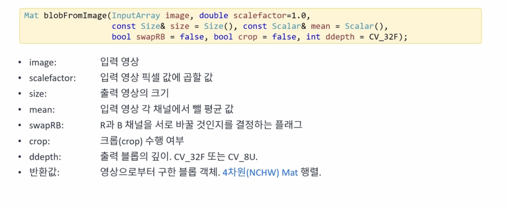
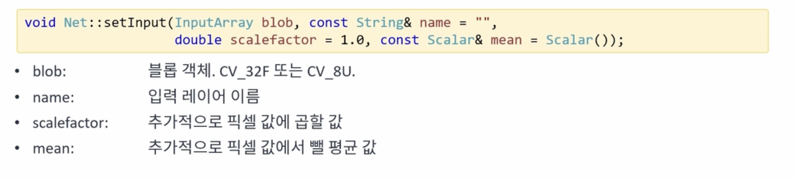

# DNN(Deep Neural Netowrk)
{: .no_toc }

## Table of contents
{: .no_toc .text-delta }

1. TOC
{:toc}

---

# OpenCV DNN 모듈

* Net 클래스


* 네트워크 불러오기


* 신경망의 입력 정의하기


* 신경망 입력 설정하기


* 순방향 전파하기


## pytorch 모델 학습
pytorch를 이용해서 데이터를 학습하고 학습된 모델을 `mnist.onnx` 파일로 저장한다.

```cpp
import torch 
import torch.nn as nn
import torchvision
import torchvision.transforms as transforms


# Device configuration
device = torch.device('cuda:0' if torch.cuda.is_available() else 'cpu')

# Hyper parameters
num_epochs = 5
num_classes = 10
batch_size = 100
learning_rate = 0.001

# MNIST dataset
train_dataset = torchvision.datasets.MNIST(root='./data/',
                                           train=True, 
                                           transform=transforms.ToTensor(),
                                           download=True)

test_dataset = torchvision.datasets.MNIST(root='./data/',
                                          train=False, 
                                          transform=transforms.ToTensor())

# Data loader
train_loader = torch.utils.data.DataLoader(dataset=train_dataset,
                                           batch_size=batch_size, 
                                           shuffle=True)

test_loader = torch.utils.data.DataLoader(dataset=test_dataset,
                                          batch_size=batch_size, 
                                          shuffle=False)

# Convolutional neural network (two convolutional layers)
class ConvNet(nn.Module):
    def __init__(self, num_classes=10):
        super(ConvNet, self).__init__()
        self.layer1 = nn.Sequential(
            nn.Conv2d(1, 16, kernel_size=5, stride=1, padding=2),
            nn.BatchNorm2d(16),
            nn.ReLU(),
            nn.MaxPool2d(kernel_size=2, stride=2))
        self.layer2 = nn.Sequential(
            nn.Conv2d(16, 32, kernel_size=5, stride=1, padding=2),
            nn.BatchNorm2d(32),
            nn.ReLU(),
            nn.MaxPool2d(kernel_size=2, stride=2))
        self.fc = nn.Linear(7*7*32, num_classes)
        
    def forward(self, x):
        out = self.layer1(x)
        out = self.layer2(out)
        out = out.reshape(out.size(0), -1)
        out = self.fc(out)
        return out

model = ConvNet(num_classes).to(device)

# Loss and optimizer
criterion = nn.CrossEntropyLoss()
optimizer = torch.optim.Adam(model.parameters(), lr=learning_rate)

# Train the model
total_step = len(train_loader)
for epoch in range(num_epochs):
    for i, (images, labels) in enumerate(train_loader):
        images = images.to(device)
        labels = labels.to(device)
        
        # Forward pass
        outputs = model(images)
        loss = criterion(outputs, labels)
        
        # Backward and optimize
        optimizer.zero_grad()
        loss.backward()
        optimizer.step()
        
        if (i+1) % 100 == 0:
            print ('Epoch [{}/{}], Step [{}/{}], Loss: {:.4f}' 
                   .format(epoch+1, num_epochs, i+1, total_step, loss.item()))

# Test the model
model.eval()  # eval mode (batchnorm uses moving mean/variance instead of mini-batch mean/variance)
with torch.no_grad():
    correct = 0
    total = 0
    for images, labels in test_loader:
        images = images.to(device)
        labels = labels.to(device)
        outputs = model(images)
        _, predicted = torch.max(outputs.data, 1)
        total += labels.size(0)
        correct += (predicted == labels).sum().item()

    print('Test Accuracy of the model on the 10000 test images: {} %'.format(100 * correct / total))

# Save the model checkpoint
torch.save(model.state_dict(), 'model.ckpt')

# onnx export
import torch.onnx

dummy_input = torch.randn(1, 1, 28, 28).to(device)
torch.onnx.export(model, dummy_input, "mnist.onnx")
```


# OpenCV에서 pytorch 모델 불러와서 필기체 인식하기

```cpp
#include <iostream>
#include "opencv2/opencv.hpp"

using namespace std;
using namespace cv;
using namespace cv::dnn;

void on_mouse(int event, int x, int y, int flags, void* userdata);

Mat norm_digit(Mat& src)
{
	CV_Assert(!src.empty() && src.type() == CV_8UC1);

	Mat src_bin;
	threshold(src, src_bin, 0, 255, THRESH_BINARY | THRESH_OTSU);

	Mat labels, stats, centroids;
	int n = connectedComponentsWithStats(src_bin, labels, stats, centroids);

	Mat dst = Mat::zeros(src.rows, src.cols, src.type());
	for (int i = 1; i < n; i++) {
		if (stats.at<int>(i, 4) < 20) continue;

		int cx = cvRound(centroids.at<double>(i, 0));
		int cy = cvRound(centroids.at<double>(i, 1));

		double dx = 14 - cx;
		double dy = 14 - cy;

		Mat warpMat = (Mat_<double>(2, 3) << 1, 0, dx, 0, 1, dy);
		warpAffine(src, dst, warpMat, dst.size());
	}

	return dst;
}

int main()
{
	// Net net = readNet("mnist.pb");
	Net net = readNet("mnist.onnx");

	if (net.empty()) {
		cerr << "Network load failed!" << endl;
		return -1;
	}

	Mat img = Mat::zeros(400, 400, CV_8UC1);

	imshow("img", img);
	setMouseCallback("img", on_mouse, (void*)&img);

	while (true) {
		int c = waitKey();

		if (c == 27) {
			break;
		} else if (c == ' ') {
			Mat blr, resized;
			GaussianBlur(img, blr, Size(), 1.0);
			resize(blr, resized, Size(28, 28), 0, 0, INTER_AREA);

			Mat blob = blobFromImage(norm_digit(resized), 1/255.f, Size(28, 28));
			net.setInput(blob);
			Mat prob = net.forward();

			double maxVal;
			Point maxLoc;
			minMaxLoc(prob, NULL, &maxVal, NULL, &maxLoc);
			int digit = maxLoc.x;

			cout << digit << " (" << maxVal * 100 << "%)" <<endl;

			img.setTo(0);
			imshow("img", img);
		}
	}
}

Point ptPrev(-1, -1);

void on_mouse(int event, int x, int y, int flags, void* userdata)
{
	Mat img = *(Mat*)userdata;

	if (event == EVENT_LBUTTONDOWN) {
		ptPrev = Point(x, y);
	} else if (event == EVENT_LBUTTONUP) {
		ptPrev = Point(-1, -1);
	} else if (event == EVENT_MOUSEMOVE && (flags & EVENT_FLAG_LBUTTON)) {
		line(img, ptPrev, Point(x, y), Scalar::all(255), 40, LINE_AA, 0);
		ptPrev = Point(x, y);

		imshow("img", img);
	}
}
```