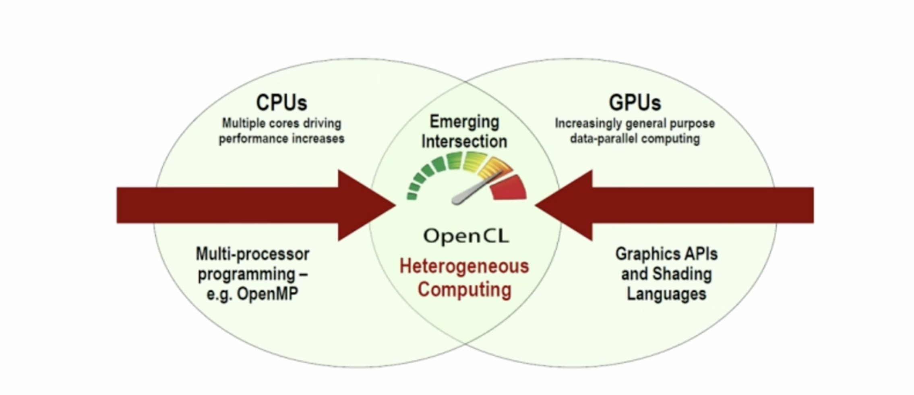
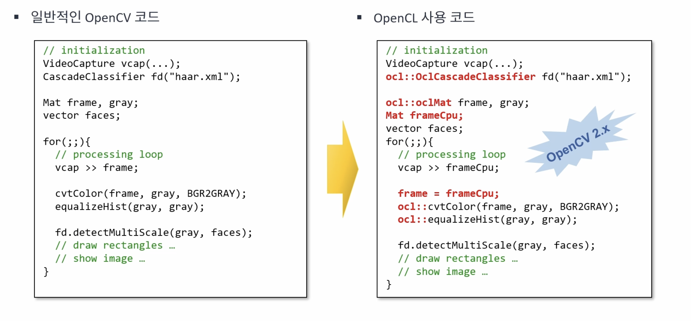
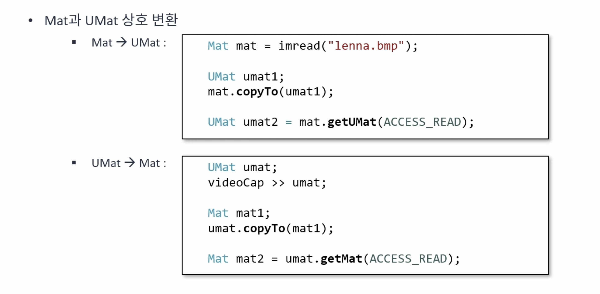
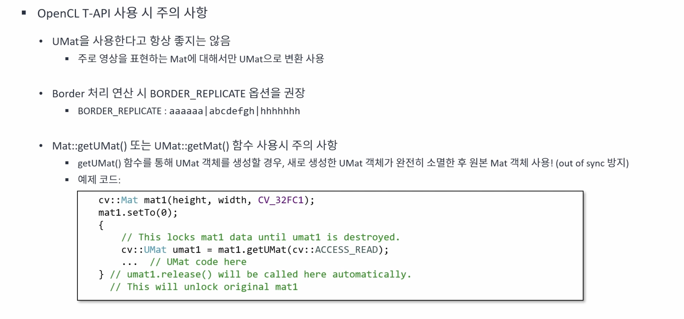

# OpenCV(Open Computing Language)
{: .no_toc }

## Table of contents
{: .no_toc .text-delta }

1. TOC
{:toc}

---

# OpenCV(Open Computing Language)이란?
여러 개의 CPU, GPU, DSP 등의 프로세서로 이루어진 이종 플랫폼에소 동작하는 프로그램 코드를 작성하기 위한 개방형 범용 병렬 컴퓨팅 프레임워크를 의미한다.


Cuda가 없는 시스템에서도 하드웨어 가속을 통한 빠른 처리가 가능하다.





```cpp
#include <iostream>
#include "opencv2/opencv.hpp"


using namespace std;
using namespace cv;
using namespace cv::cuda;


int main(int argc, char* argv[]){
	VideoCapture cap("../data/korea.mp4");

	if (!cap.isOpened()) {
		cerr << "Video open failed!" << endl;
		return -1;
	}

	int frame_width = cvRound(cap.get(CAP_PROP_FRAME_WIDTH));
	int frame_height = cvRound(cap.get(CAP_PROP_FRAME_HEIGHT));
	int frame_count = cvRound(cap.get(CAP_PROP_FRAME_COUNT));
	int fps = cvRound(cap.get(CAP_PROP_FPS));
	cout << "Frame width: " << frame_width << endl;
	cout << "Frame height: " << frame_height << endl;
	cout << "Frame count: " << frame_count << endl;
	cout << "FPS: " << fps << endl;

	namedWindow("src");
	namedWindow("dst");

	// Mat frame, gray, blr, edge;
	UMat frame, gray, blr, edge; // OpenCL 사용을 위한 데이터 타입 지정
	while (true) {
		cap >> frame;
		if (frame.empty())
			break;

		TickMeter tm;
		tm.start();

		cvtColor(frame, gray, COLOR_BGR2GRAY);
		bilateralFilter(gray, blr, -1, 10, 3);
		Canny(blr, edge, 50, 150);

		tm.stop();
		cout << "It took " << tm.getTimeMilli() << "ms." << endl;

		imshow("src", frame);
		imshow("dst", edge);

		if (waitKey(10) == 27)
			break;
	}
}
```


## 속도 비교
### CPU(Mat)

```
Frame width: 1280
Frame height: 720
Frame count: 401
FPS: 25
[ INFO:0@0.086] global registry.impl.hpp:114 UIBackendRegistry UI: Enabled backends(3, sorted by priority): GTK(1000); GTK3(990); GTK2(980) + BUILTIN(COCOA)
[ INFO:0@0.155] global registry_parallel.impl.hpp:96 ParallelBackendRegistry core(parallel): Enabled backends(3, sorted by priority): ONETBB(1000); TBB(990); OPENMP(980)
It took 268.154ms.
It took 270.403ms.
It took 268.642ms.
It took 262.068ms.
It took 268.889ms.
It took 271.527ms.
It took 262.524ms.
It took 257.057ms.
```

### OpenCL(UMat)

```
Frame width: 1280
Frame height: 720
Frame count: 401
FPS: 25
[ INFO:0@0.111] global registry.impl.hpp:114 UIBackendRegistry UI: Enabled backends(3, sorted by priority): GTK(1000); GTK3(990); GTK2(980) + BUILTIN(COCOA)
[ INFO:0@0.186] global registry_parallel.impl.hpp:96 ParallelBackendRegistry core(parallel): Enabled backends(3, sorted by priority): ONETBB(1000); TBB(990); OPENMP(980)
[ INFO:0@0.188] global ocl.cpp:1186 haveOpenCL Initialize OpenCL runtime...
[ INFO:0@0.188] global ocl.cpp:1192 haveOpenCL OpenCL: found 1 platforms
[ INFO:0@0.188] global ocl.cpp:984 getInitializedExecutionContext OpenCL: initializing thread execution context
[ INFO:0@0.188] global ocl.cpp:994 getInitializedExecutionContext OpenCL: creating new execution context...
[ INFO:0@0.198] global ocl.cpp:1012 getInitializedExecutionContext OpenCL: device=Apple M1 Pro
[ INFO:0@0.198] global ocl.cpp:5370 __init_buffer_pools OpenCL: Initializing buffer pool for context@0 with max capacity: poolSize=0 poolSizeHostPtr=0
[ INFO:0@0.201] global ocl.cpp:410 OpenCLBinaryCacheConfigurator Successfully initialized OpenCL cache directory: /var/folders/d3/m5yzp9q979bbz2cr4n6n6wmr0000gn/T/opencv/4.x-dev/opencl_cache/
[ INFO:0@0.201] global ocl.cpp:434 prepareCacheDirectoryForContext Preparing OpenCL cache configuration for context: Apple--Apple_M1_Pro--1_2_1_0
It took 10.1561ms.
It took 2.29017ms.
It took 1.44463ms.
It took 1.29033ms.
It took 1.44225ms.
It took 3.03408ms.
It took 1.5135ms.
It took 2.51725ms.
It took 1.44642ms.
It took 3.50108ms.
```


## Mat과 UMat의 상호 변환 방법




