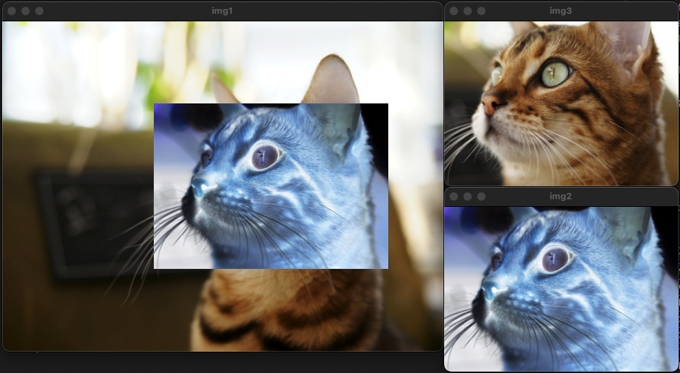

# 참조와 복사
{: .no_toc }

## Table of contents
{: .no_toc .text-delta }

1. TOC
{:toc}

---


# Mat 객체의 데이터 접근 방법
```cpp
void ex_get_data()
{
    // 행렬 생서과 동시에 0으로 초기화
	Mat mat1 = Mat::zeros(3, 4, CV_8UC1);

    // 인덱스를 통해 Mat 객체의 데이터에 접근하는 방법
    // mat.at<data_type>(y, x)로 접근이 가능하다.
    // 이때 y 인덱스부터 접근 후 x 인덱스에 접근하는 것이 바람직하다.
    // 동적 메모리 할당 방법 때문이며 효율성이 떨어 질 수 있다.
	for (int y = 0; y < mat1.rows; y++) {
		for (int x = 0; x < mat1.cols; x++) {
			mat1.at<uchar>(y, x)++;
		}
	}

    // pointer 객체를 통한 데이터 접근 방법
    // 위 방법과 마찬가지로 y인덱스에 먼저 접근 후 x 데이터에 접근하는 모습을 볼 수 있다.
    // 한 행씩 데이터를 접근하는 경우라면 이 방법이 더 빠르게 동작한다.
	for (int y = 0; y < mat1.rows; y++) {
		uchar* p = mat1.ptr<uchar>(y);

		for (int x = 0; x < mat1.cols; x++) {
			p[x]++;
		}
	}

    // Iterator를 이용한 데이터 접근 방법
    // Vector 객체와 비슷한 방법의 접근 방법으로 많이 사용되지 않는 방법이다.
    // 속도가 가장 느리다.
	for (MatIterator_<uchar> it = mat1.begin<uchar>(); it != mat1.end<uchar>(); ++it) {
		(*it)++;
	}

	cout << "mat1:\n" << mat1 << endl;
}
```

# 참조와 복사
## copyTo
영상 데이터를 다른 영상 데이터에 복사해서 그대로 붙여넣는다. `mask` 인자를 통해 0이 아닌 영역만 선택적으로 붙여 넣기가 가능하다.
```cpp
void copyTo(OutputArray dst) const;
void copyTo(OutputArray dst, InputArray mask) const;

void Mat::copyTo(InputArray src, OutputArray dst, InputArray mask);
```

```cpp
void ex_copy()
{
	// 이미지 초기화
    Mat img1 = imread("../data/dog.bmp");
    // 얕은 복사
	Mat img2 = img1;
	Mat img3;
    //얕은 복사
	img3 = img1;
    // 깊은 복사
	Mat img4 = img1.clone();
	Mat img5;
    //깊은 복사
	img1.copyTo(img5);
	// or
    // copyTo(img1, img5, noArray());
    // img1, img2, img3에 노란색으로 덮어씌어짐
	img1.setTo(Scalar(0, 255, 255));	// yellow

	imshow("img1", img1);
	imshow("img2", img2);
	imshow("img3", img3);
	imshow("img4", img4);
	imshow("img5", img5);

	waitKey();
	destroyAllWindows();
}
```


```cpp
void ex_copy2()
{
	Mat img1 = imread("../data/cat.bmp");

	if (img1.empty()) {
		cerr << "Image load failed!" << endl;
		return;
	}


    // Rect(x, y, width, height)은 영상 또는 행렬의 크기를 정의하는 객체이다.
    // img1 영상의 일부분을 가져온다.
    //얕은 복사
	Mat img2 = img1(Rect(220, 120, 340, 240));
    // 깊은 복사
	Mat img3 = img1(Rect(220, 120, 340, 240)).clone();

    // img2와 img1의 img2 부분의 색이 반전된다.
	img2 = ~img2;

	imshow("img1", img1);
	imshow("img2", img2);
	imshow("img3", img3);

	waitKey();
	destroyAllWindows();
}
```

