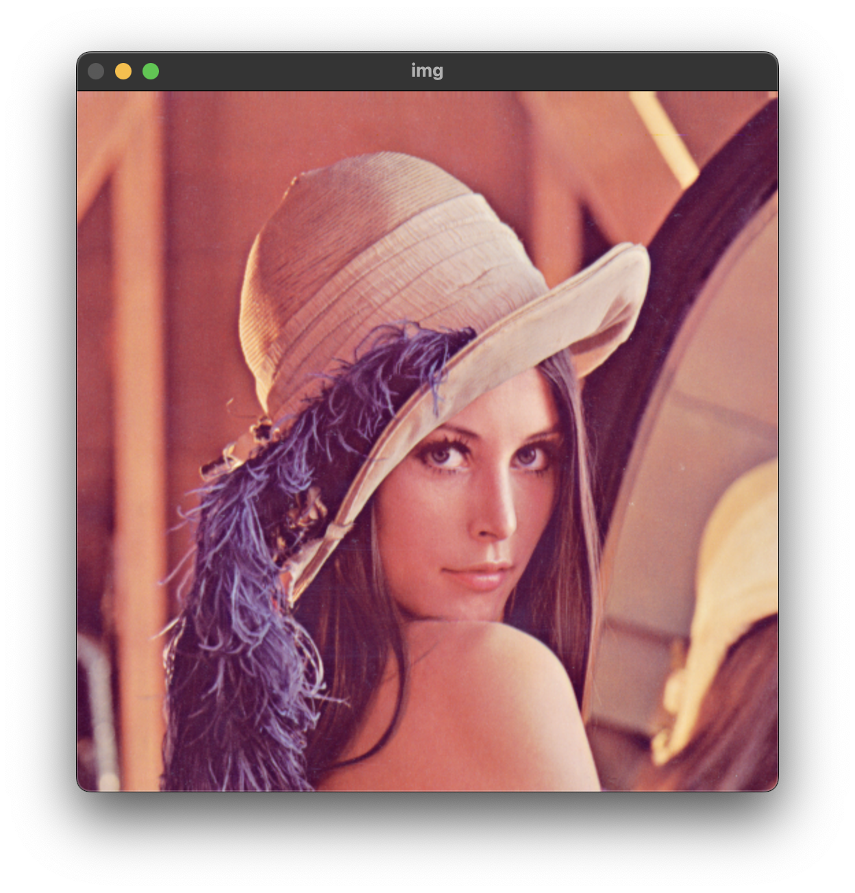

# 파일 입출력
{: .no_toc }

## Table of contents
{: .no_toc .text-delta }

1. TOC
{:toc}

---


## 창 띄우기
OpenCV는 기본적으로 영상을 다루는 라이브러리이다. 때문에 영상을 시각화 해야하는 경우가 많은데 이때 창을 띄우는 방법이다.
```cpp
void ex_windows(){
    Mat frame(200, 200, CV_8UC1, 255);

    namedWindow("img", WINDOW_NORMAL);
    // 새로운 창을 생성
    moveWindow("img", 200, 200);
    // 창의 위치를 이동
    imshow("img", frame);
    // frame 행렬의 이미지를 출력
    resizeWindow("img", 500, 500); 
    // 창의 크기를 조정

    int keycode = waitKey();
    // 키 입력 대기

    destroyAllWindows();
    // 열려있는 모든 창을 닫음
}
```

## 영상 파일 시각화하기
```cpp
void ex_imread() { 
    Mat frame;
    frame = imread("../data/lenna.bmp", IMREAD_UNCHANGED);

    if (frame.empty()) {
        // Mat 객체가 비어있는지를 확인
        // 객체가 비어있으면 1을 아니면 0을 반환
        cerr << "Image laod failed!" << endl;
        return ;
    }

    namedWindow("img", WINDOW_AUTOSIZE);
    imshow("img", frame);
    waitKey(0);
}
```




## 이미지 파일로 저장하기
```cpp
void ex_imwrite(){
    Mat frame;
    frame = imread("../data/lenna.bmp", IMREAD_GRAYSCALE);
    // 영상 파일을 읽어 Mat 타입의 변수를 반환
    bool ret = imwrite("../data/lenna_out.png", frame);
    // 
    if (ret){
        cout << "파일 저장이 정상적으로 이루어졌습니다." << endl;
    }else{
        cout << "파일 저장이 이루어지지 않았습니다." << endl;
    }
}
```


