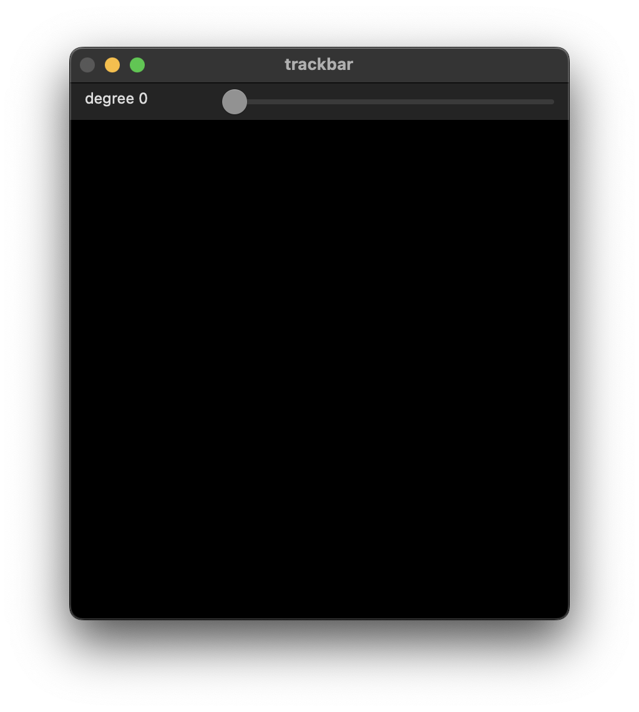
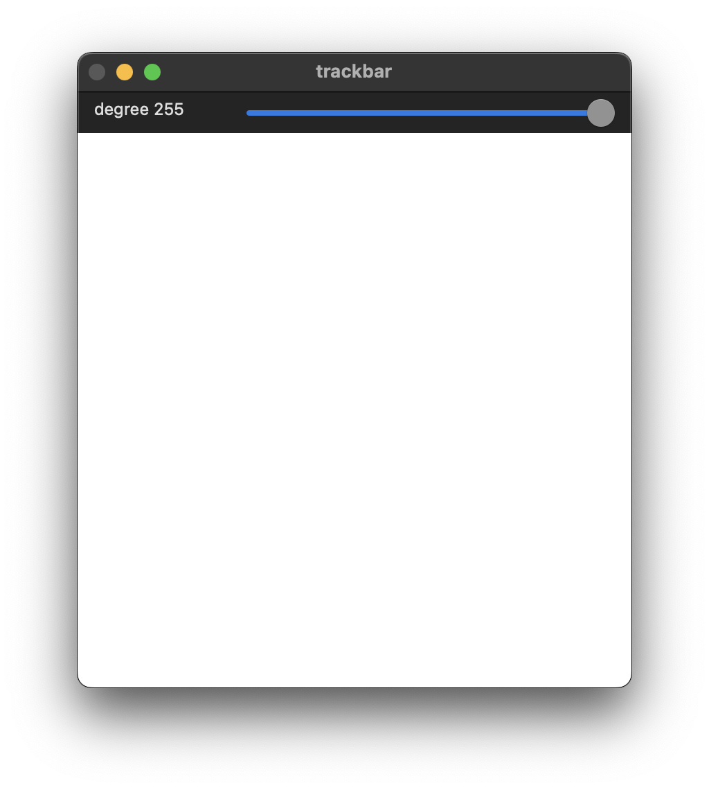
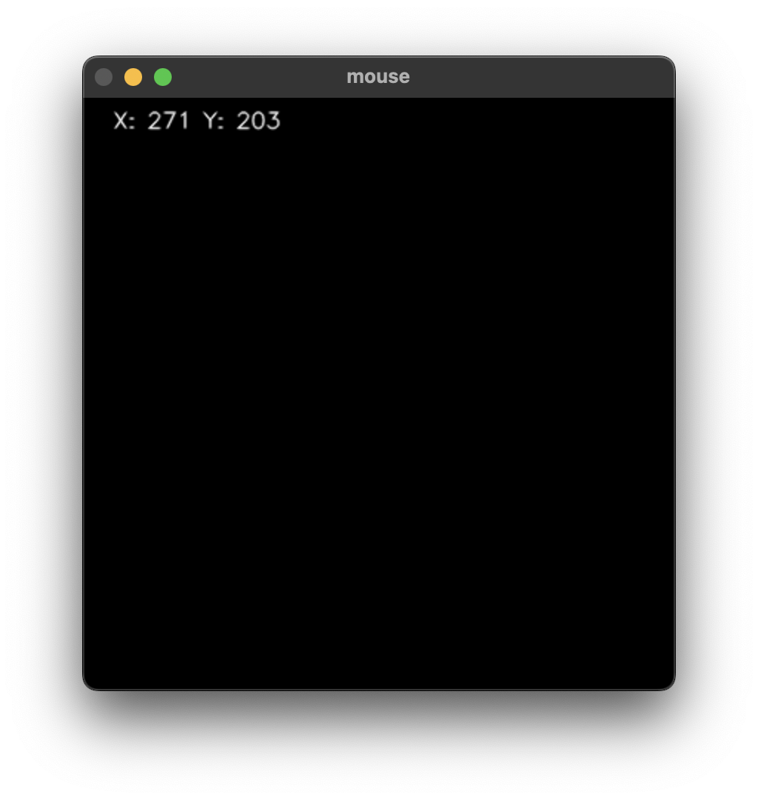

# 창 이벤트 처리
{: .no_toc }

## Table of contents
{: .no_toc .text-delta }

1. TOC
{:toc}

---


## 트랙바
트랙바를 생성하는 클래스이다. 다음과 같은 인자로 정의되어 있으며, 동작 상태에 따라 1(정상)과 0(비정상)을 반환한다.
```text
trackbarname: 트랙바의 이름
winname: 트랙바를 적용할 창의 이름
value: 현재 트랙바의 위치를 받을 변수
count: 트랙바의 최대값 (최소값은 항상 0으로 초기화)
onChange: 트랙바의 변화가 발생할 때마다 실행할 콜백 함수의 포인터
userdata: 콜백 함수에 전달함 사용자의 데이터 포인터
```

```cpp
int createTrackbar(const String& trackbarname, const String& winname, int* value, int count, TrackbarCallback onChange = 0, void* userdata = 0);
```
### Example code
트랙바를 움직이면 출력된 이미지의 밝기가 변화한다.

```cpp
void on_trackbar_change(int pos, void* userdata){
    Mat frame = *(Mat*)userdata;
    frame.setTo(pos);
    imshow("trackbar", frame);
}

void ex_trackbar(){
    Mat frame(400, 400, CV_8UC1, Scalar(0));
    namedWindow("trackbar");
    createTrackbar("degree", "trackbar", 0, 255, on_trackbar_change, (void*)&frame);
    imshow("trackbar", frame);

    waitKey();
    destroyAllWindows();
}
```




## 마우스 이벤트

```cpp
event: one of the cv::MouseEventTypes constants.
x: The x-coordinate of the mouse event.
y: The y-coordinate of the mouse event.
flags: one of the cv::MouseEventFlags constants.
userdata: The optional parameter.
```

```cpp
typedef void (*MouseCallback)(int event, int x, int y, int flags, void* userdata);
void setMouseCallback(const String& winname, MouseCallback onMouse, void* userdata = 0);
````
마우스 이벤트 종류는 다음과 같이 정의되어 있다. `MouseEventFlags`의 경우 2진수 비트 형태로 표현된 것을 확인할 수 있다. 이는 이벤트가 중복되더라고 해당 이벤트를 정확하게 잡아내기 위함이다. 때문에 & 비트 연산을 통해서 해당 비트가 플래그 되어 있는지를 확인할 수도 있다.

```cpp
//! Mouse Events see cv::MouseCallback
enum MouseEventTypes {
       EVENT_MOUSEMOVE      = 0, //!< indicates that the mouse pointer has moved over the window.
       EVENT_LBUTTONDOWN    = 1, //!< indicates that the left mouse button is pressed.
       EVENT_RBUTTONDOWN    = 2, //!< indicates that the right mouse button is pressed.
       EVENT_MBUTTONDOWN    = 3, //!< indicates that the middle mouse button is pressed.
       EVENT_LBUTTONUP      = 4, //!< indicates that left mouse button is released.
       EVENT_RBUTTONUP      = 5, //!< indicates that right mouse button is released.
       EVENT_MBUTTONUP      = 6, //!< indicates that middle mouse button is released.
       EVENT_LBUTTONDBLCLK  = 7, //!< indicates that left mouse button is double clicked.
       EVENT_RBUTTONDBLCLK  = 8, //!< indicates that right mouse button is double clicked.
       EVENT_MBUTTONDBLCLK  = 9, //!< indicates that middle mouse button is double clicked.
       EVENT_MOUSEWHEEL     = 10,//!< positive and negative values mean forward and backward scrolling, respectively.
       EVENT_MOUSEHWHEEL    = 11 //!< positive and negative values mean right and left scrolling, respectively.
     };

//! Mouse Event Flags see cv::MouseCallback
enum MouseEventFlags {
       EVENT_FLAG_LBUTTON   = 1, //!< indicates that the left mouse button is down.
       EVENT_FLAG_RBUTTON   = 2, //!< indicates that the right mouse button is down.
       EVENT_FLAG_MBUTTON   = 4, //!< indicates that the middle mouse button is down.
       EVENT_FLAG_CTRLKEY   = 8, //!< indicates that CTRL Key is pressed.
       EVENT_FLAG_SHIFTKEY  = 16,//!< indicates that SHIFT Key is pressed.
       EVENT_FLAG_ALTKEY    = 32 //!< indicates that ALT Key is pressed.
     };

```

```cpp
void on_mouse_callback(int event, int x, int y, int flags, void* userdata){
    Mat frame = *(Mat*)userdata;

    switch(event){
        case EVENT_MOUSEMOVE:
            frame.setTo(0);
            putText(frame, "X: " + to_string(x) + " Y: " + to_string(y), Point(20, 20),
            FONT_HERSHEY_SIMPLEX, .5, Scalar(255,0,0),1, LINE_AA);
            break;
    }

    imshow("mouse", frame);
}
void ex_mouse_event(){
    Mat frame(400, 400, CV_8UC1, Scalar(0));

    namedWindow("mouse");
    setMouseCallback("mouse", on_mouse_callback, (void*)&frame);
    imshow("mouse", frame);

    waitKey();
    destroyAllWindows();

    
}

```

