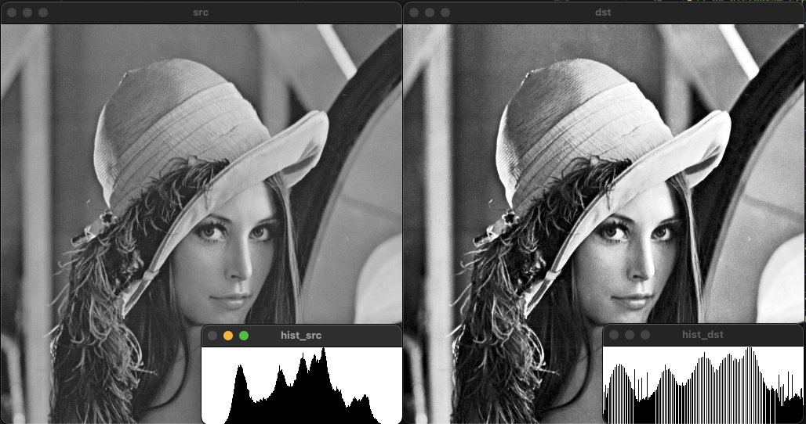

#  정리
{: .no_toc }

## Table of contents
{: .no_toc .text-delta }

1. TOC
{:toc}

---


# Mat 데이터 나누기 및 합치기

```cpp
void ex_split_merge(){
    Mat img = imread("../data/lenna.bmp");

    vector<Mat> channels;
    split(img, channels);
    
    imshow("img1", channels[0]);
    imshow("img2", channels[1]);
    imshow("img3", channels[2]);

    swap(channels[0], channels[2]);

    Mat merged;
    merge(channels, merged);
    imshow("merged", merged); 

    waitKey();
    destroyAllWindows();
}
```


## 시간 측정

```cpp
void ex_tick_count(){
    int64 start = getTickCount();
    my_function();
    int64 end = getTickCount();
    double ms = (end - start) * 1000 / getTickFrequency();
}
```

```cpp
void ex_tick_count(){
    TickMeter tm;
    tm.start();
    // my_function();
    tm.stop();
    cout << tm.getTimeMilli() << endl;
    tm.reset();

    tm.start();
    // my_function2();
    tm.stop();
    cout << tm.getTimeMilli() << endl;
}
```


## 마스킹을 이용한 영상 합치기

```cpp
void ex_masking1(){
    Mat src = imread("../data/airplane.bmp");
    Mat mask = imread("../data/mask_plane.bmp");
    Mat det = imread("../data/field.bmp");

    copyTo(src, det, mask);

    imshow("src", src);
    imshow("mask", mask);
    imshow("det", det);

    waitKey();
    destroyAllWindows();
}
```

```cpp
void ex_masking2(){
    Mat src = imread("../data/cat.bmp");
    Mat logo = imread("../data/opencv-logo-white.png", IMREAD_UNCHANGED);
    // 투명도 정보를 가져오기 위해서 IMREAD_UNCHANGED 플래그를 사용한다.
    Rect rect(10, 10, logo.cols, logo.rows);
    vector<Mat> planes;
    split(logo, planes);
    merge(vector<Mat>(planes.begin(), planes.begin()+3), logo);
    // 투명도를 제외한 BGR 채널만 합쳐서 3채널 이미지를 만든다.
    
    
    copyTo(logo, src(rect), planes[3]);

    imshow("rect", src(rect));
    imshow("src", src);
    cout << rect;

    waitKey();
    destroyAllWindows();
}

```
{: .img}


## 흑백(Grayscale) 영상
영상 처리에서 흑백 영상이 많이 사용된다. 그 이유는 과거 알고리즘이 흑백 영상을 기준으로 개발 되었기 때문에다. 또한 흑백 영상을 사용하면 메모리 사용량을 줄이고 연산 속도를 크게 높일 수 있는데 이는 픽셀 당 발기 정보 하나만 가지고 있기 때문이다.

### 화소 처리(Point processing)
화소 처리는 한 픽셀을 변환하는 방법으로 dst=f(src)와 같이 함수를 정의해서 한 픽셀을 다른 픽셀로 변환하는 방법이다. 예를들어 입력값을 그대로 출력하는 항등 함수의 경우 원래 입력을 그대로 출력하기 때문에 원래 영상을 복사하는 형태와 같다. 그리고 반전, 밝기 혹은 명망비 조절, 이진화 등에 사용될 수 있다.

$$
\text{dst}(x, y) = f(\text{src}(x, y))
$$

{: .img}
위 함수의 경우 입력과 같은 값을 출력하는 함수로 원본 영상을 그대로 복사하는 기능을 수행한다.

{: .img}
위 함수의 경우 영상의 밝기가 증가되는 형태로 동작한다.

{: .img}
위 함수의 경우 0과 1로 구성된 이진화 영상을 만드는 역할을 수행한다.

#### 영상 밝기(Brightness) 조절
흑백 영상에서의 픽셀 값은 밝기의 정도를 나타내기 때문에 단순하게 원래 픽셀값에서 정수를 더해주면 된다. 이때 흑백 영상의 표현 범위가 0에서 255까지 이므로 이를 넘어가는 영역을 처리해 주어야한다.

$$
\text{dst}(x, y) = \text{src}(x, y)+n\\
\text{dst}(x, y) = \text{saturate}(\text{src}(x, y))+n
$$

Mat 클래스의 연산자 오버로드를 이용한 방법으로 자동으로 saturate에 대한 처리를 수행해준다.

{: .img}
<!-- >화소처리 원본 영상.png -->

```cpp
void ex_point_processing(){
    Mat src = imread("../data/lenna.bmp", IMREAD_GRAYSCALE);

    imshow("src", src);
    imshow("dst", src - 50 );
    imshow("dst", src + 100 );

    waitKey();
    destroyAllWindows();
}
```
{: .img}
<!-- >더하기 오버로딩을 이용한 밝기조절 방법.png -->
{: .img}
<!-- >뺴기 오버로딩을 이용한 밝기조절 방법.png -->

for문을 이용한 화소처리 방법이다. 포화에 대한 처리를 직접 해주어야 한다.
```cpp
void ex_point_processing(){
    Mat src = imread("../data/lenna.bmp", IMREAD_GRAYSCALE);
    Mat dst(src.rows, src.cols, CV_8UC1);

    for(int y=0; y<src.rows; y++){
        for(int x=0; x<src.cols; x++){
            // dst.at<uchar>(y, x) = src.at<uchar>(y, x) + 50;
            // 8bit를 넘어가는 경우 overflow에 의한 비트 잘림 현상으로 255를 넘어가면 (256)0부터 다시시작 된다.
            // 이러한 경우 포화에 대한 처리를 다음과 같이 수행한다.
            // Method1
            int v = src.at<uchar>(y, x) + 50;
            v = (v > 255) ? 255 : (v < 0) ? 0 : v;
            dst.at<uchar>(y, x) = v;
            // Method2
            // dst.at<uchar>(y, x) = saturate_cast<uchar>(src.at<uchar>(y, x) + 50);
        }
    }

    waitKey();
    destroyAllWindows();

}
```
{: .img}
<!-- >포화 문제.png -->
{: .img}
<!-- >포화 문제 개선.png -->


#### 영상 반전(Inverse)
픽셀이 갖는 최대값에서 각 픽셀값들을 빼주면 영상이 반전된다.
{: .img}

```cpp
void ex_point_processing(){
    Mat src = imread("../data/lenna.bmp", IMREAD_GRAYSCALE);

    imshow("inverse", 255-src);

    waitKey();
    destroyAllWindows();
}
```
{: .img}
<!-- >영상 반전.png -->

#### 영상 평균 변환
원본 영상을 평균 128의 밝기로 변환하는 방법이다.
```cpp
void ex_point_processing(){
    Mat src = imread("../data/lenna.bmp", IMREAD_GRAYSCALE);
    int m = (int)mean(src)[0];

    cout << m << endl;
    Mat dst = src + (128 - m);

    imshow("src", src);
    imshow("dst", dst);
    waitKey();
    destroyAllWindows();
}
```

#### 명암비(Contrast) 조절
명암비는 밝은 곳과 어두운 곳의 밝기 정도의 차이를 의미한다.
{: .img}
<!-- >명암비란.png -->

{: note} 명암비를 조절하는 간단한 방법으로 각 픽셀에 일정 비율의 상수(s)를 곱하는 방법이다.

$$
\text{dst}(x, y) = \text{saturate}(s*\text{src}(x, y))
$$

{: .img}
<!-- >명암비 조절 함수.png -->
{: .img}
<!-- >명암비 조절 예시.png -->

하지만 이 방법은 원점을 기준으로 증가하기 때문에 밝은 부분에 많은 포화 상태가 나타날 수 있다.

$$
\text{dst}(x, y) = \text{saturate}(\text{src}(x, y)+(\text{src}(x, y)-128)*s)
$$

{: .img}
<!-- >밝기 중심을 이용한 명암비 조절 함수.png -->

위와 같이 밝기의 중심인 128을 기준으로 변할 수 있도록 만들면 효과적으로 명암비를 조절할 수 있다. 하지만 이 경우에도 영상의 평균에 따른 차이가 나타날 수 있다.
{: .img}
<!-- >평균에 따른 명암비 조절 문제.png -->

```cpp
void ex_contrast(){
    Mat src = imread("lenna.bmp", IMREAD_GRAYSCALE);

	if (src.empty()) {
		cerr << "Image load failed!" << endl;
		return;
	}

	float alpha = 1.0f;
	Mat dst = src + (src - 128) * alpha;

	imshow("src", src);
	imshow("dst", dst);

	waitKey();

}
```

영상의 평균이 128보다 작은 경우 어두운 부분이 모두 포화되어 구분하기 어려울 정도로 어두워지고 반대로, 평균이 높은 영상은 지나치게 밝아지는 문제가 나타난다.

$$
\text{dst}(x, y) = \text{saturate}(\text{src}(x, y)+(\text{src}(x, y)-m)*s)
$$

위 방법에서 사용한 상수(128) 대신 평균을 빼주면 영상의 평균을 고려한 명암비 조절이 가능하다.

```cpp
void ex_contrast(){
    Mat src = imread("lenna.bmp", IMREAD_GRAYSCALE);

	if (src.empty()) {
		cerr << "Image load failed!" << endl;
		return;
	}

	float alpha = 1.0f;
	int m = (int)mean(src)[0];
	Mat dst = src + (src - m) * alpha;

	imshow("src", src);
	imshow("dst", dst);

	waitKey();

}
```

## 히스토그램(Histogram) 분석
영상의 픽셀 값 분포를 그래프의 형태로 표현하여 분석하는 방법이다. 흑백 영상 기준 0부터 255까지의 밝기 정보에 대해서 픽셀의 개수를 새는 것이다.


또한 구한 히스토그램을 전체 픽셀의 개수로 나누어 정규화(Nomalize)하면 영상이 갖는 픽셀의 분포에 대하여 비율 혹은 확률로 표현할 수 있다.


### Example code
```cpp
// 직접 구현하는 방법
void ex_histogram(){
    Mat src = imread("../data/lenna.bmp", IMREAD_GRAYSCALE);

	if (src.empty()) {
		cerr << "Image load failed!" << endl;
		return ;
	}

	int hist[256] = {};
	for (int y = 0; y < src.rows; y++) {
		for (int x = 0; x < src.cols; x++) {
			hist[src.at<uchar>(y, x)]++;
		}
	}

	int size = (int)src.total();
	float normed_hist[256] = {};
	for (int i = 0; i < 256; i++) {
		normed_hist[i] = (float)hist[i] / size;
	}

	int histMax = 0;
	for (int i = 0; i < 256; i++) {
		if (hist[i] > histMax) histMax = hist[i];
	}

	Mat imgHist(100, 256, CV_8UC1, Scalar(255));
	for (int i = 0; i < 256; i++) {
		line(imgHist, Point(i, 100),
			Point(i, 100 - cvRound(hist[i] * 100 / histMax)), Scalar(0));
	}

	imshow("src", src);
	imshow("hist", imgHist);
	waitKey();
}
```

```cpp
// calcHist() 함수를 이용하는 방법
Mat calcGrayHist(const Mat& img){
    Mat hist;
    int channels[] = {0};
    int dims = 1;
    const int hist_size[] = { 256 };
    float level[] = {0,256};
    const float* ranges[] = {level};

    calcHist(&img, 1, channels, Mat(), hist, dims, hist_size, ranges);
    return hist;
}

Mat getGrayHistImage(const Mat& hist)
{
	double histMax = 0.;
	minMaxLoc(hist, 0, &histMax);

	Mat imgHist(100, 256, CV_8UC1, Scalar(255));
	for (int i = 0; i < 256; i++) {
		line(imgHist, Point(i, 100),
			Point(i, 100 - cvRound(hist.at<float>(i, 0) * 100 / histMax)), Scalar(0));
	}

	return imgHist;
}

void ex_histogram(){
    Mat src = imread("../data/lenna.bmp", IMREAD_GRAYSCALE);

	if (src.empty()) {
		cerr << "Image load failed!" << endl;
		return ;
	}
	Mat hist = calcGrayHist(src);
	Mat imgHist = getGrayHistImage(hist);
    
	imshow("src", src);
	imshow("hist", imgHist);
	waitKey();
}
```

{: .img}
{: .img}
{: .img}


## 히스토그램 스트레칭(Histogram stretching)
영상의 히스토그램이 전 구간에 걸쳐 나타나도록 변경하는 선형 변환 기법이다.

{: .img}

{: .img}

$$
\text{기울기} = \frac{255}{G_{max} - G_{min}}\\
\text{y 절편} = \frac{255*G_{min}}{G_{max} - G_{min}}\\
\text{dst(x,y)} = \frac{255}{G_{max} - G_{min}} * \text{src(x,y)} - \frac{255*G_{min}}{G_{max} - G_{min}}
$$

```cpp
void ex_histogram_stretching(){
    Mat src = imread("../data/lenna.bmp", IMREAD_GRAYSCALE);

	if (src.empty()) {
		cerr << "Image load failed!" << endl;
		return ;
	}

	double gmin, gmax;
	minMaxLoc(src, &gmin, &gmax);

	Mat dst = (src - gmin) * 255 / (gmax - gmin);

	imshow("src", src);
	imshow("dst", dst);
	imshow("hist_src", getGrayHistImage(calcGrayHist(src)));
	imshow("hist_dst", getGrayHistImage(calcGrayHist(dst)));

	waitKey();
}

```
{: .img}
{: .img}


## 히스토그램 평활화(Histogram equalize)
히스토그램의 전체 구간에서 `균일한 분포`로 나타나도록 변환하는 명암비 향상 방법중 하나이다. 히스토그램 평활화를 위해서는 정규화된 히스토그램의 누적 분포 함수(CDF)를 이용한다.

$$
\text{dst} = round(cdf(\text{src}(x,y))*L_{max})
$$

변환 함수는 위와 같은 형태이다. $L_{max}$의 경우 픽셀의 최대값이 255이며, 원본 영상의 픽셀값을 `cdf`의 값으로 치환 후 반올림한 픽셀로 변환하는 형태이다.


```cpp
void ex_histogram_equalization(){
    Mat src = imread("../data/lenna.bmp", IMREAD_GRAYSCALE);
	if (src.empty()) {
		cerr << "Image load failed!" << endl;
		return ;
	}

	Mat dst(src.rows, src.cols, src.type());
	int hist[256] = {};
	for (int y = 0; y < src.rows; y++)
		for (int x = 0; x < src.cols; x++)
			hist[src.at<uchar>(y, x)]++;

	int size = (int)src.total();
	float cdf[256] = {};
	cdf[0] = float(hist[0]) / size;
	for (int i = 1; i < 256; i++)
		cdf[i] = cdf[i - 1] + float(hist[i]) / size;

	for (int y = 0; y < src.rows; y++) {
		for (int x = 0; x < src.cols; x++) {
			dst.at<uchar>(y, x) = uchar(cdf[src.at<uchar>(y, x)] * 255);
		}
	}

	imshow("src", src);
	imshow("dst", dst);
	imshow("hist_src", getGrayHistImage(calcGrayHist(src)));
	imshow("hist_dst", getGrayHistImage(calcGrayHist(dst)));

	waitKey();
}
```

```cpp
void ex_histogram_equalization(){
    Mat src = imread("../data/lenna.bmp", IMREAD_GRAYSCALE);
	if (src.empty()) {
		cerr << "Image load failed!" << endl;
		return ;
	}

    Mat dst;
	equalizeHist(src, dst);
    
	imshow("src", src);
	imshow("dst", dst);
	imshow("hist_src", getGrayHistImage(calcGrayHist(src)));
	imshow("hist_dst", getGrayHistImage(calcGrayHist(dst)));

	waitKey();
}
```


{: .img}

{: .img}


## 히스토그램 스트레칭과 평활화 비교
두 방법 모두 명암비를 개선해 준다. 평활화는 픽셀 크기의 분포가 균일하게 분포되는 반면, 스트레칭의 경우 픽셀 분포가 한쪽에 몰릴 수 있다. 


{: .img}
{: .img}


## 영상의 산술 연산
### 덧셈 연산
두 영상의 같은 위치에 픽셀을 더하는 연산 방법이다. 픽셀의 최대값(255)를 넘어가는 경우에 포화 연산을 처리하여야 한다.

$$
\text{dst} = \text{taturate}(src1(x,y) + src2(x,y))
$$

```cpp
void ex_arthmetic(){
    Mat src1 = imread("../data/lenna256.bmp", IMREAD_GRAYSCALE);
	Mat src2 = imread("../data/square.bmp", IMREAD_GRAYSCALE);

	imshow("src1", src1);
	imshow("src2", src2);

	Mat dst;

	add(src1, src2, dst);
	
	imshow("dst1", dst);
	waitKey();
}
```
### 뺄셈 연산
두 영상의 같은 위치에 픽셀을 빼는 연산 방법이다. 픽셀의 최소값(0) 보다 작은 경우에 포화 연산을 처리하여야 한다. 덧셈 연산과 달리 영상 순서에 따라 결과가 달라진다.

$$
\text{dst} = \text{taturate}(src1(x,y) - src2(x,y))
$$

```cpp
void ex_arthmetic(){
    Mat src1 = imread("../data/lenna256.bmp", IMREAD_GRAYSCALE);
	Mat src2 = imread("../data/square.bmp", IMREAD_GRAYSCALE);

	imshow("src1", src1);
	imshow("src2", src2);

	Mat dst1, dst2, dst3, dst4;

	add(src1, src2, dst1);
	addWeighted(src1, 0.5, src2, 0.5, 0, dst2);
	subtract(src1, src2, dst3);
	absdiff(src1, src2, dst4);

	imshow("dst1", dst1);
	imshow("dst2", dst2);
	imshow("dst3", dst3);
	imshow("dst4", dst4); 
	waitKey();
}
```

### 가중치 합(Weighted sum)
두 영상의 같은 위치에 존재하는 픽셀에 대하여 가중합을 계산한다. 보통 가중치의 합은 1로 설정하여 영상의 평균 밝기를 유지한다.

$$
\text{dst} = \text{taturate}(\alpha * src1(x,y) + \beta * src2(x,y))
$$

```cpp
void ex_arthmetic(){
    Mat src1 = imread("../data/lenna256.bmp", IMREAD_GRAYSCALE);
	Mat src2 = imread("../data/square.bmp", IMREAD_GRAYSCALE);

	imshow("src1", src1);
	imshow("src2", src2);

	Mat dst;
	addWeighted(src1, 0.2, src2, 0.8, 0, dst);
	imshow("dst", dst);
	waitKey();
}
```

### 평균 연산(Average)
가중치의 합 연산에서 가중치를 0.5로 일치시킨 연산 방법이다.

$$
\text{dst} = \frac{1}{2}(src1(x,y) + src2(x,y))
$$

{: .img}

영상의 경우 카메라에 의해 노이즈가 발생할 수 있다. 노이즈의 경우 발생 위치와 확률이 랜덤하기 때문에 동일한 장면의 영상의 평균을 구하면 노이즈를 제거할 수 있다.

```cpp
void ex_arthmetic(){
    Mat src1 = imread("../data/lenna256.bmp", IMREAD_GRAYSCALE);
	Mat src2 = imread("../data/square.bmp", IMREAD_GRAYSCALE);

	imshow("src1", src1);
	imshow("src2", src2);

	Mat dst;
	addWeighted(src1, 0.5, src2, 0.5, 0, dst);
	imshow("dst", dst);
	waitKey();
}
```

### 차이 연산
두 입력에 대해서 뺄셈은 수행한 후 절댓값을 취하는 연산 방법이다. 뺄셈 연산과 달리 연산 순서에 영향을 받지 않으며, 두 영상 내에서 다른 부분을 찾고자 하는 경우에 사용된다.

$$
\text{dst} = |src1(x,y) - src2(x,y)|
$$

{: .img}

```cpp
void ex_arthmetic(){
    Mat src1 = imread("../data/lenna256.bmp", IMREAD_GRAYSCALE);
	Mat src2 = imread("../data/square.bmp", IMREAD_GRAYSCALE);

	imshow("src1", src1);
	imshow("src2", src2);

	Mat dst;

	absdiff(src1, src2, dst);

	imshow("dst", dst); 
	waitKey();
}
```


## 영상의 논리 연산
우리가 흔히 아는 논리 연산과 동일한 연산들이 영상 데이터에도 그대로 적용이 된다.

```cpp
void ex_logical(){
	Mat src1 = imread("../data/lenna256.bmp", IMREAD_GRAYSCALE);
	Mat src2 = imread("../data/square.bmp", IMREAD_GRAYSCALE);

	if (src1.empty() || src2.empty()) {
		cerr << "Image load failed!" << endl;
		return ;
	}

	imshow("src1", src1);
	imshow("src2", src2);

	Mat dst1, dst2, dst3, dst4;

	bitwise_and(src1, src2, dst1);
	bitwise_or(src1, src2, dst2);
	bitwise_xor(src1, src2, dst3);
	bitwise_not(src1, dst4);
	//dst4 = ~src1;

	imshow("and", dst1);
	imshow("or", dst2);
	imshow("xor", dst3);
	imshow("not", dst4);
	waitKey();
}
```


# 필터링
필터링이란 단어 뜻 그대로 필요한 부분을 취하기 위하여 필요없는 부분을 걸러내는 작업을 의미한다. 영상 데이터에서의 필터링 방법은 `블러링`, `샤프닝`, `잡음 제거`, `에지 검출` 등이 이에 해당한다.

## 주파수 공간의 필터링(Fraquency domain filtering)
푸리에 변환(Fourier transform)을 통해 영상을 주파수 공간으로 변환한 상태에서 이 주파수 공간에서의 필터링 작업을 수행하는 방법이 주파수 공간에서의 필터링 방법이다.


## 공간적 필터링(Spatial domain filtering)
마스크(Mask) 연산을 이용하여 영상의 필셀에 직접 변환를 가하는 방법이다. 여기서 마스크는 커널(Kernel)이라는 용어로 불리는 경우도 있다. 특히 공간적 필터링은 마스크 영역의 연산을 통한 변환이 수행되기 때문에 마스크의 크기가 커지는 경우 연산량의 증가로 인해 속도가 느려질 수 있다. 때문에 OpenCV에서는 마스크의 크기가 작은 경우에는 공간적 필터링을 수행하고, 마스크의 크기가 커지면 주파수 공간에서의 필터링을 수행한다.


공간적 필터링은 위 그림처럼 마스크가 영상 위를 지나가면서 마스크 영역과 영상의 영역이 겹치는 부분에 대해서 곱셉 연산을 수행하고 이 결과를 모두 더해서 결과 영상의 한 픽셀이 된다.


convolution은 필터 g의 모양이 좌우 반전된 형태로 사용되는 반면 correlation은 필터 모양 그대로 사용되는 것을 볼 수 있다. 필터의 모양이 좌우 대칭인 경우 두 함수는 동일한 역할을 수행하기 때문에 이를 혼용해서 사용된다. 특히, 공간적 필터링에서는 좌우, 상하 대칭 형태의 필터를 사용하기 때문에 convolution 이라고도 할 수 있다. (정확하게는 correlation이지만 관용적으로 convolution이라고 불린다)


이미지의 끝 부분에도 연산을 수행하기 때문에 모서리 부분에 모자라는 부분이 발생할 수 있다. 이를 처리하는 방법들에 대한 예시이다.

### 공강적 필터링에 사용되는 주요 함수
```cpp
void filter2D( InputArray src, OutputArray dst, int ddepth,
				InputArray kernel, Point anchor = Point(-1,-1),
				double delta = 0, int borderType = BORDER_DEFAULT );
```
```
src: 입력 영상
dst: 출력 영상(원본 영상과 동일한 크기와 채널 수를 갖음)
ddepth: 출력 영상의 깊이를 조절 (-1: 입력 영상과 동일)
// @anchor filter_depths
// ### Depth combinations
// Input depth (src.depth()) | Output depth (ddepth)
// --------------------------|----------------------
// CV_8U                     | -1/CV_16S/CV_32F/CV_64F
// CV_16U/CV_16S             | -1/CV_32F/CV_64F
// CV_32F                    | -1/CV_32F
// CV_64F                    | -1/CV_64F
kernel: 필터 마스크 행렬(1차원 행렬 형태)
anchor: 고정점 지정((-1, -1)의 경우 중앙을 기준으로 함)
delta: 결과 영상에 추가적으로 더해지는 값
```

```cpp
void copyMakeBorder(InputArray src, OutputArray dst,
					int top, int bottom, int left, int right,
					int borderType, const Scalar& value = Scalar() );
```

```
src: 입력 영상
dst: 출력 영상 (src.cols+left+right, src.rows+top+bottom) .
top: the top pixels
bottom: the bottom pixels
left: the left pixels
right: Parameter specifying how many pixels in each direction from the source image rectangle
to extrapolate. For example, top=1, bottom=1, left=1, right=1 mean that 1 pixel-wide border needs
to be built.
borderType: Border type. See borderInterpolate for details.
//! Various border types, image boundaries are denoted with `|`
//! @see borderInterpolate, copyMakeBorder
// enum BorderTypes {
//     BORDER_CONSTANT    = 0, //!< `iiiiii|abcdefgh|iiiiiii`  with some specified `i`
//     BORDER_REPLICATE   = 1, //!< `aaaaaa|abcdefgh|hhhhhhh`
//     BORDER_REFLECT     = 2, //!< `fedcba|abcdefgh|hgfedcb`
//     BORDER_WRAP        = 3, //!< `cdefgh|abcdefgh|abcdefg`
//     BORDER_REFLECT_101 = 4, //!< `gfedcb|abcdefgh|gfedcba`
//     BORDER_TRANSPARENT = 5, //!< `uvwxyz|abcdefgh|ijklmno`

//     BORDER_REFLECT101  = BORDER_REFLECT_101, //!< same as BORDER_REFLECT_101
//     BORDER_DEFAULT     = BORDER_REFLECT_101, //!< same as BORDER_REFLECT_101
//     BORDER_ISOLATED    = 16 //!< do not look outside of ROI
// };
value: Border value if borderType==BORDER_CONSTANT .
```


## 엠보싱 필터(Embossing filter)
직물이나 종이, 금속판 등에 올록볼록한 형태로 만든 객체의 윤곽 또는 무늬를 의마한다.

```cpp
void ex_filtering(){
    Mat src = imread("../data/rose.bmp", IMREAD_GRAYSCALE);

    if (src.empty()) {
        cerr << "Image load failed!" << endl;
        return ;
    }

    float data[] = { -1, -1, 0, -1, 0, 1, 0, 1, 1 };
    Mat emboss(3, 3, CV_32FC1, data);

    Mat dst;
    filter2D(src, dst, -1, emboss, Point(-1, -1), 128);

    imshow("src", src);
    imshow("dst", dst);
    waitKey();
}
```


위와 같은 형태를 엠보싱 필터라고 하며 결과 영상에 128을 더해서 결과를 두드러지게 할 수 있다.

{: .img}

{: .img}


## 평균 필터(Mean filter)
주변 픽셀 값들의 산술 평균을 계산하고, 이를 출력 영상의 픽셀 값으로 설정한다. 영상의 인접한 픽셀 간의 급격한 변화가 줄어들어, 날카로운 엣지가 무뎌지고 영상에 있는 잡음이 감소하는 효과가 있다.


```cpp
void blur( InputArray src, OutputArray dst,
			Size ksize, Point anchor = Point(-1,-1),
			int borderType = BORDER_DEFAULT );
```

```
src: 입력 영상
dst: 출력 영상
ksize: blurring kernel size.
anchor: anchor point; default value Point(-1,-1) means that the anchor is at the kernel center.
borderType: border mode used to extrapolate pixels outside of the image, see #BorderTypes. #BORDER_WRAP is not supported.
```

```cpp
void ex_filtering(){
    Mat src = imread("../data/rose.bmp", IMREAD_GRAYSCALE);

    if (src.empty()) {
        cerr << "Image load failed!" << endl;
        return ;
    }

    Mat kernel = Mat::ones(3,3, CV_32FC1) / 9.f;

    Mat dst;
    filter2D(src, dst, -1, kernel, Point(-1, -1));

    imshow("src", src);
    imshow("dst", dst);
    waitKey();
}
```


원본 영상부터 필터의 크기가 3, 5인 평균값 필터를 적용시킨 결과 영상이다.

{: .img}
{: .img}


```cpp
void ex_filtering(){
    Mat src = imread("../data/rose.bmp", IMREAD_GRAYSCALE);
    Mat dst;

    if (src.empty()) {
        cerr << "Image load failed!" << endl;
        return ;
    }

    imshow("src", src);
    blur(src, dst, Size(3,3));
    imshow("dst3", dst);
    blur(src, dst, Size(5,5));
    imshow("dst5", dst);
    blur(src, dst, Size(7,7));
    imshow("dst7", dst);

    waitKey();
}
```

{: .img}
{: .img}
{: .img}
{: .img}

### 평균 필터의 단점
평균값을 이용한 필터에서는 필터의 중앙 점을 기준으로 주변 영상의 가중치가 높아지기 때문에 현재 위치의 픽셀 값의 비중은 줄어들고 주변 픽셀들의 영향이 커지는 문제가 나타난다.


## 가우시안 필터(Gaussian filter)
### 정규 분포(Normal distribution)
평균을 중심으로 좌우대칭인 종 모양을 갖는 확률 분포이다. 자연에서 발생하는 많은 사건들을 설명할 수 있어 많은 확률 모델에 사용된다(e.g. 키, 몸무게, 시험점수, 제품의 수명 등).

$$
G_{\mu,\sigma}(x)=\frac{1}{\sqrt{2\pi}\sigma}^{-\frac{(x-\mu)^2}{2\sigma^2}}
$$


가우시안 함수의 경우 $1\sigma$ 내에 전체의 68%, $2\sigma$ 내에 전체의 95%, $3\sigma$ 내에 전체의 99.7%를 포함한다. 

#### 가우시안 필터의 모양
가우시안 필터는 2차원 가우시안 함수의 결과값을 필터 형태로 만든 것이다. 필터의 크기는 $8\sigma$+1 혹은 $6\sigma+1$ 의 형태를 갖는다.


#### 가우시안 필터 OpenCV 함수
가우시한 필터를 적용하는 함수이다. `ksize`의 경우 `Size()`를 넣어주면 `sigma`에 따라서 자동으로 필터 사이즈를 결정한다(e.g. 1 sigma = (7,7) filter)

```cpp
void GaussianBlur( InputArray src, OutputArray dst, Size ksize,
                                double sigmaX, double sigmaY = 0,
                                int borderType = BORDER_DEFAULT );
```
```
src: input image; the image can have any number of channels, which are processed independently, but the depth should be CV_8U, CV_16U, CV_16S, CV_32F or CV_64F.
dst: output image of the same size and type as src.
ksize: Gaussian kernel size. ksize.width and ksize.height can differ but they both must be positive and odd. Or, they can be zero's and then they are computed from sigma.
sigmaX: Gaussian kernel standard deviation in X direction.
sigmaY: 0인경우 sigmax와 같은 값을 취함
borderType: pixel extrapolation method, see #BorderTypes. #BORDER_WRAP is not supported.
```

```cpp

void ex_filtering(){
    Mat src = imread("../data/rose.bmp", IMREAD_GRAYSCALE);
    Mat dst;

    if (src.empty()) {
        cerr << "Image load failed!" << endl;
        return ;
    }
    imshow("src", src);
    GaussianBlur(src, dst, Size(), 2.0);
    imshow("gaussian", dst); 
    waitKey();
}
```

{: .img}
{: .img}


# 샤프닝(Sharping)
## 언샤프 마스크 필터링(Unsharp mask filtering)
날카롭지 않은 (Unsharp; Blur) 영상을 이용해서 날카로운(Sharp) 영상을 생성하는 방법이다. 정리하면 블러된 영상을 원본 영상에서 빼면 날카로운 부분만 남게된다. 이 영상을 다시 원본 영상에 더하면 원본 영상은 보다 날카로운 영상이 된다. 

{: .img}
$$
dst = src - blr
shp = 
dst = 2 * src - blur(src)
$$
위 그림과 같은 과정을 거친다.


### Sharpning code
```cpp
void ex_sharpning(){
    Mat src = imread("../data/rose.bmp", IMREAD_GRAYSCALE);
    Mat blr, dst;

    if (src.empty()) {
        cerr << "Image load failed!" << endl;
        return ;
    }
	
    // blur(src, blr, Size(3,3));
// or 
    GaussianBlur(src, blr, Size(), 2.0);
    dst = 2 * src - blr;
    
    imshow("src", src);
    imshow("sharp", dst); 
    // imshow("mean", dst); 

    waitKey();
}
```


{: .img}
{: .img}

## 샤프니스(Sharpness) 조절
샤프닝 정도를 조절할 수 있도록 상수($\alpha$)를 이용해서 강도를 조절한다.

$$
dst = src + (src - blur(src))
\\
dst = src + \alpha * (src - blur(src))
\\
dst = src + \alpha * src - \alpha * blur(src)
\\
dst = (1 + \alpha) * src - \alpha * blur(src) 
$$

```cpp
void ex_sharpness(){
	Mat srcf, dst;
	Mat src = imread("../data/rose.bmp", IMREAD_GRAYSCALE);

	if (src.empty()) {
		cerr << "Image load failed!" << endl;
		return;
	}

	imshow("src", src);

	src.convertTo(srcf, CV_32FC1);

	for (int sigma = 1; sigma <= 5; sigma++) {
		Mat blr;
		GaussianBlur(srcf, blr, Size(), sigma);

		float alpha = 1.0f;
		dst = (1.f + alpha) * srcf - alpha * blr;

		dst.convertTo(dst, CV_8UC1);

		String desc = format("sigma: %d", sigma);
		putText(dst, desc, Point(10, 30), FONT_HERSHEY_SIMPLEX, 1.0, Scalar(255), 1, LINE_AA);

		imshow("dst", dst);
		waitKey();
	}

	destroyAllWindows();
}
```

{: .img}
{: .img}
{: .img}


# 잡음 제거
영상 데이터의 잡음은 픽셀 값에 원하지 않는 랜덤한 값이 추가되는 형태이다. 카메라에서 광학 신호를 전기적 신호로 변환하는 과정에서 센서에 잡음이 추가될 수 있다.

{: .img}
영상의 잡음은 크게 두 종류로 왼쪽 사진과 같이 흰색 혹은 검은색 점이 찍히는 잡음을 소금 그리고 후추 잡음이라고 한다. 오른쪽 영상과 같이 지글거리는 형태로 보이는 것이 가우시안 노이즈이다.


$$
f(x,y)=s(x,y)+n(x,u)
$$

```cpp
/** @brief Fills the array with normally distributed random numbers.
The function cv::randn fills the matrix dst with normally distributed random numbers with the specified
mean vector and the standard deviation matrix. The generated random numbers are clipped to fit the
value range of the output array data type.
@param dst output array of random numbers; the array must be pre-allocated and have 1 to 4 channels.
@param mean mean value (expectation) of the generated random numbers.
@param stddev standard deviation of the generated random numbers; it can be either a vector (in
which case a diagonal standard deviation matrix is assumed) or a square matrix.
@sa RNG, randu
난수를 생성하는 함수로 반환 결과는 주어진 변수의 데이터 타입과 동일하게 적용된다.
*/
void randn(InputOutputArray dst, InputArray mean, InputArray stddev);
```
```cpp
void ex_noise(){
    Mat src = imread("../data/lenna.bmp", IMREAD_GRAYSCALE), noise(src.size(), CV_32S), dst;
    randn(noise, 0, 10);

    add(src, noise, dst, noArray(), CV_8U);

    imshow("src", src);
    imshow("dst", dst);
    waitKey();
    destroyAllWindows();
}
```


# 프로파일(Profile)
영상에서 특정 경로(라인 또는 곡선) 상에 있는 픽셀의 밝기 값을 그래프 형태로 나타낸 것이다.

```cpp
Mat src, dst, profile;
int row = 0;

void on_trackbar(int, void*)
{
	src.copyTo(dst);
	profile.setTo(255);

	uchar* pSrc = (uchar*)src.ptr<uchar>(row);
	uchar* pDst = (uchar*)dst.ptr<uchar>(row);

	for (int i = 1; i < src.cols; i++) {
		line(profile, Point(i - 1, 255 - pSrc[i - 1]), Point(i, 255 - pSrc[i]), 0);
		pDst[i] = saturate_cast<uchar>(pSrc[i] + 50);
	}

	imshow("dst", dst);
	imshow("profile", profile);
}


void ex_profile(){
	src = imread("../data/lenna.bmp", IMREAD_GRAYSCALE);

	if (src.empty()) {
		cerr << "Image load failed!" << endl;
		return ;
	}

//	GaussianBlur(src, src, Size(), 2);
	
	namedWindow("dst");
	namedWindow("profile");

	profile.create(256, src.cols, CV_8UC1);

	createTrackbar("Profile", "dst", &row, src.rows - 1, on_trackbar);
	on_trackbar(0, 0);

	waitKey();
}

```


# 양방향 필터(Bilateral filter)
엣지 보전 잡음 제거 필터의 한 종류이다. 평균 값 필터 또는 가우시안 필터는 엣지 영역을 평탄화하기 때문에 물체의 경계가 사라지는 문제가 있다. 기준 픽셀과 이웃 픽셀들 과의 거리, 그리고 픽셀 값의 차이를 함께 고려해서 블러링 정도를 조절한다.


필터 중앙의 픽셀을 기준으로 비슷한 수준의 픽셀에는 일반적인 가우시안 필터를 적용하고, 그렇지 않고 중앙 픽셀과 많은 차이를 보이는 픽셀에는 0으로 채워진 필터를 디자인해서 필터링에 사용한다.


```cpp
src: Source 8-bit or floating-point, 1-channel or 3-channel image.
dst: Destination image of the same size and type as src .
d: 커널 사이즈와 마찬가지로 필터링에 사용될 거리(-1: sigma에 의해 자동을 결정)
sigmaColor: 색 공간에서 필터의 표준 편차
sigmaSpace: 좌표 공간에서 필터의 표준 편차 (거리에 따른 가우시안 필터를 적용한다. 만약 10을 입력하면 -30~30 범위 밖에 있는 픽셀에는 0에 가까운 값을 곱하게 된다.)
borderType: border mode used to extrapolate pixels outside of the image, see #BorderTypes

void bilateralFilter( InputArray src, OutputArray dst, int d,
					double sigmaColor, double sigmaSpace,
					int borderType = BORDER_DEFAULT );
```


```cpp
void ex_bilateral(){
	Mat src = imread("../data/lenna.bmp", IMREAD_GRAYSCALE);

	if (src.empty()) {
		cerr << "Image load failed!" << endl;
		return ;
	}

	TickMeter tm;
	tm.start();

	Mat dst1;
	GaussianBlur(src, dst1, Size(), 5);

	tm.stop(); 
	cout << "Gaussian: " << tm.getTimeMilli() << endl;

	tm.reset();
	tm.start();

	Mat dst2;
	bilateralFilter(src, dst2, -1, 10, 5);

	tm.stop();
	cout << "Bilateral: " << tm.getTimeMilli() << endl;

	imshow("src", src);
	imshow("dst1", dst1);
	imshow("dst2", dst2);
	waitKey();
}

```


