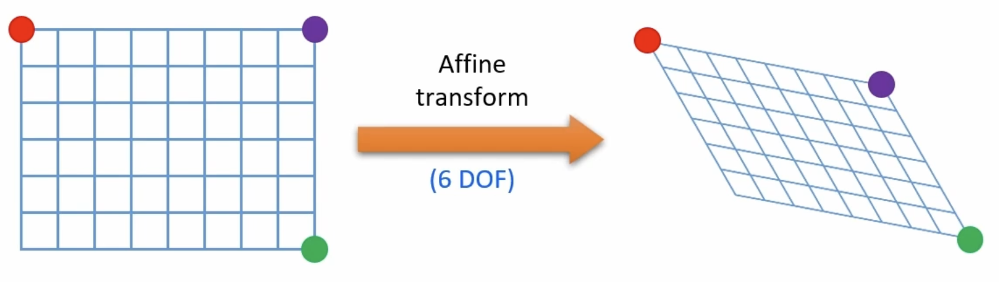

# 영상의 기하학적 변환
{: .no_toc }

## Table of contents
{: .no_toc .text-delta }

1. TOC
{:toc}

---

# 영상의 기하학적 변환(Geometric transformation)
영상을 구선하는 픽셀의 구조를 변경함으로써 전체 영상의 모양을 바꾸는 작업이다. 전처리, 영상 접합, 왜곡 제거 등이 이에 해당한다.

영상의 변환 방법은 크게 두 가지로 나눠진다. 첫 번째로 원본 영상의 직선 형태를 변환 후에도 직선으로 유지하는 형태의 변환이다. 두 번째는 원본 영상의 직선 형태를 곡선 형태로 변환하는 혹은 그 반대인 변환 방법들이 존재한다.


# 이동 변환(Translation trnaform)
이동 변환은 영상의 가로 또는 세로 방향으로 영상을 특정 크기만큼 이동시키는 변환 방법이다.

좌표를 이용하여 식으로 표현하면 다음과 같다.
$$
\begin{cases}
x`=x+a\\
y`=y+b
\end{cases}
\\
$$

원점이 (0,0)에서 (a,b)로 이동했기 때문에 영상 전체의 픽셀이 마찬가지로 원래 위치에서 (a, b)만큼 증가하는 형태가 되어야 한다.

$$
\begin{bmatrix}
x`\\
y`
\end{bmatrix} =\begin{bmatrix}
1 & 0\\
0 & 1
\end{bmatrix}\begin{bmatrix}
x\\
y
\end{bmatrix} +\begin{bmatrix}
a\\
b
\end{bmatrix}
\\
$$
위와 같이 행렬로 표현이 가능하며
$$
\begin{bmatrix}
x`\\
y`
\end{bmatrix} =\begin{bmatrix}
1 & 0 & a\\
0 & 1 & b
\end{bmatrix}\begin{bmatrix}
x\\
y\\
1
\end{bmatrix}
$$
행렬 연산 과정에서 덧셈이 포함되는 경우 식의 전개가 복잡해진다. 때문에 위 식처럼 덧셈 부분을 업애기 위해 곱셈 부분에 하나의 차원을 늘릴 수 있다. 이러한 좌표계를 동차좌표계`(Homogeneous Coordinate)`라고 한다.


```cpp
void ex_translate(){
    Mat src = imread("../data/lenna.bmp", IMREAD_GRAYSCALE);

	if (src.empty()) {
		cerr << "Image load failed!" << endl;
		return ;
	}

	Mat dst = Mat::zeros(src.size(), CV_8UC1);

	for (int y = 0; y < src.rows; y++) {
		for (int x = 0; x < src.cols; x++) {
			int x_ = x + 100;
			int y_ = y + 100;
			if (x_ < 0 || x_ >= dst.cols) continue;
			if (y_ < 0 || y_ >= dst.rows) continue;
			dst.at<uchar>(y_, x_) = src.at<uchar>(y, x);
		}
	}
	imshow("src", src);
	imshow("dst", dst);
	waitKey();

}
```

```cpp
void ex_processing(){
    Mat src = imread("../data/lenna.bmp", IMREAD_GRAYSCALE);

	if (src.empty()) {
		cerr << "Image load failed!" << endl;
		return ;
	}
	float data[] = {1, 0, 100, 0, 1, 100};
	Mat affine = Mat(2,3, CV_32FC1, data);
	// or
	// Mat affine = (Mat_<float>(2, 3) << 1, 0, 100, 0, 1, 100);

	Mat dst;
	warpAffine(src, dst, affine, Size());


	imshow("src", src);
	imshow("dst", dst);
	waitKey();

}
```


# 전단 변환(Shear transform)
층밀림 변환이라고 하며, 직사각형 형태의 영상 데이터를 한쪽 방햫 혹은 양쪽 방향을 밀어서 평행사변형 모양으로 변환하는 방법이다.

$$
\begin{bmatrix}
x`\\
y`
\end{bmatrix} =\begin{bmatrix}
1 & m_{y} & 0\\
m_{x} & 1 & 0
\end{bmatrix}\begin{bmatrix}
x\\
y\\
1
\end{bmatrix}
$$


```cpp
void ex_processing(){
    Mat src = imread("../data/lenna.bmp", IMREAD_GRAYSCALE);

	if (src.empty()) {
		cerr << "Image load failed!" << endl;
		return ;
	}
    
	Mat dst(src.rows * 3 / 2, src.cols, src.type(), Scalar(0));

	double m = 0.5;
	for (int y = 0; y < src.rows; y++) {
		for (int x = 0; x < src.cols; x++) {
			int nx = x;
			int ny = int(y + m*x);
			dst.at<uchar>(ny, nx) = src.at<uchar>(y, x);
		}
	}

	imshow("src", src);
	imshow("dst", dst);

	waitKey();

}
```


```cpp
void ex_processing(){
    Mat src = imread("../data/lenna.bmp", IMREAD_GRAYSCALE);

	if (src.empty()) {
		cerr << "Image load failed!" << endl;
		return ;
	}
	float data[] = {1, 0.5, 0, 0, 1, 0};
	Mat affine = Mat(2,3, CV_32FC1, data);
	// or
	// Mat affine = (Mat_<float>(2, 3) << 1, 0.5, 0, 0, 1, 0);

	Mat dst;
	warpAffine(src, dst, affine, Size(src.cols * 3 / 2, src.rows));

	imshow("src", src);
	imshow("dst", dst);

	waitKey();

}
```


```cpp
void ex_processing(){
    Mat src = imread("../data/lenna.bmp", IMREAD_GRAYSCALE);

	if (src.empty()) {
		cerr << "Image load failed!" << endl;
		return ;
	}
    
	float data[] = {1, 0.5, 0,
                    0.5, 1, 0};
	Mat affine = Mat(2,3, CV_32FC1, data);

	Mat dst;
	warpAffine(src, dst, affine, Size(src.cols * 1.5, src.rows * 1.5));

s
	imshow("src", src);
	imshow("dst", dst);

	waitKey();

}
```


# 크기 변환(Scale transform)
영상의 크기를 변환하는 방법이다. 스케일 비율에 따라 크기를 조절한다.

$$
\begin{bmatrix}
x`\\
y`
\end{bmatrix} =\begin{bmatrix}
s_{x} & 0 & 0\\
0 & s_{y} & 0
\end{bmatrix}\begin{bmatrix}
x\\
y\\
1
\end{bmatrix}
$$

## 순방향 맵핑(Forward mapping)
for loop를 이용한 이미지 확대 방법을 이용해서 영상의 크기를 2배 확대하는 경우 빈 공간이 생기는것을 확인할 수 있다. 입력 영상의 좌표를 2배하여 출력 영상의 값으로 사용하기 때문이다.

$$
\begin{cases}
x`=s_{x} x\\
y`=s_{y} y
\end{cases}
$$

```cpp
void ex_processing(){
    Mat src = imread("../data/lenna.bmp", IMREAD_GRAYSCALE);

	if (src.empty()) {
		cerr << "Image load failed!" << endl;
		return ;
	}
    
	Mat dst = Mat::zeros(src.rows * 2, src.cols * 2, CV_8UC1);

	for (int y = 0; y < src.rows; y++) {
		for (int x = 0; x < src.cols; x++) {
			int x_ = x * 2;
			int y_ = y * 2;

			dst.at<uchar>(y_, x_) = src.at<uchar>(y, x);
		}
	}

	imshow("src", src);
	imshow("dst", dst);
	waitKey();

}
```


## 역방향 맵핑(Backward mapping)
역방향 맵핑을 통해 순방향 맵핑에서 나타나는 문제를 해결할 수 있다. 출력 영상의 좌표를 기준으로 스케일 팩터(s)를 나눈 원본 영상의 위치의 픽셀값을 가져온다. 하지만 역방향 맵핑의 경우 원본 영상에서 중복된 픽셀을 가져오기 때문에 계산 현상이 심한것을 확인할 수 있다.

$$
\begin{cases}
x= x`/s_{x}\\
y=y`/s_{y}
\end{cases}
$$

```cpp
void ex_processing(){
    Mat src = imread("../data/camera.bmp", IMREAD_GRAYSCALE);

	if (src.empty()) {
		cerr << "Image load failed!" << endl;
		return ;
	}
    
	Mat dst = Mat::zeros(src.rows * 2, src.cols * 2, src.type());

	for (int y_ = 0; y_ < dst.rows; y_++) {
		for (int x_ = 0; x_ < dst.cols; x_++) {
			int x = x_ / 2;
			int y = y_ / 2;
			dst.at<uchar>(y_, x_) = src.at<uchar>(y, x);
		}
	}

	imshow("src", src);
	imshow("dst", dst);
	waitKey();
}
```


# 보간법

$$
\begin{align*}
x & =( 1-p) a+pb\\
y & =( 1-p) d+pc\\
z & =( 1-p) y+px\\
z & = ( 1-q)[( 1-p) d+pc] +q[( 1-p) a+pb]\\
 & = ( 1-p)( 1-q) d+( 1-q) pc+( 1-p) qa+pqb
\end{align*}
$$

```cpp

void resizeBilinear(const Mat& src, Mat& dst, Size size)
{
	dst.create(size.height, size.width, CV_8U);

	int x1, y1, x2, y2;	double rx, ry, p, q, value;
	double sx = static_cast<double>(src.cols - 1) / (dst.cols - 1);
	double sy = static_cast<double>(src.rows - 1) / (dst.rows - 1);

	for (int y = 0; y < dst.rows; y++) {
		for (int x = 0; x < dst.cols; x++) {
			rx = sx * x;			ry = sy * y;
			x1 = cvFloor(rx);		y1 = cvFloor(ry);
			x2 = x1 + 1; if (x2 == src.cols) x2 = src.cols - 1;
			y2 = y1 + 1; if (y2 == src.rows) y2 = src.rows - 1;
			p = rx - x1;			q = ry - y1;

			value = (1. - p) * (1. - q) * src.at<uchar>(y1, x1)
				+ p * (1. - q) * src.at<uchar>(y1, x2)
				+ (1. - p) * q * src.at<uchar>(y2, x1)
				+ p * q * src.at<uchar>(y2, x2);

			dst.at<uchar>(y, x) = static_cast<uchar>(value + .5);
		}
	}
}
```

```cpp
    Mat src = imread("../data/camera.bmp", IMREAD_GRAYSCALE);

	if (src.empty()) {
		cerr << "Image load failed!" << endl;
		return ;
	}
    
	Mat dst;
	resizeBilinear(src, dst, Size(1200, 1200));

	imshow("src", src);
	imshow("dst", dst);
	waitKey();
```


## resize() 함수를 이용한 사이즈 변환
```cpp
void ex_processing(){
    Mat src = imread("../data/rose.bmp");

	if (src.empty()) {
		cerr << "Image load failed!" << endl;
		return ;
	}
    
	Mat dst1, dst2, dst3, dst4;
	resize(src, dst1, Size(), 4, 4, INTER_NEAREST);
	resize(src, dst2, Size(1920, 1280));
	resize(src, dst3, Size(1920, 1280), 0, 0, INTER_CUBIC);
	resize(src, dst4, Size(1920, 1280), 0, 0, INTER_LANCZOS4);

	imshow("src", src);
	imshow("dst1", dst1(Rect(400, 500, 400, 400)));
	imshow("dst2", dst2(Rect(400, 500, 400, 400)));
	imshow("dst3", dst3(Rect(400, 500, 400, 400)));
	imshow("dst4", dst4(Rect(400, 500, 400, 400)));
	waitKey();

}
```

## 영상 데이터 축소 시 주의할 점
영상을 축소하는 것은 확대하는 것보다 단순하게 생각할 수 있지만 원본 영상을 급격하게 축소시키는 경우 열화 현상에 의해 화질이 나빠질 수 있다. 원본 영상에 blur 처리를 한 후 영상을 축소하거나, INTER_AREA 라는 옵션을 이용하면 된다.


# 회전 변환(Rotation transform)
영상을 특정 각도만큼 회전시키는 변환 방법이다. OpenCV에서는 기본적으로 반시계 방향을 정방향으로 정의한다.

## 정방향 맵핑(Forward mapping)
$$
\begin{cases}
x`=cos\theta \cdotp x +sin\theta \cdot y\\
y`=-sin\theta \cdot x+cos\theta \cdot y
\end{cases}
$$

$$
\begin{bmatrix}
x`\\
y`
\end{bmatrix} =\begin{bmatrix}
cos\theta  & sin\theta \\
-sin\theta  & cos\theta 
\end{bmatrix}\begin{bmatrix}
x\\
y
\end{bmatrix} +\begin{bmatrix}
0\\
0
\end{bmatrix}
$$

$$
\begin{bmatrix}
x`\\
y`
\end{bmatrix} =\begin{bmatrix}
cos\theta  & sin\theta  & 0\\
-sin\theta  & cos\theta  & 0
\end{bmatrix}\begin{bmatrix}
x\\
y\\
1
\end{bmatrix}
$$

## 역방향 맵핑(Backward mapping)
$$
\begin{align*}
\begin{bmatrix}
x`\\
y`
\end{bmatrix} & =\begin{bmatrix}
cos\theta  & sin\theta \\
-sin\theta  & cos\theta 
\end{bmatrix}\begin{bmatrix}
x\\
y
\end{bmatrix}\\
\begin{bmatrix}
x\\
y
\end{bmatrix} & =\begin{bmatrix}
cos\theta  & sin\theta \\
-sin\theta  & cos\theta 
\end{bmatrix}^{-1}\begin{bmatrix}
x`\\
y`
\end{bmatrix}\\
 & =\begin{bmatrix}
cos\theta  & -sin\theta \\
sin\theta  & cos\theta 
\end{bmatrix}\begin{bmatrix}
x`\\
y`
\end{bmatrix}
\end{align*}
$$


## getRotationMatrix2D() 함수
2x3 크기의 affine matrix를 생성하는 함수이다. center는 회전에 중심이 되는 원본 영상의 중점을 의미한다(e.g. src.cols/2.f, src/rosw/2.f). angle은 회전할 각도를 입력하며 degree를 기준으로 한다.

영상을 그대로 회전 변환하면 중심축이 좌측 상단이기 때문에 기준점을 중심으로 옮겨 주어야 한다. 


$$
\begin{align*}
\begin{bmatrix}
x`\\
y`\\
1
\end{bmatrix} & =\begin{bmatrix}
1 & 0 & c_{x}\\
0 & 1 & c_{y}\\
0 & 0 & 1
\end{bmatrix}\begin{bmatrix}
\alpha  & \beta  & 0\\
-\beta  & \alpha  & 0\\
0 & 0 & 1
\end{bmatrix}\begin{bmatrix}
1 & 0 & -c_{x}\\
0 & 1 & -c_{y}\\
0 & 0 & 1
\end{bmatrix}\begin{bmatrix}
x\\
y\\
1
\end{bmatrix} \ \begin{cases}
\alpha =cos\theta \\
\beta =sin\theta 
\end{cases}\\
 & =\begin{bmatrix}
\alpha  & \beta  & c_{x}\\
-\beta  & \alpha  & c_{y}\\
0 & 0 & 1
\end{bmatrix}\begin{bmatrix}
1 & 0 & -c_{x}\\
0 & 1 & -c_{y}\\
0 & 0 & 1
\end{bmatrix}\begin{bmatrix}
x\\
y\\
1
\end{bmatrix} \ \\
 & =\begin{bmatrix}
\alpha  & \beta  & -\alpha c_{x} -\beta c_{y} +c_{x}\\
-\beta  & \alpha  & \beta c_{x} -\alpha c_{y} +c_{y}\\
0 & 0 & 1
\end{bmatrix}\begin{bmatrix}
x\\
y\\
1
\end{bmatrix} \ 
\end{align*}
$$


```
center: 회전 중심 좌표
angle: 회전 각도(반시계 방향)
scale: 회전 후 확대 비율
```
```cpp
Mat getRotationMatrix2D(Point2f center, double angle, double scale);
```

## warpAffine() 함수
affine matrix를 원본 영상에 적용해서 반환하는 함수이다.

```cpp
void warpAffine( InputArray src, OutputArray dst,
                              InputArray M, Size dsize,
                              int flags = INTER_LINEAR,
                              int borderMode = BORDER_CONSTANT,
                              const Scalar& borderValue = Scalar());
```
```
src: input image.
dst: output image that has the size dsize and the same type as src.
M: [2 x 3] transformation matrix. 
dsize: size of the output image.
flags: 보간법을 선택
//! interpolation algorithm
enum InterpolationFlags{
    /** nearest neighbor interpolation */
    INTER_NEAREST        = 0,
    /** bilinear interpolation */
    INTER_LINEAR         = 1,
    /** bicubic interpolation */
    INTER_CUBIC          = 2,
    /** resampling using pixel area relation. It may be a preferred method for image decimation, as
    it gives moire'-free results. But when the image is zoomed, it is similar to the INTER_NEAREST
    method. */
    INTER_AREA           = 3,
    /** Lanczos interpolation over 8x8 neighborhood */
    INTER_LANCZOS4       = 4,
    /** Bit exact bilinear interpolation */
    INTER_LINEAR_EXACT = 5,
    /** Bit exact nearest neighbor interpolation. This will produce same results as
    the nearest neighbor method in PIL, scikit-image or Matlab. */
    INTER_NEAREST_EXACT  = 6,
    /** mask for interpolation codes */
    INTER_MAX            = 7,
    /** flag, fills all of the destination image pixels. If some of them correspond to outliers in the
    source image, they are set to zero */
    WARP_FILL_OUTLIERS   = 8,
    /** flag, inverse transformation

    For example, #linearPolar or #logPolar transforms:
    - flag is __not__ set: \f$dst( \rho , \phi ) = src(x,y)\f$
    - flag is set: \f$dst(x,y) = src( \rho , \phi )\f$
    */
    WARP_INVERSE_MAP     = 16
};
borderMode: pixel extrapolation method (see #BorderTypes); when borderMode=#BORDER_TRANSPARENT, it means that the pixels in the destination image corresponding to the "outliers" in the source image are not modified by the function.
//! Various border types, image boundaries are denoted with `|`
//! @see borderInterpolate, copyMakeBorder
enum BorderTypes {
    BORDER_CONSTANT    = 0, //!< `iiiiii|abcdefgh|iiiiiii`  with some specified `i`
    BORDER_REPLICATE   = 1, //!< `aaaaaa|abcdefgh|hhhhhhh`
    BORDER_REFLECT     = 2, //!< `fedcba|abcdefgh|hgfedcb`
    BORDER_WRAP        = 3, //!< `cdefgh|abcdefgh|abcdefg`
    BORDER_REFLECT_101 = 4, //!< `gfedcb|abcdefgh|gfedcba`
    BORDER_TRANSPARENT = 5, //!< `uvwxyz|abcdefgh|ijklmno`

    BORDER_REFLECT101  = BORDER_REFLECT_101, //!< same as BORDER_REFLECT_101
    BORDER_DEFAULT     = BORDER_REFLECT_101, //!< same as BORDER_REFLECT_101
    BORDER_ISOLATED    = 16 //!< do not look outside of ROI
};
borderValue: value used in case of a constant border; by default, it is 0.
```


## Example code

```cpp

void on_rotate(int pos, void* data)
{
	Mat src = *(Mat*)data;

	float degree = (float)pos;
	Point2f pt(src.cols / 2.f, src.rows / 2.f);
	Mat rot = getRotationMatrix2D(pt, degree, 1.0);

	Mat dst;
	warpAffine(src, dst, rot, Size());

	imshow("dst", dst);
}

void ex_processing(){
    Mat src = imread("../data/rose.bmp");

	if (src.empty()) {
		cerr << "Image load failed!" << endl;
		return ;
	}
    
	imshow("src", src);

	namedWindow("dst");
	createTrackbar("angle", "dst", 0, 360, on_rotate, (void*)&src);
	on_rotate(0, (void*)&src);

	waitKey();

}


```


# 기하학적 변환

```cpp
void flip(InputArray src, OutputArray dst, int flipCode);
```

```
src: input array.
dst: output array of the same size and type as src.
flipCode: a flag to specify how to flip the array; 0 means
flipping around the x-axis and positive value (for example, 1) means
flipping around y-axis. Negative value (for example, -1) means flipping around both axes.
1: 좌우 대칭
0: 상하 대칭
-1: 좌우 상하 대칭
```

```cpp
void ex_processing(){
    Mat src = imread("../data/rose.bmp"), dst;

	if (src.empty()) {
		cerr << "Image load failed!" << endl;
		return ;
	}
    
    flip(src, dst, 1);

	imshow("src", src);
    imshow("dst", dst);
	waitKey();

}
```


# 어파인 변환(Affine transform)
Affine transform 같은 경우 평행사변형 형태로 변환하기 때문에 3개의 점의 변환 정보만 알아도 나머지 1개는 3개의 점으로 구할 수 있다. 빨간색 점을 좌표 편면상의 한 점의 이동이라고 봤을 때, x와 y에 대한 두 식으로 표현이 가능하다. 나머지 두 점 또한 4개의 식으로 표현이 가능하기 때문에 총 6개의 식으로 위 변환을 정의할 수 있다.




# 투시 변환(Perspective tranform)
Perspectiva transform은 8개의 방정식으로 정의가 가능하며, 이를 통한 affine matrix를 구할 수 있다.


$$
\begin{aligned}
\begin{bmatrix}
wx`\\
wy`\\
w
\end{bmatrix} & =\begin{bmatrix}
a & b & c\\
d & e & f\\
g & h & i
\end{bmatrix}\begin{bmatrix}
x\\
y\\
1
\end{bmatrix} \ \ 
\end{aligned}
$$
$$
\begin{cases}
x` & =\frac{ax+by+c}{gx+hy+i}\\
y` & =\frac{dx+ey+f}{gx+hy+i}
\end{cases}
$$
$$
\begin{cases}
x` & =ax+by+c-gxx`-hx`y\\
y` & =dx+ey+f-gxy`-yy`
\end{cases}
$$
$$
\begin{cases}
x_{1}^{`} & =ax_{1} +by_{1} +c &  & -gx_{1} x_{1}^{`} -hx_{1} y_{1}^{`}\\
y_{1}^{`} & = & dx_{1} +ey_{1} +f & -gx_{1} y_{1}^{`} -hy_{1} y_{1}^{`}
\end{cases}
$$
$$
\begin{bmatrix}
x_{1}^{`}\\
y_{1}^{`}\\
x_{2}^{`}\\
y_{2}^{`}\\
x_{3}^{`}\\
y_{3}^{`}\\
x_{4}^{`}\\
y_{4}^{`}
\end{bmatrix} =\begin{bmatrix}
x_{1} & y_{1} & 1 & 0 & 0 & 0 & -x_{1} x_{1}^{`} & -x_{1}^{`} y_{1}\\
0 & 0 & 0 & x_{1} & y_{1} & 1 & -x_{1} y_{1}^{`} & -y_{1} y_{1}^{`}\\
x_{2} & y_{2} & 1 & 0 & 0 & 0 & -x_{2} x_{2}^{`} & -x_{2}^{`} y_{2}\\
0 & 0 & 0 & x_{2} & y_{2} & 1 & -x_{2} y_{2}^{`} & -y_{2} y_{2}^{`}\\
x_{3} & y_{3} & 1 & 0 & 0 & 0 & -x_{3} x_{3}^{`} & -x_{3}^{`} y_{3}\\
0 & 0 & 0 & x_{3} & y_{3} & 1 & -x_{3} y_{3}^{`} & -y_{3} y_{3}^{`}\\
x_{4} & y_{4} & 1 & 0 & 0 & 0 & -x_{4} x_{4}^{`} & -x_{4}^{`} y_{4}\\
0 & 0 & 0 & x_{4} & y_{4} & 1 & -x_{4} y_{4}^{`} & -y_{4} y_{4}^{`}
\end{bmatrix}\begin{bmatrix}
a\\
b\\
c\\
d\\
e\\
f\\
g\\
h
\end{bmatrix}
$$

```cpp
Mat getPerspectiveTransform(InputArray src, InputArray dst, int solveMethod = DECOMP_LU);
```
```
src: Coordinates of quadrangle vertices in the source image.
dst: Coordinates of the corresponding quadrangle vertices in the destination image.
solveMethod: method passed to cv::solve (#DecompTypes)
```

```cpp
void warpPerspective( InputArray src, OutputArray dst,
                                   InputArray M, Size dsize,
                                   int flags = INTER_LINEAR,
                                   int borderMode = BORDER_CONSTANT,
                                   const Scalar& borderValue = Scalar());
```
```
src: input image.
dst: output image that has the size dsize and the same type as src .
M: \f$3\times 3\f$ transformation matrix.
dsize: size of the output image.
flags: combination of interpolation methods (#INTER_LINEAR or #INTER_NEAREST) and the
optional flag #WARP_INVERSE_MAP, that sets M as the inverse transformation (
\f$\texttt{dst}\rightarrow\texttt{src}\f$ ).
borderMode: pixel extrapolation method (#BORDER_CONSTANT or #BORDER_REPLICATE).
borderValue: value used in case of a constant border; by default, it equals 0.
```


```cpp
void ex_processing(){
    VideoCapture cap("../data/test_video.mp4");

	if (!cap.isOpened()) {
		cerr << "Video load failed!" << endl;
		return ;
	}

    Mat src;
	while (true) {
		cap >> src;

		if (src.empty())
			break;

		int w = 500, h = 260;

		vector<Point2f> src_pts(4);
		vector<Point2f> dst_pts(4);

		src_pts[0] = Point2f(474, 400);	src_pts[1] = Point2f(710, 400);
		src_pts[2] = Point2f(866, 530); src_pts[3] = Point2f(366, 530);

		dst_pts[0] = Point2f(0, 0);		dst_pts[1] = Point2f(w - 1, 0);
		dst_pts[2] = Point2f(w - 1, h - 1);	dst_pts[3] = Point2f(0, h - 1);

		Mat per_mat = getPerspectiveTransform(src_pts, dst_pts);

		Mat dst;
		warpPerspective(src, dst, per_mat, Size(w, h));

		vector<Point> pts;
		for (auto pt : src_pts) {
			pts.push_back(Point(pt.x, pt.y));
		}
		polylines(src, pts, true, Scalar(0, 0, 255), 2, LINE_AA);
        
        imshow("src", src);
        imshow("dst", dst);

        if (waitKey(1) == 27)
            break;

    }
}
```


# 리맵핑(Remapping)
영상의 특정 위치 픽셀을 다른 위치에 재배치하는 일반적인 방법이다.

$$
\begin{cases}
x & :\ input\\
x` & :\ output
\end{cases} \Longrightarrow \begin{cases}
x` & =x+200\\
y` & =y+100
\end{cases} \Longrightarrow \begin{cases}
x & =x`-200\\
y & =y`-100
\end{cases}
$$

$$
 \begin{array}{l}
이동\ 변환:\ \begin{cases}
map_{x}( x,y) & =x-200\\
map_{y}( x,y) & =y-100
\end{cases}\\
\\
상하\ 대칭:\ \begin{cases}
map_{x}( x,y) & =x\\
map_{y}( x,y) & =h-1-y
\end{cases}\\
\\
크기\ 변환:\ \begin{cases}
map_{x}( x,y) & =x/2\\
map_{y}( x,y) & =y/2
\end{cases}
\end{array}
$$

```cpp
void ex_processing(){
    Mat src = imread("../data/lenna.bmp");

	if (src.empty()) {
		cerr << "Image load failed!" << endl;
		return ;
	}

	int w = src.cols;
	int h = src.rows;

	Mat map1 = Mat::zeros(h*2, w*2, CV_32FC1);
	Mat map2 = Mat::zeros(h*2, w*2, CV_32FC1);

	for (int y = 0; y < h*2; y++) {
		for (int x = 0; x < w*2; x++) {
			map1.at<float>(y, x) = (float)x/2;
			map2.at<float>(y, x) = (float)y;
			//map2.at<float>(y, x) = (float)h - 1 - y;
			//map2.at<float>(y, x) = (float)y/2;
		}
	}

	Mat dst;
	remap(src, dst, map1, map2, INTER_LINEAR);
	//remap(src, dst, map1, map2, INTER_LINEAR, BORDER_DEFAULT);

	imshow("src", src);
	imshow("dst", dst);
	waitKey();
}
```


