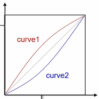

# 컬러 영상 처리
{: .no_toc }

## Table of contents
{: .no_toc .text-delta }

1. TOC
{:toc}

---


# 컬러 영상 처리 기초

## 영상 반전 변환
```cpp
void ex_processing(){
    Mat src = imread("../data/mandrill.bmp");

	if (src.empty()) {
		cerr << "Image load failed!" << endl;
		return ;
	}
    
	Mat dst = Scalar(255, 255, 255) - src;


	imshow("src", src);
	imshow("dst", dst);
	waitKey();
	destroyAllWindows();

}
```

```cpp
void ex_processing(){
    Mat src = imread("../data/mandrill.bmp");

	if (src.empty()) {
		cerr << "Image load failed!" << endl;
		return ;
	}

	Mat dst(src.rows, src.cols, CV_8UC3);

	for (int y = 0; y < src.rows; y++) {
		for (int x = 0; x < src.cols; x++) {
			dst.at<Vec3b>(y, x) = Vec3b(255, 255, 255) - src.at<Vec3b>(y, x);
		}
	}

	imshow("src", src);
	imshow("dst", dst);
	waitKey();
	destroyAllWindows();

}
```


## 흑백 영상 변환
```cpp
#define RGB2GRAY(r, g, b) ((4899*(r) + 9617*(g) + 1868*(b)) >> 14)


void ex_processing(){
    Mat src = imread("../data/mandrill.bmp");

	if (src.empty()) {
		cerr << "Image load failed!" << endl;
		return ;
	}

	Mat dst(src.rows, src.cols, CV_8UC1);

	for (int y = 0; y < src.rows; y++) {
		for (int x = 0; x < src.cols; x++) {
			uchar b = src.at<Vec3b>(y, x)[0];
			uchar g = src.at<Vec3b>(y, x)[1];
			uchar r = src.at<Vec3b>(y, x)[2];

			//uchar gray = (uchar)(0.299 * r + 0.587 * g + 0.114 * b + 0.5);
			//dst.at<uchar>(y, x) = gray;

			dst.at<uchar>(y, x) = (uchar)RGB2GRAY(r, g, b);
		}
	}

	imshow("src", src);
	imshow("dst", dst);
	waitKey();
	destroyAllWindows();

}

```


## 색 변환 함수

```cpp
void cvtColor( InputArray src, OutputArray dst, int code, int dstCn = 0 );
```
```
src: input image: 8-bit unsigned, 16-bit unsigned ( CV_16UC... ), or single-precision
floating-point.
dst: output image of the same size and depth as src.
code: color space conversion code (see #ColorConversionCodes).
dstCn: number of channels in the destination image; if the parameter is 0, the number of the channels is derived automatically from src and code.
```

```cpp
void ex_processing(){
    Mat src = imread("../data/mandrill.bmp");

	if (src.empty()) {
		cerr << "Image load failed!" << endl;
		return ;
	}

	Mat dst;
	cvtColor(src, dst, COLOR_BGR2GRAY);

	imshow("src", src);
	imshow("dst", dst);
	waitKey();
	destroyAllWindows();

}
```


# HSV 색 공간
Hue, Satutation, Value를 이용해서 색을 표현하는 방법이다.
* Hue: 색상, 색의 종류로 0도에서 360도로 표현
* Satuation: 채도, 색의 탁하고 선명한 정도를 표현
* Value: 명도, 빛의 밝기를 표현
OpenCV에서 Hue는 0도에서 180도로 표현한다.


# YCrCb 색 공간
휘도와 색차 성분을 이용해서 색을 표현하는 방법이다. 8비트의 경우 0부터 255의 범위로 표현한다.
* Y: 휘도, 밝기 정보(Luma)
* Cr, Cb: 색차(Chroma)


# 색 공간 분할
## BGR
```cpp
void ex_processing(){
    Mat src = imread("../data/candies.png");

	if (src.empty()) {
		cerr << "Image load failed!" << endl;
		return ;
	}

    vector<Mat> bgr_planes;
	split(src, bgr_planes);

	imshow("src", src);
	imshow("B plane", bgr_planes[0]);
	imshow("G plane", bgr_planes[1]);
	imshow("R plane", bgr_planes[2]);

	waitKey();
	destroyAllWindows();
}
```


## HSV
```cpp
void ex_processing(){
    Mat src = imread("../data/candies.png");

	if (src.empty()) {
		cerr << "Image load failed!" << endl;
		return ;
	}

	Mat src_hsv;
	cvtColor(src, src_hsv, COLOR_BGR2HSV);

	vector<Mat> hsv_planes;
	split(src_hsv, hsv_planes);

	imshow("src", src);
	imshow("H plane", hsv_planes[0]);
	imshow("S plane", hsv_planes[1]);
	imshow("V plane", hsv_planes[2]);

	waitKey();
	destroyAllWindows();
}
```


## YCrCb

```cpp

void ex_processing(){
    Mat src = imread("../data/candies.png");

	if (src.empty()) {
		cerr << "Image load failed!" << endl;
		return ;
	}

	Mat src_ycrcb;
	cvtColor(src, src_ycrcb, COLOR_BGR2YCrCb);

	vector<Mat> ycrcb_planes;
	split(src_ycrcb, ycrcb_planes);

	imshow("src", src);
	imshow("Y plane", ycrcb_planes[0]);
	imshow("Cr plane", ycrcb_planes[1]);
	imshow("Cb plane", ycrcb_planes[2]);

	waitKey();
	destroyAllWindows();
}
```


# 컬려 영상의 히스토그램 평활화
RGB로 평활화를 하는경우 색이 크게 변경되는 경우가 나타날 수 있다. 각 색에 적용되는 평활화 알고리즘이 다르게 동작하기 떄문에 이러한 문제가 나타난다.


```cpp
void ex_processing(){
    Mat src = imread("../data/candies.png", IMREAD_COLOR);

	if (src.empty()) {
		cerr << "Image load failed!" << endl;
		return ;
	}

    vector<Mat> planes;
    split(src, planes);
    for(int i=0; i<3; i++){
    	equalizeHist(planes[i], planes[i]);
    }
    Mat dst;
    merge(planes, dst);

	imshow("src", src);
	imshow("dst", dst);
	waitKey();
}
```


밝기 정보와 색상 정보로 나눠지는 색 공간을 이용하면 위와같음 문제를 피할 수 있다.


```cpp
void ex_processing(){
    Mat src = imread("../data/candies.png", IMREAD_COLOR);

	if (src.empty()) {
		cerr << "Image load failed!" << endl;
		return ;
	}
    Mat src_ycrcb;
	cvtColor(src, src_ycrcb, COLOR_BGR2YCrCb);

    vector<Mat> planes;
    split(src_ycrcb, planes);

	equalizeHist(planes[0], planes[0]);

    Mat dst;
    merge(planes, dst);
    cvtColor(dst, dst, COLOR_YCrCb2BGR);

	imshow("src", src);
	imshow("dst", dst); 
	waitKey();
}

```


# 색 변환




```cpp

uchar curve1[256] = {
	0, 2, 3, 4, 7, 8, 9, 11,
	12, 14, 15, 16, 18, 19, 21, 22,
	24, 25, 27, 28, 30, 31, 33, 34,
	36, 37, 39, 40, 42, 43, 45, 46,
	47, 49, 50, 52, 53, 55, 56, 58,
	59, 61, 62, 63, 65, 66, 68, 69,
	71, 72, 73, 75, 76, 78, 79, 80,
	82, 83, 85, 86, 87, 89, 90, 91,
	93, 94, 95, 97, 98, 100, 101, 102,
	104, 105, 106, 107, 109, 110, 111, 113,
	114, 115, 117, 118, 119, 120, 122, 123,
	124, 125, 127, 128, 129, 130, 131, 133,
	134, 135, 136, 137, 139, 140, 141, 142,
	143, 144, 145, 146, 148, 149, 150, 151,
	152, 153, 154, 155, 156, 157, 158, 159,
	160, 161, 162, 164, 165, 165, 166, 167,
	168, 169, 170, 171, 172, 173, 174, 175,
	176, 177, 178, 179, 180, 180, 181, 182,
	183, 184, 185, 186, 186, 187, 188, 189,
	190, 191, 191, 192, 193, 194, 195, 195,
	196, 197, 198, 198, 199, 200, 201, 201,
	202, 203, 204, 204, 205, 206, 207, 207,
	208, 209, 209, 210, 211, 211, 212, 213,
	213, 214, 215, 215, 216, 217, 217, 218,
	219, 219, 220, 221, 221, 222, 222, 223,
	224, 224, 225, 226, 226, 227, 227, 228,
	229, 229, 230, 230, 231, 231, 232, 233,
	233, 234, 234, 235, 235, 236, 237, 237,
	238, 238, 239, 239, 240, 241, 241, 242,
	242, 243, 243, 244, 244, 245, 246, 246,
	247, 247, 248, 248, 249, 249, 250, 250,
	251, 252, 252, 253, 254, 254, 255, 255
};

uchar curve2[256] = {
	0, 0, 1, 1, 1, 2, 3, 3,
	4, 4, 5, 6, 6, 7, 7, 8,
	8, 9, 9, 10, 10, 11, 11, 12,
	12, 13, 13, 14, 14, 15, 15, 16,
	17, 17, 18, 18, 19, 19, 20, 20,
	21, 21, 22, 23, 23, 24, 24, 25,
	25, 26, 27, 27, 28, 28, 29, 30,
	30, 31, 31, 32, 33, 33, 34, 35,
	35, 36, 37, 37, 38, 38, 39, 40,
	40, 41, 42, 43, 43, 44, 45, 45,
	46, 47, 47, 48, 49, 50, 50, 51,
	52, 53, 53, 54, 55, 56, 57, 57,
	58, 59, 60, 61, 61, 62, 63, 64,
	65, 66, 67, 68, 68, 69, 70, 71,
	72, 73, 74, 75, 76, 77, 78, 79,
	80, 81, 82, 82, 83, 85, 86, 87,
	88, 89, 90, 91, 92, 93, 94, 95,
	96, 97, 98, 99, 100, 102, 103, 104,
	105, 106, 107, 108, 110, 111, 112, 113,
	114, 115, 117, 118, 119, 120, 121, 123,
	124, 125, 126, 128, 129, 130, 131, 133,
	134, 135, 136, 138, 139, 140, 141, 143,
	144, 145, 147, 148, 149, 151, 152, 153,
	155, 156, 157, 159, 160, 161, 163, 164,
	165, 167, 168, 169, 171, 172, 174, 175,
	176, 178, 179, 180, 182, 183, 185, 186,
	187, 189, 190, 192, 193, 195, 196, 197,
	199, 200, 202, 203, 205, 206, 207, 209,
	210, 212, 213, 215, 216, 217, 219, 220,
	222, 223, 225, 226, 228, 229, 230, 232,
	233, 235, 236, 238, 239, 241, 242, 244,
	245, 246, 248, 249, 250, 252, 253, 255
};


void ex_processing(){
    Mat src = imread("../data/girl.jpg ", IMREAD_COLOR);

	if (src.empty()) {
		cerr << "Image load failed!" << endl;
		return ;
	}
	vector<Mat> channels;
	split(src, channels);

	for (int y = 0; y < src.rows; y++) {
		for (int x = 0; x < src.cols; x++) {
			channels[0].at<uchar>(y, x) = curve1[channels[0].at<uchar>(y, x)];
			channels[2].at<uchar>(y, x) = curve2[channels[2].at<uchar>(y, x)];
		}
	}

	Mat dst;
	merge(channels, dst);

	imshow("src", src);
	imshow("dst", dst);
	waitKey();
}
```


# 색상 범위 지정
색 공간에서 각 색상 성분의 범위를 지정하여 특정 색상을 추출한다.

```cpp
int pos_hue1 = 50, pos_hue2 = 80, pos_sat1 = 150, pos_sat2 = 255;
Mat src, src_hsv, dst, mask;
void on_hsv_changed(int, void*)
{
	Scalar lowerb(pos_hue1, pos_sat1, 0);
	Scalar upperb(pos_hue2, pos_sat2, 255);
	inRange(src_hsv, lowerb, upperb, mask);

	cvtColor(src, dst, COLOR_BGR2GRAY);
	cvtColor(dst, dst, COLOR_GRAY2BGR);
	src.copyTo(dst, mask);

	imshow("mask", mask);
	imshow("dst", dst);
}


void ex_processing(){
    src = imread("../data/candies.png");

	if (src.empty()) {
		cerr << "Image load failed!" << endl;
		return ;
	}
	cvtColor(src, src_hsv, COLOR_BGR2HSV);

	namedWindow("src");
	namedWindow("mask");
	namedWindow("dst");

	imshow("src", src);

	createTrackbar("Lower Hue", "dst", &pos_hue1, 179, on_hsv_changed);
	createTrackbar("Upper Hue", "dst", &pos_hue2, 179, on_hsv_changed);
	createTrackbar("Lower Sat", "dst", &pos_sat1, 255, on_hsv_changed);
	createTrackbar("Upper Sat", "dst", &pos_sat2, 255, on_hsv_changed);
	on_hsv_changed(0, 0);

	waitKey();
}

```


# 히스토그램 역투영 함수
```cpp
void calcBackProject( const Mat* images, int nimages,
                                 const int* channels, InputArray hist,
                                 OutputArray backProject, const float** ranges,
                                 double scale = 1, bool uniform = true );
```
```
images: 입력 영상의 주소
nimages: 입력 영상의 수
channels: 역투영 계산에 사용될 채널의 목록(배열)
hist: 계산하고자 하는 히스토그램
backProject: 결과를 저장할 변수, 입력 영상과 동일한 크기로 CV_8UC1의 데이터 타입을 갖음
ranges: 히스토그램의 bin 값들
scale: Optional scale factor for the output back projection.
uniform: Flag indicating whethe
```

```cpp
void ex_processing(){
    Mat src = imread("../data/cropland.png", IMREAD_COLOR);

	if (src.empty()) {
		cerr << "Image load failed!" << endl;
		return ;
	}

	Rect rc = selectROI(src);

	Mat src_ycrcb;
	cvtColor(src, src_ycrcb, COLOR_BGR2YCrCb);

	Mat crop = src_ycrcb(rc);

	Mat hist;
	int channels[] = {1, 2};
	int cr_bins = 128; int cb_bins = 128;
	int histSize[] = {cr_bins, cb_bins};
	float cr_range[] = {0, 256};
	float cb_range[] = {0, 256};
	const float* ranges[] = {cr_range, cb_range};

	calcHist(&crop, 1, channels, Mat(), hist, 2, histSize, ranges);
	
	Mat backproj;
	calcBackProject(&src_ycrcb, 1, channels, hist, backproj, ranges);

	Mat dst = Mat::zeros(src.rows, src.cols, CV_8UC3);
	src.copyTo(dst, backproj);

	imshow("src", src);
	imshow("dst", dst);
	waitKey();
}
```


channels에 1과 2만 있는 이유는 YCrCb색 공간에서 Y를 제외한 Cr과 Cb만 이용해서 histogram을 만들겠다는 의미이다.
Cr_bins, Cb_bins의 128은 histogram의 각 축의 크기를 최대 128개로 나타내겠다는 의미이다.
range의 마지막 요소는 포함되지 않기 때문에 0에서 255까지의 영역이 된다.

```cpp
void ex_processing(){
	Mat ref, ref_ycrcb, mask;
	ref = imread("../data/ref.png", IMREAD_COLOR);
	mask = imread("../data/mask.bmp", IMREAD_GRAYSCALE);
	cvtColor(ref, ref_ycrcb, COLOR_BGR2YCrCb);

	Mat hist;
	int channels[] = { 1, 2 };
	int cr_bins = 128; int cb_bins = 128;
	int histSize[] = { cr_bins, cb_bins };
	float cr_range[] = { 0, 256 };
	float cb_range[] = { 0, 256 };
	const float* ranges[] = { cr_range, cb_range };

	calcHist(&ref_ycrcb, 1, channels, mask, hist, 2, histSize, ranges);

#if 1
	Mat hist_norm;
	normalize(hist, hist_norm, 0, 255, NORM_MINMAX, CV_8UC1);
	imshow("hist_norm", hist_norm);
#endif

	Mat src, src_ycrcb;
	src = imread("../data/kids.png", IMREAD_COLOR);
	cvtColor(src, src_ycrcb, COLOR_BGR2YCrCb);

	Mat backproj;
	calcBackProject(&src_ycrcb, 1, channels, hist, backproj, ranges);
	
	// GaussianBlur(backproj, backproj, Size(), 1.0);
	// backproj = backproj > 50;

	Mat dst = Mat::zeros(src.rows, src.cols, CV_8UC3);
	src.copyTo(dst, backproj);

	imshow("ref", ref);
	imshow("mask", mask);
	imshow("src", src);
	imshow("backproj", backproj);
	imshow("dst", dst);
	waitKey();
}
```


blur 처리를 한 경우 더 매끄러운 결과를 얻을 수 있다.
